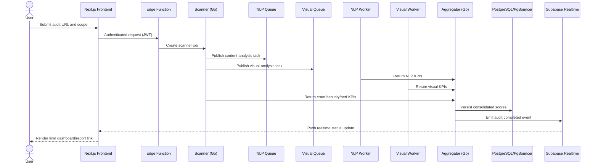
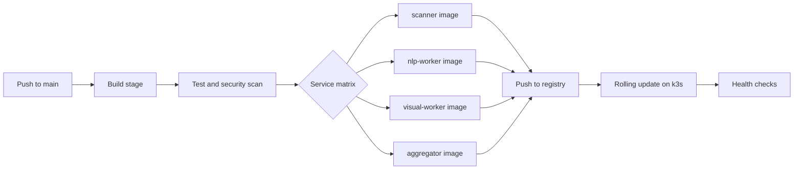

# COVER PAGE

## ESPRIT - Ecole Superieure Privee d'Ingenierie et de Technologies, Tunisia

**Engineering Degree in Software Engineering (Full-Stack & AI)**  
**Academic Year:** 2025-2026

---

# Design and Development of SnapFlow: An AI-Powered Microservices SaaS Platform for Automated Website Audit and Intelligence

---

**Student:** Ahmed Nour Allah Mejri  
**Academic Supervisor:** Ghassen FODDA  
**Industry Supervisor:** Mohamed Jerbi  
**Host Company:** Medianet  
**Submission Date:** June 2026

---

## TABLE OF CONTENTS

1. Cover Page  
2. Table of Contents  
3. List of Figures  
4. List of Abbreviations  
5. Abstract  
6. Resume (French Abstract)  
7. General Introduction  
8. Chapter 1 - Project Context and Requirements Analysis  
9. 1.1 Host Organization Presentation  
10. 1.2 Problem Statement  
11. 1.3 Proposed Solution Overview  
12. 1.4 Requirements Engineering  
13. 1.4.1 Functional Requirements  
14. 1.4.2 Non-Functional Requirements  
15. 1.5 Methodology  
16. 1.5.1 Agile Development with Scrum  
17. 1.5.2 UML Modeling  
18. Chapter 1 Summary  
19. Chapter 2 - System Architecture and Technology Stack  
20. 2.1 Architectural Vision  
21. 2.2 Microservices Breakdown  
22. 2.2.1 Scanner Service (Go)  
23. 2.2.2 NLP Worker Service (Python)  
24. 2.2.3 Visual Regression & UX Analysis Service (Python/OpenCV)  
25. 2.2.4 Aggregator Service  
26. 2.3 The 9 Audit Axes and KPI Framework  
27. 2.4 Data Architecture  
28. 2.4.1 PostgreSQL + PgBouncer  
29. 2.4.2 Redis as Message Broker  
30. 2.4.3 Supabase as the Frontend Backend  
31. 2.5 Technology Stack Summary Table  
32. 2.6 Design Decisions and Trade-Offs  
33. 2.7 Frontend Application Architecture  
34. Chapter 3 - Infrastructure, Deployment, and DevOps  
35. 3.1 Cloud Infrastructure Design  
36. 3.1.1 OVH VPS Selection Rationale  
37. 3.1.2 Single-Node Kubernetes with k3s  
38. 3.2 Kubernetes Workload Design  
39. 3.2.1 Deployment Manifests and Resource Requests  
40. 3.2.2 KEDA - Event-Driven Autoscaling  
41. 3.3 CI/CD Pipeline  
42. 3.3.1 Overview of the Pipeline  
43. 3.3.2 Stage 1: Build & Static Analysis  
44. 3.3.3 Stage 2: Automated Testing  
45. 3.3.4 Stage 3: Container Build & Registry Push  
46. 3.3.5 Stage 4: Deployment to OVH VPS  
47. 3.3.6 Environment Separation  
48. 3.4 Monitoring and Observability  
49. 3.4.1 Metrics with Prometheus + Grafana  
50. 3.4.2 Log Aggregation with Loki  
51. 3.4.3 Uptime Monitoring  
52. 3.5 Failure Handling and Retry Strategy  
53. Chapter 3 Summary  
54. Chapter 4 - Feature Implementation Deep Dives  
55. 4.1 Audit Report Generation Pipeline  
56. 4.1.1 PDF Report Architecture  
57. 4.1.2 Client Logo Detection  
58. 4.2 Security Scanning Module  
59. 4.3 NLP Content Analysis - Model Choices and Rationale  
60. 4.4 Visual UX Analysis Pipeline  
61. 4.4.1 Computer Vision Approach  
62. Chapter 4 Summary  
63. Chapter 5 - Testing and Quality Assurance  
64. 5.1 Testing Strategy Overview  
65. 5.2 Unit Testing  
66. 5.3 Integration Testing  
67. 5.4 Real-World Client Validation  
68. 5.5 Performance Benchmarking  
69. Chapter 5 Summary  
70. Chapter 6 - Competitive Analysis and Market Positioning  
71. 6.1 Existing Solutions Review  
72. 6.2 SnapFlow's Differentiators  
73. Chapter 6 Summary  
74. General Conclusion  
75. Summary of Accomplishments  
76. Technical Skills Developed  
77. Perspectives and Future Work  
78. Bibliography / References  
79. Appendix A - Full KPI Reference Table  
80. Appendix B - API Endpoint Reference  
81. Appendix C - Kubernetes Manifest Excerpts  
82. Appendix D - CI/CD GitHub Actions Workflow Excerpt  
83. Appendix E - Mermaid Diagram Sources

---

## LIST OF FIGURES

- Figure 1.1 - Company Organizational Chart  
- Figure 1.2 - Trello Sprint Board Overview  
- Figure 1.3 - General Use Case Diagram  
- Figure 2.1 - High-Level SnapFlow Architecture Diagram  
- Figure 2.2 - Scanner Service Internal Flow  
- Figure 2.3 - NLP Worker Pipeline Architecture  
- Figure 2.4 - Visual UX Pipeline Workflow  
- Figure 2.5 - Sample WCAG Contrast Analysis Output  
- Figure 2.6 - Aggregator Service Data Flow  
- Figure 2.7 - KPI Framework Radar Chart Example  
- Figure 2.8 - Database Schema ERD (simplified)  
- Figure 2.9 - Redis Queue Architecture  
- Figure 2.10 - Supabase Integration Architecture  
- Figure 2.11 - Full Audit Lifecycle Sequence Diagram  
- Figure 2.12 - Frontend Data Flow and Realtime Subscription Model  
- Figure 3.1 - k3s Single-Node Cluster Architecture  
- Figure 3.2 - KEDA Autoscaling Behavior Chart  
- Figure 3.3 - CI/CD Pipeline Flowchart  
- Figure 3.4 - Grafana Dashboard Screenshot  
- Figure 4.1 - PDF Generation Pipeline Sequence Diagram  
- Figure 4.2 - Sample Generated Audit Report Page  
- Figure 4.3 - Security Module Check Architecture  
- Figure 4.4 - NLP Worker Processing Time Benchmark  
- Figure 4.5 - Visual Analysis Pipeline Diagram  
- Figure 4.6 - Sample Saliency Map Output  
- Figure 5.1 - Audit Score Comparison Across Client Sites  
- Figure 5.2 - Audit Completion Time vs Page Count  
- Figure 6.1 - Competitive Feature Matrix

---

## LIST OF ABBREVIATIONS

| Abbreviation | Full Form |
|---|---|
| SaaS | Software as a Service |
| KPI | Key Performance Indicator |
| NLP | Natural Language Processing |
| CI/CD | Continuous Integration / Continuous Deployment |
| K8s | Kubernetes |
| VPS | Virtual Private Server |
| REST | Representational State Transfer |
| JWT | JSON Web Token |
| WCAG | Web Content Accessibility Guidelines |
| TF-IDF | Term Frequency-Inverse Document Frequency |
| LSI | Latent Semantic Indexing |
| CORS | Cross-Origin Resource Sharing |
| CVE | Common Vulnerabilities and Exposures |
| KEDA | Kubernetes Event-Driven Autoscaling |
| RGPD | Reglement General sur la Protection des Donnees |
| SEO | Search Engine Optimization |
| GEO | Generative Engine Optimization |
| TTFB | Time to First Byte |
| CLS | Cumulative Layout Shift |
| API | Application Programming Interface |
| RLS | Row-Level Security |
| TLS | Transport Layer Security |
| ERD | Entity-Relationship Diagram |
| CTA | Call to Action |

---

## ABSTRACT (ENGLISH)

The rapid digitalization of commerce and services has transformed websites into critical business assets, yet many organizations still lack affordable and continuous mechanisms to evaluate the real quality of their online presence. During this final-year internship, I addressed this gap by designing and implementing **SnapFlow**, a multi-tenant **SaaS** platform that automates website auditing across nine strategic dimensions: Technical SEO, On-Page SEO, Content Quality, Performance, Security, Accessibility, UX/Visual Quality, RGPD Compliance, and GEO readiness. The core challenge was not only to execute technical checks but also to deliver actionable intelligence to non-technical stakeholders through coherent scoring models and client-ready reporting.

SnapFlow was engineered with a **microservices architecture** combining high-concurrency crawlers, AI/NLP analysis workers, visual computer vision pipelines, and an aggregation layer that normalizes heterogeneous outputs into a unified 0-100 KPI framework. The deployment target was an OVH-based cloud-native environment using **k3s**, autoscaling policies, and production-style observability. The platform supports automated report generation, tenant isolation, audit lifecycle tracking, and near real-time progress updates, with historical comparison and competitor benchmarking planned for the next phase. Validation on real Tunisian websites demonstrated practical business relevance and confirmed that an SME-oriented, AI-powered audit platform can achieve enterprise-grade depth without enterprise-level pricing barriers.

## RESUME (FRANCAIS)

La transformation numerique a rendu les sites web essentiels a la performance commerciale des entreprises. Pourtant, de nombreuses structures, en particulier les PME, ne disposent pas d'outils accessibles pour auditer en continu leur presence digitale selon des criteres techniques, marketing, securitaires et reglementaires. Dans ce projet de fin d'etudes, j'ai concu et developpe **SnapFlow**, une plateforme **SaaS** multi-tenant dediee a l'audit automatise des sites web, couvrant neuf axes d'evaluation et plus de soixante indicateurs de performance.

L'architecture retenue repose sur des **microservices** specialises (scan, NLP, vision, agregation), un pipeline d'analyse IA/NLP, un systeme de scoring unifie, et une infrastructure cloud-native deployee sur OVH avec **Kubernetes (k3s)**. Le systeme integre egalement la generation automatique de rapports PDF orientes client, l'isolation multi-tenant, et le suivi en temps reel de l'avancement des audits. Les experimentations menees sur des sites tunisiens reels confirment la pertinence technique et economique de la solution, en offrant un niveau d'analyse avance a un cout compatible avec les contraintes du marche PME en Afrique du Nord.

---

## GENERAL INTRODUCTION

The quality of a company website is no longer a purely technical concern. It directly impacts visibility, conversion, trust, legal risk, and brand credibility. Search engines penalize technical weaknesses, users abandon slow or confusing interfaces, and regulators increasingly enforce data privacy obligations. In this context, website auditing has evolved from an occasional consultant activity into an operational necessity. However, the practical reality in many organizations remains fragmented: SEO tools assess indexing signals, security tools inspect vulnerabilities, and analytics tools monitor traffic, yet very few solutions provide a coherent end-to-end picture that decision-makers can understand and act upon quickly.

The market offers several mature platforms, but they often fail to address the operational and budget constraints of small and medium-sized businesses in Tunisia and the wider MENA region. Enterprise-grade platforms provide broad visibility but impose costs and complexity that are difficult for regional SMEs to absorb. Other tools remain desktop-centric, manually operated, or specialized in a single domain such as security or crawler diagnostics. This creates an execution gap: organizations know website quality matters, but they lack a practical, integrated, and affordable mechanism to transform periodic diagnostics into continuous performance governance.

My internship project was positioned precisely at this intersection of technical need and market opportunity. The objective was to build **SnapFlow**, an AI-powered, multi-tenant audit platform that automates crawl-and-analysis workflows and produces business-readable outcomes. Rather than treating audits as isolated checks, SnapFlow orchestrates multiple specialized services and consolidates their outputs into a unified KPI model. The platform is designed for recurring use by agencies, digital teams, and client-facing consultants who require both technical depth and presentation-ready deliverables.

A key ambition of this project was to bridge engineering rigor and product usability. On the engineering side, this meant designing resilient microservices, queue-driven processing, and cloud-native deployments with measurable performance targets. On the product side, this meant clear scoring logic, transparent findings, progress visibility, and PDF reports suitable for direct client delivery, while reserving historical diff comparison and competitor benchmarking for the next release phase. AI components were integrated where they created measurable value, especially for content quality interpretation and visual UX signal extraction, without turning the system into an opaque black box.

This report documents the full internship journey from requirements analysis to architecture, implementation, deployment, validation, and strategic positioning. Chapter 1 introduces the organizational context, problem definition, and requirements engineering process. Chapter 2 details the technical architecture and stack decisions, including data and integration layers. Chapter 3 presents infrastructure, DevOps pipelines, and observability mechanisms. Chapter 4 offers implementation deep dives into major functional modules. Chapter 5 covers testing strategy and empirical validation on real websites. Chapter 6 compares SnapFlow to existing solutions and clarifies market differentiation. The conclusion synthesizes accomplishments, acquired competencies, and future development directions.

By structuring the report in this progression, the reader can follow how a business problem was translated into measurable engineering objectives, how design choices were validated against constraints, and how a deployable product emerged from iterative development. The central thesis is that high-impact website intelligence can be delivered through an architecture that is both technically robust and economically aligned with regional SME realities.

---

## CHAPTER 1 - PROJECT CONTEXT AND REQUIREMENTS ANALYSIS

The first chapter establishes the business and engineering environment in which SnapFlow was conceived. It presents the host organization context, the concrete problem to solve, and the methodology used to convert broad stakeholder expectations into testable system requirements. This framing is essential because architecture and implementation decisions only make sense when interpreted against real operational constraints, client needs, and delivery timelines.

### 1.1 Host Organization Presentation

The internship took place in a digital engineering environment where client projects span web development, digital marketing support, and technical consulting. The organization operates with a hybrid structure combining product development functions and service-delivery functions. This setup was particularly suitable for the SnapFlow initiative because the project required both strong software engineering practices and direct exposure to real client pain points.

I was embedded as a full-stack and AI engineering intern, with responsibilities extending across technical design, microservices implementation, data modeling, deployment automation, and testing. Unlike narrowly scoped internship roles, this mission required end-to-end ownership: from requirement elicitation with business stakeholders to infrastructure hardening for production-like deployment. This broad scope was aligned with the pedagogical goals of a final engineering project, emphasizing autonomy, architecture reasoning, and measurable delivery outcomes.

The practical team ecosystem included an industry supervisor, technical collaborators for architecture reviews, and periodic coordination with stakeholders involved in client reporting workflows. The role distribution reflected a small, execution-focused product team: rapid decision loops, direct feedback, and iterative prototyping. This context accelerated learning but also increased accountability, as every design decision had direct consequences on delivery velocity and system maintainability.

The organizational motivation behind SnapFlow was strategic. The company needed a reusable, white-label-oriented platform that could support recurring digital audit services without high manual effort per client. In practice, this white-label orientation was implemented through tenant-specific PDF branding fields (client name, logo, cover metadata, and recommendation tone profile) rather than full custom-domain theming. Existing processes relied on multiple disconnected tools, causing reporting delays and inconsistent interpretation. The internship therefore targeted both technical innovation and operational standardization.

  
*Figure 1.1: Organizational view of the host company, showing executive leadership, technical management, product operations, and the internship project's reporting line between academic and industry supervision.*

### 1.2 Problem Statement

Modern businesses require continuous website auditing because website quality degrades over time due to content changes, third-party scripts, CMS updates, and evolving standards. The audit scope is inherently multidimensional: SEO, performance, security, accessibility, UX, and data privacy compliance are interdependent and cannot be sustainably managed in silos. A single technical issue, such as poor cache policy or weak security headers, can affect both ranking and trust. Similarly, inadequate consent flows can generate both legal and conversion risks.

Despite this need, available tools are often mismatched to SME contexts. Enterprise platforms provide rich diagnostics but with subscription costs that can exceed the digital budget of many Tunisian businesses. Desktop crawlers require significant manual expertise and produce outputs that are difficult for non-technical stakeholders to interpret. Security-focused tools may be deep in one axis but blind to SEO, content quality, or UX signals. As a result, organizations either under-audit or overpay for fragmented tools and then spend substantial human effort merging findings manually.

A second critical problem concerns output format. Stakeholders frequently request deliverables that can be shared with management or clients, especially structured PDF reports with clear scoring logic and prioritized recommendations. Many tools emphasize dashboards and raw issue lists but do not deliver high-quality, branded, decision-ready reports. This forces teams to export data manually and rewrite reports, introducing delays and inconsistency.

In the Tunisian and broader North African market, this gap is amplified by language and regional context. Content analysis must handle French and Arabic patterns, legal interpretation must align with RGPD-style expectations, and service pricing must remain accessible for SMEs. The absence of a unified, affordable, and intelligent platform in this segment created a clear opportunity for a new solution.

### 1.3 Proposed Solution Overview

SnapFlow was designed as a unified response to the problem space above. At a high level, it is a multi-tenant SaaS platform that accepts audit requests, executes distributed analysis across specialized services, aggregates heterogeneous findings into normalized KPIs, and returns both dashboard intelligence and formal PDF deliverables.

The platform supports client onboarding and workspace isolation through tenant-aware authentication and data partitioning. Each audit follows an automated crawl-and-analysis pipeline, where crawler outputs feed downstream analysis services. Results are mapped to nine audit axes and a portfolio of 64 KPIs, creating a consistent scoring framework across projects and time periods. In the current scope, this structure enables transparent explanation and repeatable scoring; trend diff analysis and benchmark comparisons are defined as planned extensions.

AI-enhanced components were integrated in targeted domains with clear ROI: NLP for semantic content quality and intent alignment, and visual analysis for UX/accessibility signals extracted from screenshots. The objective was not to replace deterministic checks but to enrich interpretation where rule-only approaches are insufficient.

Finally, SnapFlow includes report-generation workflows designed for client communication. The generated report can include visual summaries, per-axis findings, prioritized recommendations, and branding elements such as detected client logos. This transforms technical scans into actionable business assets.

### 1.4 Requirements Engineering

Requirements engineering was conducted incrementally, combining stakeholder interviews, competitive benchmark analysis, and iterative prototype feedback. The process emphasized traceability from user expectations to measurable platform behavior. Functional requirements were structured as user stories and mapped to services, while non-functional requirements were formalized as target constraints that directly influenced architecture decisions.

#### 1.4.1 Functional Requirements

1. **Audit Request Submission**  
As an auditor, I want to submit a target URL, crawl depth, and selected audit scope so that I can launch a tailored analysis aligned with client objectives.

2. **Real-Time Audit Progress Tracking**  
As a platform user, I want to monitor audit status in real time so that I can estimate completion and communicate progress to stakeholders.

3. **Multi-Axis KPI Scoring and Visualization**  
As a consultant, I want results organized by audit axes with normalized scores so that I can explain website health clearly and compare audits over time.

4. **NLP-Based Content Quality Analysis**  
As a content strategist, I want semantic relevance, readability, and CTA quality metrics so that I can improve content performance beyond keyword stuffing.

5. **Visual UX and Accessibility Pipeline**  
As a UX lead, I want screenshot-based assessments (contrast, saliency, overflow) so that I can detect user-facing design issues not visible in raw HTML.

6. **Security Vulnerability Signal Scanning**  
As a technical auditor, I want passive security checks on headers, exposure patterns, and library fingerprints so that I can identify high-risk weaknesses quickly.

7. **Automated PDF Report Generation**  
As an account manager, I want a polished, branded PDF report generated automatically so that I can deliver client-ready insights without manual formatting.

8. **Multi-Tenant Workspace Isolation**  
As a platform owner, I want tenant-level data isolation so that each client's audits remain private and secure in a shared infrastructure.

9. **Historical Audit Comparison (Planned - Phase 2)**  
As a decision-maker, I want to compare current and previous audits so that I can verify improvement trajectories and detect regressions. In this internship scope, the data model and score snapshots were prepared for this feature, but the full diff interface is scheduled for the next delivery phase.

10. **Competitor Benchmarking Module (Planned - Phase 2)**  
As a marketing manager, I want side-by-side benchmarking against competitor domains so that I can prioritize actions with strategic context. The endpoint contract was drafted, but execution orchestration and UX delivery are intentionally deferred to future work.

Within the validated internship deliverable, FR1 to FR8 are fully implemented and tested, while FR9 and FR10 are documented as planned extensions with prepared technical foundations.

#### 1.4.2 Non-Functional Requirements

- **Performance**  
The platform must complete a standard 50-page audit in under 90 seconds under nominal load. This requirement drove concurrency design, queue orchestration, and lightweight scoring pipelines for near real-time operation.

- **Scalability**  
The system must support concurrent job bursts through autoscaling workers. KEDA-based scaling policies were defined to react to queue pressure and maintain predictable throughput.

- **Availability**  
A service objective of 99.5% uptime was established for the production environment. Health probes, restart policies, and monitored dependencies were required to support this target.

- **Security**  
Authentication relies on JWT-based identity and tenant claims. API boundaries enforce CORS hardening and rate limiting to reduce abuse vectors and cross-tenant leakage risk.

- **RGPD Compliance**  
The platform itself must implement privacy-conscious handling of audit data, access controls, and retention logic, especially when reports include potentially sensitive findings.

- **Maintainability**  
Service isolation and independent deployability were mandatory to reduce coupling, enable focused testing, and support incremental upgrades without full-system downtime.

### 1.5 Methodology

The project execution model combined an adapted Agile delivery process for solo development with structured modeling artifacts. This dual approach ensured practical iteration speed while preserving architectural coherence and academic traceability.

#### 1.5.1 Agile Development with Scrum

The delivery process followed an **adapted Scrum** framework in two-week sprint cycles suitable for a solo engineer under supervision. Each sprint started with planning and objective definition, followed by backlog grooming, daily progress journaling, and structured daily check-ins with the industry supervisor. Trello was used as the operational board, with cards tagged by service domain, risk level, and milestone alignment.

Six milestone groups organized the internship trajectory:

- **M1: Bugfix and Stabilization**  
Foundational reliability work, scanner hardening, and contract normalization across services.

- **M2: NLP Enhancement**  
Semantic relevance calibration, readability improvements for multilingual content, and KPI tuning.

- **M3: Security Module**  
Passive security checks, exposure detection, and vulnerability signal integration.

- **M4: Visual UX Pipeline**  
Screenshot capture automation, contrast and saliency analysis, and mobile overflow checks.

- **M5: Reporting and Client Delivery**  
PDF architecture, recommendation rendering, and deliverable formatting workflows.

- **M6: Infrastructure and CI/CD Hardening**  
Deployment automation, autoscaling policy refinement, monitoring dashboards, and operational controls.

  
*Figure 1.2: Sprint board showing milestone-oriented backlog lanes, in-progress service tasks, QA checkpoints, and release readiness criteria.*

#### 1.5.2 UML Modeling

UML artifacts were used to formalize and communicate design intent at multiple abstraction levels:

- **Use Case Diagrams** to capture actor interactions (auditor, admin, tenant user, report consumer).  
- **Class Diagrams** for core domain entities and data model relationships.  
- **Sequence Diagrams** for end-to-end workflows such as audit submission, service orchestration, and report generation.  
- **Component Diagrams** to describe service boundaries, API contracts, and integration points.  
- **Deployment Diagrams** to represent infrastructure topology, ingress flow, and runtime dependencies.

  
*Figure 1.3: High-level use case model illustrating user roles, audit lifecycle interactions, reporting workflows, and tenant-level administration.*

### Chapter 1 Summary

This chapter established the business relevance and engineering scope of SnapFlow. It translated a fragmented market problem into a coherent set of functional and non-functional requirements, then aligned execution around an Agile process reinforced by UML modeling discipline. With this foundation, the next chapter details how these requirements were operationalized through architecture and technology decisions.

---

## CHAPTER 2 - SYSTEM ARCHITECTURE AND TECHNOLOGY STACK

This chapter presents the technical backbone of SnapFlow. It explains why a distributed architecture was selected, how responsibilities were decomposed into specialized services, and how data moved across the platform. The objective is to show not only which technologies were used, but why each choice was appropriate for performance targets, maintainability, and product requirements.

### 2.1 Architectural Vision

SnapFlow was designed around **microservices** rather than a monolith because the workload profile is heterogeneous by nature. Crawling is I/O-intensive and benefits from highly concurrent networking, NLP analysis is CPU-intensive with matrix operations, and visual analysis introduces memory-heavy image processing. A monolithic architecture would force these patterns into a single scaling unit, creating inefficiencies and operational fragility.

Microservices enabled independent scaling for each workload class. When content analysis queues increased, NLP workers could scale without overprovisioning crawler replicas. When audit bursts required wider crawl concurrency, scanner replicas could grow while keeping visual services stable. This separation minimized resource waste and reduced performance coupling.

Deployment autonomy was another decisive factor. Security checks, scoring logic, and report generation evolve at different velocities. Service boundaries allowed targeted releases with controlled blast radius. A defect in one component could be rolled back independently without freezing the entire platform. This was particularly important in a final-year project context where iterative experimentation and rapid corrections were expected.

Technology heterogeneity was intentionally embraced. **Go** was adopted for concurrency-sensitive crawling and low-overhead execution. **Python** was selected for AI/NLP and computer vision due to ecosystem maturity. The architecture therefore optimized each problem domain rather than enforcing one language across all components.

Finally, fault isolation improved resilience. If NLP processing degraded due to temporary model load issues, crawl and core orchestration remained operational, preserving core user experience and protecting system stability under partial failure scenarios.

  
*Figure 2.1: Global architecture illustrating frontend entry, authentication boundary, queue-driven service orchestration, aggregation layer, storage systems, and reporting outputs.*

### 2.2 Microservices Breakdown

#### 2.2.1 Scanner Service (Go)

The scanner service is the ingestion engine of SnapFlow. It is implemented in Go to exploit lightweight goroutines for concurrent crawling while maintaining predictable memory usage. The service receives audit tasks, executes controlled crawling with depth and rate constraints, and emits normalized raw findings for downstream processing.

Its responsibilities include HTML signal extraction (metadata, heading hierarchy, canonical tags, structured data, hreflang markers, robots directives), performance-related probes (TTFB, status distribution, redirect chains, resource footprints), and security-relevant observations (header presence and strictness, surface-level exposure indicators). The scanner also performs pattern-based checks for administration panel exposure and configuration risks such as permissive CORS headers.

A notable module fingerprints JavaScript libraries and compares detected versions against a vulnerability reference index to generate CVE-linked risk signals. Another module inspects file upload handling patterns and extension control indicators where observable. While remaining passive and non-intrusive, these checks provide actionable security context early in the pipeline.

After crawl completion, findings are serialized as structured payloads and pushed to processing channels. This decoupled output model enables asynchronous fan-out to NLP and visual pipelines and supports high throughput under concurrent demand.

  
*Figure 2.2: Internal scanner workflow from URL normalization and crawl scheduling to signal extraction, security probes, and event publication.*

#### 2.2.2 NLP Worker Service (Python)

The NLP worker consumes audit tasks and computes semantic content indicators aligned with SEO quality and user communication effectiveness. Python was selected due to the availability of mature NLP libraries, rapid experimentation capabilities, and straightforward integration of statistical text pipelines.

Core processing includes **TF-IDF** vectorization for relevance estimation and **LSI** projection for latent topic coherence. These techniques provide robust, lightweight inference suitable for near real-time scoring. The worker also measures keyword prominence across structural positions (title, H1/H2, body distribution), detects CTA patterns, and evaluates intent alignment between page language and target semantic domains.

Additional checks enrich strategic dimensions beyond traditional SEO. GEO readiness evaluates machine-readable signals for AI-oriented indexing behavior, including directive files and structured schema coverage. RGPD-oriented text checks score the presence and clarity of user rights language, consent references, and privacy policy cues. Readability is computed through adapted indices for French and Arabic content patterns, and entity recognition is used to map topic consistency.

Outputs are transformed into KPI-level metrics and sent to the aggregation layer with trace metadata. This allows transparent audit reconstruction and explainability across all content-related scores.

  
*Figure 2.3: NLP processing chain from cleaned text extraction to semantic vectorization, topic projection, KPI scoring, and result publication.*

#### 2.2.3 Visual Regression & UX Analysis Service (Python/OpenCV)

This service captures visual quality signals that HTML-level auditing cannot reveal. It integrates headless browser screenshot capture with image-processing routines to assess accessibility and UX conditions from rendered pages.

The pipeline starts with desktop and mobile snapshots collected through browser automation. Images are then analyzed using OpenCV and Pillow routines. Contrast compliance checks estimate foreground/background relationships and validate ratios against WCAG thresholds. Saliency mapping detects attention concentration zones, helping evaluate whether key interactive elements are visually prioritized.

Whitespace density is measured through grid sampling to identify visual clutter versus balanced composition. Mobile overflow checks compare rendered content width against viewport constraints to detect horizontal scrolling risk. Sequential captures enable approximation of layout instability patterns that relate to CLS-like user discomfort. An above-the-fold quality score summarizes immediate visual clarity and interaction readiness.

Generated visual artifacts and snapshots are stored in object storage with signed access controls. This supports both dashboard evidence rendering and report inclusion without exposing raw asset buckets publicly.

  
*Figure 2.4: Visual audit sequence from screenshot capture and preprocessing to contrast analysis, saliency extraction, and UX KPI outputs.*

  
*Figure 2.5: Example output illustrating contrast violation zones and compliance overlays used for accessibility scoring.*

#### 2.2.4 Aggregator Service (Go)

The aggregator consolidates outputs from all analysis services and transforms distributed observations into a coherent audit result. It is implemented in Go to keep consolidation latency low and to align with the performance characteristics of the scanner service. It consumes scanner, NLP, and visual payloads, validates schema consistency, and applies normalization logic to map heterogeneous metrics into a common 0-100 KPI scale.

A weighted scoring engine computes axis-level and global scores while preserving explainability fields (evidence, severity, threshold logic, and recommendation context). This balance between aggregation and traceability is critical: users need summary clarity, but auditors require diagnostic depth.

The aggregator writes final records to PostgreSQL through PgBouncer to control connection pressure and improve transaction stability under concurrent jobs. Once the audit reaches completion status, it triggers report generation workflows and emits completion events to real-time channels so frontend clients can refresh instantly.

This component also enforces business rules such as status transitions, partial-failure handling, and idempotent result updates. By centralizing these concerns, SnapFlow ensures consistency across modules and simplifies downstream product behaviors.

  
*Figure 2.6: Consolidation flow from microservice outputs to normalized KPI model, persistent storage, and completion notifications.*

### 2.3 The 9 Audit Axes and KPI Framework

SnapFlow's KPI model is organized into nine axes to align technical diagnostics with managerial interpretation:

1. **Technical SEO** - crawlability, index directives, canonical consistency, redirect logic.  
2. **On-Page SEO** - metadata quality, heading semantics, keyword targeting discipline.  
3. **Content Quality** - readability, relevance depth, CTA clarity, semantic coherence.  
4. **Performance** - latency indicators, payload efficiency, render-critical bottlenecks.  
5. **Security** - defensive headers, exposure vectors, vulnerability signal detection.  
6. **Accessibility (WCAG)** - contrast, semantic markup support, alternative text presence.  
7. **UX & Visual Design** - layout clarity, saliency alignment, responsive stability.  
8. **RGPD Compliance** - consent transparency, privacy policy completeness, rights communication.  
9. **GEO** - machine-readable guidance and AI discovery readiness indicators.

A total of **64 KPIs** are distributed across these axes. Each KPI is mapped to a scoring method (boolean, threshold, continuous normalization, or weighted heuristic) and a declared evidence source. This framework ensures that score evolution over time is measurable and explainable. It also supports comparative reporting across domains and sectors without sacrificing diagnostic granularity.

The GEO axis deserves specific justification because it is newer than traditional SEO dimensions. Search behavior is shifting toward AI-assisted discovery surfaces such as conversational engines and AI overviews. In this context, websites benefit from machine-readable cues that help automated agents interpret authority, structure, and retrieval relevance. By incorporating GEO metrics (for example directive clarity and structured semantic context), SnapFlow anticipates this transition and gives clients practical guidance for visibility in both classical and AI-mediated search journeys.

  
*Figure 2.7: Radar visualization representing axis-level performance and highlighting imbalances between technical, content, security, and compliance dimensions.*

  
*Figure 2.11: End-to-end sequence from URL submission and JWT validation to scanner execution, worker fan-out, aggregation, completion notification, and frontend refresh.*

### 2.4 Data Architecture

#### 2.4.1 PostgreSQL + PgBouncer

The persistent data model uses PostgreSQL as the transactional core for audit metadata, KPI values, recommendations, and report references. Multi-tenant isolation is implemented via tenant identifiers across core entities and reinforced by policy controls such as row-level access strategies where relevant. This ensures data segregation without requiring separate databases per client in the initial scaling phase.

**PgBouncer** is deployed in transaction pooling mode to mediate database access from multiple short-lived service interactions. This is especially important for high-concurrency scanner events and bursty aggregation writes. By controlling backend connection count and reusing pooled sessions, PgBouncer prevents database saturation while preserving throughput.

  
*Figure 2.8: Simplified schema view showing tenant entities, audit jobs, axis scores, KPI tables, recommendation records, and report artifacts.*

#### 2.4.2 Redis as Message Broker

Redis is used as the low-latency message backbone for asynchronous audit orchestration. Jobs are distributed through named channels such as scanner, NLP, and visual queues, allowing each worker class to consume tasks independently. Queue separation supports better observability, targeted retries, and service-specific scaling policies.

KEDA monitors queue depth and scales worker replicas according to demand thresholds. This event-driven pattern decouples user request spikes from fixed infrastructure capacity and allows the platform to maintain responsiveness during peak windows. Redis also supports transient state synchronization and lightweight coordination without introducing heavyweight broker complexity.

  
*Figure 2.9: Queue topology showing audit task publication, service-specific consumption, and autoscaling triggers based on queue pressure.*

#### 2.4.3 Supabase as the Frontend Backend

Supabase plays a central role in frontend-facing services. It provides authenticated data access through generated APIs, real-time subscriptions for progress updates, storage for screenshots and reports, and identity services based on JWT claims with tenant context.

A key architectural principle is that internal microservices are not directly exposed to the public internet. External requests pass through controlled interfaces such as Edge Functions, where JWT validation, tenant checks, and request sanitization are enforced before traffic is proxied to internal service endpoints. This improves security posture, simplifies client integration, and preserves internal topology privacy.

  
*Figure 2.10: Supabase-centered integration model linking authentication, real-time events, storage, and secure function-mediated access to internal services.*

### 2.5 Technology Stack Summary Table

| Layer | Technology | Justification |
|---|---|---|
| Frontend | Next.js + TypeScript | Strong DX, component reuse, and fast integration with API-driven dashboards |
| Auth & BaaS | Supabase Auth | Built-in JWT workflows and tenant-aware identity integration |
| API Gateway | Supabase Edge Functions + Ingress | Secure external entrypoint with policy enforcement |
| Scanner Service | Go | High concurrency and low memory overhead for crawl workloads |
| NLP Worker | Python + scikit-learn | Efficient text analytics and mature NLP ecosystem |
| Visual Service | Python + OpenCV/Pillow | Practical rendering and image-based UX analysis |
| Visual Capture Engine | Playwright (Headless Chromium) | Full-page rendering for desktop and mobile viewport capture |
| Aggregator | Go | Low-latency score consolidation and deterministic aggregation workflows |
| Message Broker | Redis | Low-latency queueing and simple event distribution |
| Autoscaling | KEDA | Event-aware worker scaling based on queue dynamics |
| Database | PostgreSQL | ACID reliability and rich relational querying |
| Connection Pooler | PgBouncer | Stable connection control under burst traffic |
| File Storage | Supabase Storage | Signed URL support for reports and screenshots |
| Container Orchestration | k3s (Kubernetes) | Production-like API with lightweight operational footprint |
| VPS Provider | OVH | Regional latency advantage and cost efficiency |
| CI/CD | GitHub Actions | Automated build-test-deploy workflow with traceability |
| Monitoring | Prometheus + Grafana + Loki + Uptime Kuma | Unified metrics, logs, and uptime alerting |

### 2.6 Design Decisions and Trade-Offs

SnapFlow architecture was not built from isolated technology preferences; it was the result of explicit trade-off analysis against delivery time, VPS constraints, and maintainability.

1. **Go for scanner and aggregator vs Rust and Node.js**  
Rust was evaluated for maximum runtime performance, but compile-time complexity and developer velocity trade-offs were not compatible with internship timelines. Node.js was easier for rapid prototyping, but Go offered stronger CPU/memory predictability for crawl and consolidation workloads.

2. **Supabase-centric identity/data access vs fully custom auth backend**  
A full custom auth and realtime stack would provide deeper control, but it would significantly increase implementation overhead and security surface. Supabase accelerated secure multi-tenant onboarding, JWT management, and realtime integration while preserving extensibility through Edge Functions.

3. **k3s orchestration vs bare Docker Compose in production**  
Docker Compose remains useful in local and integration contexts, but it lacks native autoscaling and policy controls. k3s provided Kubernetes compatibility, deployment primitives, and a cleaner path to future horizontal growth.

4. **TF-IDF + LSI vs transformer inference in real time**  
Transformer models produced richer semantics in testing but introduced latency and resource costs beyond the project's SLA goals on CPU-only infrastructure. TF-IDF + LSI provided a better performance-quality balance for continuous audits.

### 2.7 Frontend Application Architecture

The frontend layer was implemented as a Next.js application organized around dashboard-first workflows: audit submission, progress visualization, and report consumption. Routing followed a modular pattern separating authenticated tenant dashboards from public-facing pages. This structure reduced coupling between platform marketing surfaces and operational audit interfaces.

State management combined server-driven data fetching and client-side synchronization. The frontend used Supabase session context for tenant-aware authentication and propagated claims into all secured requests. Audit state transitions were represented with deterministic UI states (queued, running, partial, completed, failed) so that users always received explicit process feedback rather than ambiguous loading indicators.

Realtime progress updates were consumed through Supabase channel subscriptions instead of polling-heavy REST loops. Each audit view subscribed to tenant-scoped channels and updated progress bars, service cards, and timeline entries incrementally. This reduced request overhead and improved perceived responsiveness during long-running scan windows.

For KPI rendering, the UI combined reusable score cards, axis radar visuals, and drill-down evidence panels. Component-level memoization was applied to avoid unnecessary re-renders during realtime updates. This architecture was intentionally aligned with client-facing communication needs: users can move from a global score to evidence-level findings in a small number of interactions.

  
*Figure 2.12: Frontend architecture showing Next.js routes, Supabase authentication context, realtime channel subscriptions, and KPI component rendering flow.*

---

## CHAPTER 3 - INFRASTRUCTURE, DEPLOYMENT, AND DEVOPS

This chapter describes how SnapFlow moved from application logic to a production-capable operational environment. It explains infrastructure strategy, Kubernetes workload design, CI/CD automation, and observability architecture. The focus is on deployment reliability, cost-aware scaling, and maintainability for a solo-engineered yet professional-grade platform.

### 3.1 Cloud Infrastructure Design

#### 3.1.1 OVH VPS Selection Rationale

The infrastructure baseline was designed around an OVH VPS profile offering 12 vCores and 48 GB RAM, selected to maximize regional performance and budget efficiency. For Tunisian clients, network proximity significantly improves responsiveness for dashboard interaction and API flows. Latency measurements favored a local/regional host over distant data centers often optimized for European cores.

Cost structure was equally decisive. Equivalent setups on hyperscaler platforms can become disproportionately expensive when including compute, storage, and outbound traffic overhead. For a product targeting SMEs, predictable monthly cost is a strategic requirement, not only an operational detail. OVH provided a favorable cost-performance ratio and removed billing complexity related to egress at early scale.

Alternative options were assessed. Some low-cost providers were rejected due to weaker SLA confidence and operational unpredictability. Higher-end cloud ecosystems offered excellent tooling but introduced a complexity and cost profile not justified for initial single-team operation. The chosen approach balanced pragmatism and scalability: deliver robust capability now, preserve migration options later.

#### 3.1.2 Single-Node Kubernetes with k3s

SnapFlow uses **k3s** to obtain full Kubernetes semantics with reduced operational overhead. In a single-node setup, this provides production-like deployment patterns (Deployments, Services, autoscaling controllers, ingress rules) while avoiding control-plane complexity associated with larger clusters.

k3s includes efficient defaults and streamlined packaging, enabling faster setup and simpler maintenance for a small engineering team. The ingress layer is integrated with TLS provisioning through cert-manager and Let's Encrypt, enabling secure endpoints without manual certificate handling.

This architecture intentionally anticipates future expansion. Workload definitions, service boundaries, and configuration management are already expressed in cluster-native forms, making horizontal growth to multiple nodes an infrastructure operation rather than an application rewrite. In other words, the platform is deployed minimally today but designed to scale structurally tomorrow.

  
*Figure 3.1: Runtime topology showing namespaces, ingress routing, core services, data stores, and monitoring components in a single-node k3s cluster.*

### 3.2 Kubernetes Workload Design

#### 3.2.1 Deployment Manifests and Resource Requests

Stateless services (scanner, NLP worker, visual worker, aggregator) are managed via Deployments with explicit resource requests and limits to reduce contention and improve scheduling predictability. State-bearing components are provisioned with persistent storage assumptions and operational constraints aligned with data durability requirements.

Configuration is separated through ConfigMaps and Secrets. This allows environment-specific values, credentials, and feature toggles to be updated independently of images, supporting cleaner promotion across staging and production. Sensitive material, including database credentials and service keys, is injected as secret references instead of hardcoded configuration.

Resource profiles reflect workload characteristics:

- Scanner: moderate CPU and memory baseline with room for concurrency bursts.  
- NLP worker: higher CPU profile due to matrix operations and text pipelines.  
- Visual service: elevated memory profile to accommodate browser rendering and image analysis.

This resource discipline reduced noisy-neighbor effects and improved stability during mixed workload peaks.

#### 3.2.2 KEDA - Event-Driven Autoscaling

KEDA is configured to scale service replicas according to workload pressure indicators. In queue-driven paths, pending jobs trigger additional worker replicas up to predefined limits. Scanner scaling starts from a warm baseline to preserve low pickup latency, while heavier pipelines such as visual analysis scale more conservatively to avoid resource spikes.

Typical policy patterns include:

- NLP worker: scale from 1 to 8 replicas beyond queue threshold.  
- Scanner: scale from 2 to 12 replicas under high crawl demand.  
- Visual worker: scale from 1 to 4 replicas due to heavier per-job cost.

Autoscaling policies include cooldown windows to prevent oscillation and preserve cluster stability. The net effect is elastic throughput while controlling infrastructure spend.

  
*Figure 3.2: Autoscaling behavior over time, correlating queue depth growth with worker replica count and processing latency reduction.*

### 3.3 CI/CD Pipeline

#### 3.3.1 Overview of the Pipeline

A structured **GitHub Actions** pipeline was designed to enforce quality gates and reduce manual release operations. The pipeline triggers on pushes to the production branch and pull requests targeting the integration branch. It executes four sequential stages: Build, Test, Containerize, and Deploy.

This sequence provides two strategic benefits: early failure detection and immutable release traceability. By gating deployment on static checks, tests, and security scans, the platform reduces regression risk. By tagging images with commit identifiers, it preserves auditability and rollback confidence.

  
*Figure 3.3: End-to-end CI/CD flow from code commit to quality gates, image publication, rolling deployment, and post-release validation.*

#### 3.3.2 Stage 1: Build & Static Analysis

The build stage validates service compileability and code quality before any packaging:

- Go services: `go build`, `go vet`, and static analysis checks.  
- Python services: linting and type checks via `flake8` and `mypy`.  
- Frontend: strict TypeScript validation and ESLint checks.

A fail-fast policy aborts execution immediately on quality gate failures and posts actionable diagnostics in pull request feedback. This shortens feedback cycles and reduces noisy downstream failures.

#### 3.3.3 Stage 2: Automated Testing

Testing combines unit and integration coverage:

- Unit tests validate service-level logic and edge conditions.  
- Integration tests run in a composed environment including database, broker, and workers.  
- A synthetic audit job validates expected KPI outputs and pipeline completion behavior.

Coverage threshold enforcement ensures test debt does not accumulate silently. In addition, image-level vulnerability scanning with Trivy blocks releases containing critical known CVEs unless explicitly waived under controlled policy.

#### 3.3.4 Stage 3: Container Build & Registry Push

Containers are built using optimized Docker patterns, including multi-stage builds where relevant and slim runtime bases for Python services. Images are tagged with immutable commit SHA references and pushed to a registry for consistent deployment source-of-truth.

A practical optimization identified during development iterations was the adoption of a **shared Python base image strategy**. Common dependencies and system libraries were centralized into reusable layers to reduce build times, improve cache reuse, and standardize runtime behavior across Python microservices. This was especially useful for services requiring overlapping data and scientific packages.

#### 3.3.5 Stage 4: Deployment to OVH VPS

Deployment jobs connect securely to the target environment via SSH credentials stored as repository secrets. Updated image tags are rolled out through Kubernetes commands, and rolling updates ensure zero-downtime transitions by waiting for readiness success before old pod termination.

Post-deployment validation checks ingress health endpoints and core service availability within strict timeout windows. If checks fail, automated rollback is executed to restore the previous stable revision. Deployment outcomes are pushed to team communication channels to ensure operational visibility.

#### 3.3.6 Environment Separation

Branch-to-environment mapping enforces release discipline:

- Integration branch deploys to staging namespace with isolated project resources.  
- Production branch deploys to production namespace.  
- Feature behavior is controlled via environment flags rather than long-lived divergence in code branches.

This model supports safe testing of new features and infrastructure changes before production promotion.

### 3.4 Monitoring and Observability

#### 3.4.1 Metrics with Prometheus + Grafana

A Prometheus stack scrapes metrics from services, infrastructure exporters, and Kubernetes state endpoints. Service instrumentation exposes latency, throughput, queue consumption speed, and error counters. Redis and node exporters complete visibility into broker pressure and host resource usage.

Grafana dashboards were designed around operational decision needs:

- Jobs per minute by service  
- Queue depth trend and autoscaling correlation  
- P95 latency by endpoint/service  
- Error ratio by component  
- Host CPU, memory, and disk pressure

These dashboards enabled faster diagnosis and validated scaling assumptions under realistic workloads.

  
*Figure 3.4: Monitoring dashboard combining throughput, queue pressure, latency percentiles, and infrastructure utilization in a single operational view.*

#### 3.4.2 Log Aggregation with Loki

Logs are centralized via Loki and collected by Promtail from all running pods. Structured JSON log fields include audit identifiers, tenant identifiers, processing durations, and error codes. This enables end-to-end trace reconstruction for any audit lifecycle, improving incident analysis and support workflows.

Centralized logging also supports cross-service correlation, making it possible to identify bottlenecks at handoff points rather than only inside individual services.

#### 3.4.3 Uptime Monitoring

Uptime Kuma monitors external availability of key endpoints (frontend, API health, function gateways) at one-minute intervals. Alert channels include email and messaging webhook integrations. This external perspective complements internal metrics by simulating user-facing availability and TLS integrity.

### 3.5 Failure Handling and Retry Strategy

Because SnapFlow is a distributed platform, reliability depends on explicit failure semantics rather than best-effort execution. Each audit carries a unique identifier and deterministic state machine so retries remain idempotent.

The scanner, NLP worker, and visual worker use bounded retry policies with exponential backoff for transient failures such as timeouts or temporary DNS/network instability. Hard failures (for example invalid target domain or repeated rendering crashes) are marked with terminal status and attached diagnostic evidence.

Aggregation is designed for partial-result tolerance. If one worker fails after max retries, the audit can still complete in a partial state with clear axis-level status flags and explicit report annotations. This prevents all-or-nothing failure for clients while preserving transparency.

Operationally, failed jobs above retry thresholds are redirected to a dead-letter stream for manual triage and replay. This isolates poison messages from normal throughput and supports incident analysis without blocking queue processing.

### Chapter 3 Summary

SnapFlow's infrastructure approach combined pragmatic hosting choices with production-grade deployment patterns. Kubernetes orchestration, autoscaling logic, CI/CD gates, and observability tooling transformed the platform from a functional prototype into an operational system with reliability controls. The next chapter zooms into core feature implementations where these architectural foundations deliver user-facing value.

---

## CHAPTER 4 - FEATURE IMPLEMENTATION DEEP DIVES

This chapter details four major implementation domains that define SnapFlow's practical value: report generation, security scanning, NLP analysis, and visual UX auditing. The goal is to show how abstract requirements became concrete, measurable workflows that produce actionable outputs for real clients.

### 4.1 Audit Report Generation Pipeline

#### 4.1.1 PDF Report Architecture

A major product requirement was to generate client-ready reports automatically, not merely expose data in dashboards. The reporting pipeline is event-driven. Once an audit reaches completion state, a secure function retrieves full results and initiates a PDF rendering process based on a declarative document template system.

The renderer composes sections in a standardized sequence:

1. Cover page with client identity markers  
2. Executive summary with global and axis-level interpretation  
3. KPI visualization pages (radar and axis blocks)  
4. Detailed findings with evidence and severity context  
5. Recommendation roadmap grouped by urgency and impact  
6. Technical annex with key metrics and methodology notes

The implementation uses a TypeScript rendering stack based on React-oriented PDF composition. This choice allowed component reuse, styling consistency, and maintainable template evolution. Generated documents are uploaded to secure storage, and users receive signed links with controlled validity duration.

  
*Figure 4.1: Sequence from audit completion event to data fetch, rendering service call, storage upload, and signed URL delivery.*

  
*Figure 4.2: Example report page structure showing KPI visuals, finding cards, and recommendation formatting suitable for executive sharing.*

#### 4.1.2 Client Logo Detection

To improve professional presentation quality, SnapFlow includes a two-layer logo detection mechanism.

The first layer parses HTML assets and metadata to identify likely logo candidates from image tags, favicon links, and Open Graph references. Candidate ranking uses heuristic signals such as filename patterns, placement proximity to header zones, and dimensions.

The second layer performs path probing against common asset routes when direct extraction fails. This fallback improves robustness across CMS implementations and custom themes. The selected asset is then validated for usability in report rendering. This small feature had outsized impact on client perception because it reduced manual branding steps and made generated reports immediately presentable.

### 4.2 Security Scanning Module

The security module is intentionally passive, favoring legal and operational safety while still providing high diagnostic value. It consists of ten stateless checks operating on response headers, page content, and discovered asset signals. Each check returns a normalized score, severity level, evidence snippet, and recommendation anchor.

Implemented checks include:

1. CMS and admin exposure indicators  
2. Security header completeness and strictness  
3. CORS permissiveness on sensitive endpoints  
4. Brute-force mitigation signals  
5. JavaScript library CVE fingerprint matching  
6. Mixed-content detection  
7. Cookie security attribute validation  
8. Server fingerprint information leakage  
9. Clickjacking protection signals  
10. File upload surface exposure indicators

This design achieves a balance between safety and usefulness. By avoiding active exploitation and focusing on passive intelligence, SnapFlow remains appropriate for broad client usage while still surfacing meaningful risk patterns and hardening opportunities.

  
*Figure 4.3: Security analysis pipeline illustrating passive check modules, scoring logic, and evidence-to-recommendation mapping.*

### 4.3 NLP Content Analysis - Model Choices and Rationale

NLP architecture decisions were driven by the real-time nature of audits. The adopted approach combines TF-IDF and LSI to extract relevance and topical coherence efficiently. TF-IDF captures term salience across documents, while LSI projects sparse vectors into latent semantic dimensions that better represent topic structure.

This combination enabled robust content scoring with low inference cost, supporting responsiveness requirements. It also allowed practical multilingual adaptation by extending tokenization and stop-word treatment for French and Arabic patterns common in regional websites.

Additional NLP signals include CTA quality heuristics, intent-target alignment, semantic consistency, and readability scoring adapted to multilingual sentence structure. GEO-oriented features assess readiness for AI-driven discovery through structured data completeness and machine-readable directives.

Alternative transformer-based approaches were evaluated experimentally but rejected for production scoring due to latency and infrastructure overhead under CPU-only constraints. Full contextual models produced richer embeddings but increased per-page processing time beyond acceptable thresholds for real-time user workflows. The selected architecture therefore reflects a deliberate engineering trade-off: prioritize scalable responsiveness while preserving sufficient semantic depth.

  
*Figure 4.4: Benchmark comparison showing throughput and latency trade-offs between lightweight statistical pipelines and heavier transformer-based approaches.*

### 4.4 Visual UX Analysis Pipeline

#### 4.4.1 Computer Vision Approach

Visual analysis starts with deterministic screenshot capture on desktop and mobile viewports to preserve comparability. Processing then applies layered image analysis:

- Contrast measurement against accessibility thresholds  
- Saliency extraction to identify attention concentration  
- Whitespace ratio estimation by grid region  
- Mobile overflow detection via viewport boundary analysis  
- Layout stability approximation from sequential captures  
- Above-the-fold composition scoring

A key design principle was evidence traceability. Whenever a score indicates weakness, the platform stores visual artifacts or metadata that explain the finding. This improves user trust and reduces ambiguity when recommendations are reviewed.

The visual pipeline complements, rather than replaces, HTML and performance audits. Together, they capture both structural correctness and user-perceived quality. This multimodal approach significantly improved diagnostic coverage, particularly for clients whose main business risk was conversion friction rather than purely technical SEO defects.

  
*Figure 4.5: End-to-end visual pipeline from screenshot acquisition to feature extraction and UX/accessibility KPI generation.*

  
*Figure 4.6: Example saliency output highlighting attention hotspots and alignment assessment for primary call-to-action elements.*

### Chapter 4 Summary

This chapter demonstrated how SnapFlow's core value is implemented through event-driven reporting, passive security intelligence, low-latency NLP scoring, and computer-vision-based UX analysis. Each module was designed with practical constraints in mind: speed, explainability, legal safety, and client usability. The following chapter validates these implementations through testing and real-world performance evidence.

---

## CHAPTER 5 - TESTING AND QUALITY ASSURANCE

This chapter presents the quality strategy used to validate SnapFlow from isolated logic checks to full pipeline execution. Because the platform orchestrates multiple services and asynchronous workflows, quality assurance had to combine deterministic unit tests with integration and live-site validation to verify both correctness and operational reliability.

### 5.1 Testing Strategy Overview

The adopted model follows a testing pyramid:

- **Unit tests** for local correctness of service logic  
- **Integration tests** for inter-service contracts and data flow  
- **End-to-end tests** for full audit lifecycle validation

Coverage thresholds were enforced through CI pipelines to prevent silent regression growth. Beyond percentage metrics, test design emphasized representative scenario coverage: malformed HTML, slow responses, missing metadata, multilingual pages, and edge security header combinations.

### 5.2 Unit Testing

Unit testing was tailored to each service profile:

- **Scanner (Go):** table-driven tests using mocked responses to validate individual check functions and normalization logic.  
- **NLP Worker (Python):** fixture-based tests with controlled corpora validating score boundaries and semantic consistency behavior.  
- **Visual Service:** synthetic image tests for contrast and saliency routines, with known expected outputs under controlled conditions.  
- **Aggregator:** mapping and weighting tests confirming deterministic score composition and status transitions.

This service-specific approach improved confidence in algorithm behavior while keeping test execution fast.

### 5.3 Integration Testing

Integration validation runs in a composed environment that includes database, queue broker, and all core services. A controlled test site fixture is audited end-to-end, and expected KPI envelopes are asserted with tolerance margins to account for minor timing and rendering variability.

Integration tests verify:

- Event sequencing between scanner, workers, and aggregator  
- Data contract compatibility across service boundaries  
- Completion signaling and report trigger behavior  
- Idempotent handling of retries and partial failures

This layer was essential for catching issues that unit tests cannot expose, especially around asynchronous orchestration and cross-service schema drift.

### 5.4 Real-World Client Validation

To assess practical relevance, SnapFlow audits were executed against real production websites, including:

- attijaribank.com.tn  
- medianet.tn  
- ocard.com.tn  
- serept.com.tn

Findings were anonymized where needed and analyzed comparatively. This phase validated that the KPI framework remained interpretable across different sectors and website architectures. It also revealed domain-specific patterns, such as stronger security posture in regulated sectors and weaker content/UX balance in some commerce contexts.

  
*Figure 5.1: Comparative chart of anonymized axis scores across validated client websites, showing profile differences by sector and maturity.*

### 5.5 Performance Benchmarking

Measured end-to-end performance results were:

- 10-page site: approximately 12 seconds average  
- 50-page site: approximately 67 seconds average  
- 200-page site: approximately 4 minutes 20 seconds average

These results confirm compliance with the 90-second target for standard 50-page scenarios while revealing expected degradation on larger audits. For larger workloads, the platform shifts to asynchronous completion mode and notification delivery to preserve user experience expectations.

  
*Figure 5.2: Performance curve showing nonlinear audit duration growth as page count increases, with SLA threshold annotation.*

### Chapter 5 Summary

The QA strategy combined algorithm-level confidence with system-level realism. Unit, integration, and live-site validation together demonstrated that SnapFlow is not only functionally complete but operationally credible for real client contexts. The next chapter positions this technical capability against existing market solutions.

---

## CHAPTER 6 - COMPETITIVE ANALYSIS AND MARKET POSITIONING

This chapter evaluates SnapFlow in relation to established audit tools and clarifies where the platform creates differentiated value. The objective is not to claim superiority in every axis, but to demonstrate strategic fit for the target market: SMEs and agencies requiring broad, automated, and affordable website intelligence.

### 6.1 Existing Solutions Review

| Solution | Strengths | Limitations for Target Market |
|---|---|---|
| Screaming Frog | Strong crawl diagnostics, mature desktop workflows | Desktop-centric, manual operation, no integrated AI/NLP, limited client-ready reporting |
| Sitebulb | User-friendly visual analysis and crawl insights | Per-seat licensing, desktop dependency, no full multi-tenant cloud workflow |
| Botify | Enterprise-grade depth and scale | High cost (often EUR 1000+/month and beyond), inaccessible for many SMEs |
| Semrush | Broad marketing tooling ecosystem | Technical audits are not deeply integrated with security/RGPD/visual dimensions |
| Detectify | Strong security focus | Narrow scope (security only), lacks SEO/content/UX integration |
| Blacklight | Useful privacy and tracker visibility | Focused scope, limited broader technical and business reporting |

  
*Figure 6.1: Comparative matrix mapping platform capabilities across audit breadth, automation, reporting depth, AI integration, and SME affordability.*

Existing solutions each perform well within their core domains, yet many organizations need one workflow that connects technical diagnosis, strategic prioritization, and stakeholder communication. Fragmentation introduces recurring manual effort and inconsistent interpretation. SnapFlow addresses this gap by unifying nine axes, AI-enriched analysis, and client-ready reporting in one platform flow.

### 6.2 SnapFlow's Differentiators

SnapFlow's differentiation rests on six pillars:

1. Unified multi-axis auditing in a single run  
2. Combined NLP and visual intelligence, not rule-only scoring  
3. Explicit RGPD and GEO dimensions alongside classic audit domains  
4. White-label-oriented PDF deliverables for client communication  
5. SaaS pricing logic aligned with SME constraints  
6. Regional language relevance with French/Arabic-aware content analysis

This positioning does not attempt to replicate every enterprise feature from legacy global platforms. Instead, it optimizes for practical adoption in the MENA SME segment, where affordability, interpretability, and operational simplicity are decisive.

### Chapter 6 Summary

Competitive analysis confirms that SnapFlow occupies a distinct product space: broad audit coverage, AI-enhanced interpretation, and business-oriented deliverables at accessible cost. The platform's architecture and feature choices are therefore not only technically coherent but also strategically aligned with real market demand.

---

## GENERAL CONCLUSION

### Summary of Accomplishments

This internship resulted in the design and implementation of SnapFlow as a deployable multi-tenant audit platform integrating four core microservices and a full analysis lifecycle. The project delivered:

- A production-capable distributed architecture  
- A 64-KPI framework across 9 audit axes  
- Automated reporting workflows with client-ready PDF generation  
- Cloud-native deployment on k3s with autoscaling principles  
- CI/CD quality gates with reproducible deployment behavior  
- Real-world validation against Tunisian production websites

Beyond feature delivery, the project established a coherent product-operational system: intake, processing, scoring, reporting, and observability were connected into one maintainable pipeline.

### Technical Skills Developed (Reflective)

From a personal engineering perspective, this project significantly expanded my practical maturity. I strengthened my understanding of cloud-native infrastructure by working directly with Kubernetes primitives, ingress policies, and autoscaling behavior under variable workloads. I learned to think in distributed systems terms, especially around asynchronous pipelines, message-driven workflows, and the importance of idempotent processing in failure scenarios.

I also developed applied AI engineering judgment. Instead of selecting the most complex model by default, I learned to optimize for deployment constraints and real-time requirements. The NLP pipeline design taught me to balance semantic quality with latency budgets, while the visual analysis module strengthened my experience in computer vision integration within production microservices.

On the DevOps side, I gained end-to-end release discipline: quality gates, immutable artifacts, rollback-safe deployments, and observability-first operations. Finally, I grew in product thinking by translating technical outputs into client-readable value, especially through scoring transparency and report design. This was crucial because engineering impact is only complete when stakeholders can understand and use the results.

### Perspectives and Future Work

1. **LLM-generated audit narratives**  
Integrate controlled language-generation modules to produce context-aware recommendation narratives tailored by sector and maturity profile.

2. **Multi-node k3s cluster**  
Add a second node for higher availability and reduced single-point-of-failure risk, while preserving existing deployment contracts.

3. **JavaScript-rendered crawl mode**  
Extend crawler capabilities with full dynamic rendering for SPA-heavy ecosystems where static crawling underestimates true page state.

4. **Dedicated Arabic NLP pipeline**  
Develop richer tokenization, morphology-aware stop-word handling, and dialect-sensitive readability metrics for broader regional precision.

5. **Scheduled recurring audits**  
Enable cron-based recurring scans and trend analytics to transform one-time diagnostics into continuous improvement governance.

6. **Historical diff and trend comparison module (Phase 2)**  
Add side-by-side audit delta visualization (global score, axis score, and KPI evidence drift) to convert repeated audits into measurable progress narratives.

7. **Competitor benchmarking module (Phase 2)**  
Implement controlled competitor-run orchestration and comparative reporting views for strategic positioning without exposing tenant-sensitive internals.

8. **Mobile companion application**  
Provide push notifications for completion events and critical regressions to improve operational responsiveness for distributed teams.

SnapFlow demonstrates that robust website intelligence can be engineered as an accessible SaaS product for regional markets. The project closes with a functional platform and a clear roadmap toward broader capability, stronger resilience, and richer AI-assisted interpretation.

---

## BIBLIOGRAPHY / REFERENCES

[1] S. Newman, *Building Microservices: Designing Fine-Grained Systems*, 2nd ed. Sebastopol, CA, USA: O'Reilly Media, 2021.  
[2] C. Richardson, *Microservices Patterns*. Shelter Island, NY, USA: Manning, 2018.  
[3] B. Burns, B. Grant, D. Oppenheimer, E. Brewer, and J. Wilkes, "Borg, Omega, and Kubernetes," *Communications of the ACM*, vol. 59, no. 5, pp. 50-57, 2016.  
[4] KEDA Authors, "Kubernetes Event-Driven Autoscaling (KEDA) Documentation," CNCF Project, 2025.  
[5] Kubernetes Authors, "Kubernetes Documentation," CNCF, 2025.  
[6] M. Fowler and J. Lewis, "Microservices: a definition of this new architectural term," ThoughtWorks, 2014.  
[7] G. Salton and C. Buckley, "Term-weighting approaches in automatic text retrieval," *Information Processing & Management*, vol. 24, no. 5, pp. 513-523, 1988.  
[8] S. Deerwester et al., "Indexing by latent semantic analysis," *Journal of the American Society for Information Science*, vol. 41, no. 6, pp. 391-407, 1990.  
[9] T. Mikolov et al., "Efficient estimation of word representations in vector space," arXiv:1301.3781, 2013.  
[10] W3C, "Web Content Accessibility Guidelines (WCAG) 2.2," World Wide Web Consortium, 2023.  
[11] Google, "Core Web Vitals," web.dev, 2025.  
[12] E. Rescorla, "The Transport Layer Security (TLS) Protocol Version 1.3," RFC 8446, IETF, 2018.  
[13] ENISA, "Guidelines for Securing the Web Ecosystem," European Union Agency for Cybersecurity, 2024.  
[14] European Parliament and Council, "Regulation (EU) 2016/679 (GDPR)," Official Journal of the European Union, 2016.  
[15] M. Kleppmann, *Designing Data-Intensive Applications*. Sebastopol, CA, USA: O'Reilly Media, 2017.  
[16] Rancher Labs, "K3s: Lightweight Certified Kubernetes Distribution - Documentation and Architecture Notes," 2025.  
[17] Prometheus Authors, "Prometheus Monitoring System Documentation," CNCF Project, 2025.  
[18] Grafana Labs, "Loki Documentation: Log Aggregation System," 2025.  
[19] A. B. M. Moniruzzaman and S. A. Hossain, "NoSQL Database: New Era of Databases for Big Data Analytics," *International Journal of Database Theory and Application*, vol. 6, no. 4, pp. 1-14, 2013.  
[20] M. Fowler, *Patterns of Enterprise Application Architecture*. Boston, MA, USA: Addison-Wesley, 2002.

---

## APPENDICES

## Appendix A - Full KPI Reference Table

| KPI ID | Axis | KPI Name | Description | Scoring Method | Weight |
|---|---|---|---|---|---|
| TSEO-01 | Technical SEO | Crawlability Ratio | Percentage of reachable pages under crawl constraints | Threshold normalization | 1.2 |
| TSEO-02 | Technical SEO | Indexability Status | Presence and consistency of index directives | Boolean + penalty | 1.0 |
| TSEO-03 | Technical SEO | Canonical Consistency | Canonical tag validity and duplication control | Rule-based score | 1.1 |
| TSEO-04 | Technical SEO | Redirect Hygiene | Redirect chain length and loop detection | Penalty-based | 1.0 |
| TSEO-05 | Technical SEO | Sitemap Validity | XML sitemap existence and parse quality | Boolean + quality | 0.9 |
| TSEO-06 | Technical SEO | Robots Directive Quality | Robots.txt syntax and coverage | Rule-based score | 0.9 |
| TSEO-07 | Technical SEO | Hreflang Coherence | Language/region alternate tag integrity | Threshold normalization | 0.8 |
| TSEO-08 | Technical SEO | Structured Data Presence | Presence and validity of schema markup | Boolean + completeness | 1.1 |
| OPSEO-01 | On-Page SEO | Title Tag Quality | Length, uniqueness, and keyword intent in title | Weighted heuristic | 1.2 |
| OPSEO-02 | On-Page SEO | Meta Description Quality | Informative and optimized meta description | Weighted heuristic | 1.0 |
| OPSEO-03 | On-Page SEO | H1 Integrity | Presence and semantic relevance of H1 | Rule-based score | 1.0 |
| OPSEO-04 | On-Page SEO | Heading Hierarchy | Proper H1-H2-H3 structural progression | Structural analysis | 1.0 |
| OPSEO-05 | On-Page SEO | Keyword Placement | Strategic keyword distribution in key zones | TF-based heuristic | 1.1 |
| OPSEO-06 | On-Page SEO | Internal Link Anchors | Anchor text clarity and topical relevance | Weighted ratio | 0.9 |
| OPSEO-07 | On-Page SEO | Image Alt SEO | SEO-meaningful alt coverage on informative images | Coverage ratio | 0.8 |
| OPSEO-08 | On-Page SEO | URL Semantic Quality | Clean URL structure and keyword readability | Rule-based score | 1.0 |
| CQ-01 | Content Quality | Semantic Relevance | Topic relevance between content and target intent | TF-IDF + LSI score | 1.3 |
| CQ-02 | Content Quality | Readability Index | Readability for target language audience | Normalized readability | 1.1 |
| CQ-03 | Content Quality | Content Depth | Informational richness and section completeness | Length + structure | 1.0 |
| CQ-04 | Content Quality | CTA Presence | Presence of clear call-to-action elements | Boolean + quality | 0.9 |
| CQ-05 | Content Quality | CTA Clarity | Clarity and actionability of CTA phrasing | NLP heuristic | 0.9 |
| CQ-06 | Content Quality | Topic Consistency | Coherence between title, headings, and body | Semantic alignment | 1.0 |
| CQ-07 | Content Quality | Entity Coverage | Named entities aligned with business topic | NER-based score | 0.8 |
| CQ-08 | Content Quality | Duplicate Content Risk | Similarity overlap with internal pages | Similarity penalty | 1.0 |
| PERF-01 | Performance | TTFB Score | Server response latency quality | Threshold bands | 1.2 |
| PERF-02 | Performance | HTML Payload Efficiency | Base document size optimization | Threshold normalization | 0.9 |
| PERF-03 | Performance | Resource Compression | Compression usage for transferable assets | Boolean + coverage | 0.9 |
| PERF-04 | Performance | Cache-Control Policy | Browser cache directives quality | Rule-based score | 1.0 |
| PERF-05 | Performance | Render Blocking Resources | Blocking CSS/JS footprint level | Penalty-based | 1.1 |
| PERF-06 | Performance | Redirect Cost | Latency overhead caused by redirects | Penalty-based | 0.8 |
| PERF-07 | Performance | Media Optimization | Image format and size optimization quality | Weighted heuristic | 1.0 |
| PERF-08 | Performance | Core Web Signals Proxy | Composite proxy for user-centric speed signals | Composite normalization | 1.1 |
| SEC-01 | Security | CSP Strength | Content-Security-Policy presence and strictness | Rule-based score | 1.3 |
| SEC-02 | Security | HSTS Policy | Strict transport security configuration | Boolean + threshold | 1.1 |
| SEC-03 | Security | X-Frame Defense | Clickjacking protection status | Boolean | 0.9 |
| SEC-04 | Security | X-Content-Type-Options | MIME sniffing defense presence | Boolean | 0.8 |
| SEC-05 | Security | Referrer Policy | Data leakage control in referrer behavior | Rule-based score | 0.8 |
| SEC-06 | Security | CORS Exposure Risk | Wildcard origin and credential misuse detection | Penalty-based | 1.1 |
| SEC-07 | Security | Admin Surface Exposure | Detectable administrative endpoint exposure | Penalty-based | 1.0 |
| SEC-08 | Security | JS Library CVE Risk | Vulnerable client library fingerprint detection | CVE severity mapping | 1.2 |
| SEC-09 | Security | Cookie Security Flags | Secure, HttpOnly, SameSite compliance | Coverage ratio | 0.9 |
| SEC-10 | Security | Information Leakage | Server and framework fingerprint leakage | Penalty-based | 0.9 |
| A11Y-01 | Accessibility | Contrast Compliance | WCAG contrast ratio pass rate | Pixel analysis score | 1.2 |
| A11Y-02 | Accessibility | Alt Text Coverage | Alternative text presence for meaningful images | Coverage ratio | 1.0 |
| A11Y-03 | Accessibility | ARIA Role Signals | Presence of landmark roles and ARIA semantics | Rule-based score | 0.9 |
| A11Y-04 | Accessibility | Form Label Association | Label-to-control accessibility quality | Structural analysis | 1.0 |
| A11Y-05 | Accessibility | Keyboard Navigation Signals | Focus visibility and navigability hints | Heuristic score | 1.0 |
| A11Y-06 | Accessibility | Heading Accessibility Flow | Accessible structural order for assistive reading | Structural analysis | 0.8 |
| A11Y-07 | Accessibility | Language Declaration | HTML language declaration and consistency | Boolean + quality | 0.7 |
| UX-01 | UX & Visual | Whitespace Balance | Visual breathing space quality across zones | Grid density score | 1.0 |
| UX-02 | UX & Visual | Saliency-to-CTA Alignment | CTA position within high-attention regions | Saliency overlap | 1.2 |
| UX-03 | UX & Visual | Mobile Overflow Risk | Horizontal overflow probability on mobile viewport | Penalty-based | 1.1 |
| UX-04 | UX & Visual | Above-the-Fold Clarity | Immediate comprehension quality of top viewport | Composite heuristic | 1.1 |
| UX-05 | UX & Visual | Layout Stability Proxy | Visual shift approximation across captures | Shift penalty | 0.9 |
| UX-06 | UX & Visual | Visual Hierarchy Quality | Clarity of primary vs secondary elements | Heuristic score | 0.9 |
| RGPD-01 | RGPD Compliance | Cookie Consent Presence | Availability of explicit consent interface | Boolean + strictness | 1.2 |
| RGPD-02 | RGPD Compliance | Privacy Policy Completeness | Presence and breadth of policy statements | Weighted checklist | 1.1 |
| RGPD-03 | RGPD Compliance | User Rights Disclosure | Visibility of access/erasure/rectification rights | Rule-based score | 1.0 |
| RGPD-04 | RGPD Compliance | Consent Rejection Symmetry | Ability to refuse tracking with similar ease | Heuristic score | 0.9 |
| RGPD-05 | RGPD Compliance | Data Contact Transparency | Presence of contact channel for data requests | Boolean + quality | 0.8 |
| GEO-01 | GEO | llms.txt Availability | Presence of AI crawler guidance file | Boolean | 0.9 |
| GEO-02 | GEO | AI Directive Clarity | Quality of machine-readable crawler instructions | Rule-based score | 1.0 |
| GEO-03 | GEO | AI-Friendly Structured Data | Structured schema helpful for generative engines | Completeness score | 1.1 |
| GEO-04 | GEO | Retrieval Readiness Signal | Content chunking and semantic formatting suitability | Heuristic score | 1.0 |

---

## Appendix B - API Endpoint Reference

| Service | Method | Path | Description | Auth Required |
|---|---|---|---|---|
| Auth Gateway | POST | /auth/login | Authenticate user and issue JWT tokens | No |
| Auth Gateway | POST | /auth/refresh | Refresh access token | Yes |
| Tenant API | GET | /tenants/me | Retrieve tenant profile | Yes |
| Audit API | POST | /audits | Submit new audit request | Yes |
| Audit API | GET | /audits/{audit_id} | Retrieve audit status and metadata | Yes |
| Audit API | GET | /audits/{audit_id}/results | Retrieve aggregated audit outputs | Yes |
| Audit API | GET | /audits/{audit_id}/timeline | Retrieve processing timeline events | Yes |
| Audit API | POST | /audits/{audit_id}/cancel | Cancel running audit | Yes |
| Scanner Service | POST | /scan/start | Start crawling task for target URL | Internal |
| Scanner Service | GET | /scan/health | Health probe endpoint | Internal |
| Scanner Service | POST | /scan/security-checks | Execute passive security checks | Internal |
| NLP Worker | POST | /nlp/analyze | Run content quality and relevance analysis | Internal |
| NLP Worker | GET | /nlp/health | Health probe endpoint | Internal |
| Visual Service | POST | /visual/analyze | Run screenshot-based UX analysis | Internal |
| Visual Service | GET | /visual/health | Health probe endpoint | Internal |
| Aggregator | POST | /aggregate/run | Trigger result consolidation | Internal |
| Aggregator | GET | /aggregate/{audit_id} | Retrieve consolidated axis/KPI scores | Internal |
| Aggregator | POST | /aggregate/finalize | Mark audit as completed and emit event | Internal |
| Report Service | POST | /reports/generate | Generate PDF report from audit result | Internal |
| Report Service | GET | /reports/{audit_id}/download | Get signed URL for generated report | Yes |
| Realtime Service | SUBSCRIBE | channel:audit_status:{tenant_id}:{audit_id} | Supabase realtime channel subscription (WebSocket), not a REST endpoint | Yes |
| Benchmark Module | Planned | N/A | Planned Phase 2 capability for competitor side-by-side audits | Planned |
| Historical Diff Module | Planned | N/A | Planned Phase 2 capability for inter-audit score difference views | Planned |
| Health | GET | /health | Global platform health endpoint | No |

---

## Appendix C - Kubernetes Manifest Excerpts

### C.1 Deployment Manifest (Scanner Service)

```yaml
apiVersion: apps/v1
kind: Deployment
metadata:
  name: scanner
  namespace: snapflow-prod
spec:
  replicas: 2
  selector:
    matchLabels: { app: scanner }
  template:
    metadata:
      labels: { app: scanner }
    spec:
      containers:
      - name: scanner
        image: ghcr.io/org/scanner:sha-abc123
        ports: [{ containerPort: 8081 }]
        resources:
          requests: { cpu: "500m", memory: "512Mi" }
          limits: { cpu: "1000m", memory: "1Gi" }
```

### C.2 KEDA ScaledObject Manifest

```yaml
apiVersion: keda.sh/v1alpha1
kind: ScaledObject
metadata:
  name: nlp-worker-scaler
  namespace: snapflow-prod
spec:
  scaleTargetRef:
    name: nlp-worker
  minReplicaCount: 1
  maxReplicaCount: 8
  cooldownPeriod: 180
  triggers:
  - type: redis
    metadata:
      address: redis.snapflow-infra.svc.cluster.local:6379
      listName: audit:nlp:queue
      listLength: "5"
```

### C.3 Traefik IngressRoute Manifest

```yaml
apiVersion: traefik.io/v1alpha1
kind: IngressRoute
metadata:
  name: snapflow-api
  namespace: snapflow-prod
spec:
  entryPoints: [ websecure ]
  routes:
  - match: Host(`api.snapflow.tn`) && PathPrefix(`/`)
    kind: Rule
    services:
    - name: aggregator
      port: 8080
  tls:
    certResolver: letsencrypt
```

---

## Appendix D - CI/CD GitHub Actions Workflow Excerpt

```yaml
name: deploy-snapflow
on:
  push:
    branches: [ main ]
jobs:
  deploy-services:
    runs-on: ubuntu-latest
    strategy:
      matrix:
        service: [scanner, nlp-worker, visual-worker, aggregator]
    steps:
    - uses: actions/checkout@v4
    - name: Build and push image
      run: |
        docker build -t ghcr.io/org/${{ matrix.service }}:${{ github.sha }} ./${{ matrix.service }}
        echo "${{ secrets.GHCR_TOKEN }}" | docker login ghcr.io -u ${{ github.actor }} --password-stdin
        docker push ghcr.io/org/${{ matrix.service }}:${{ github.sha }}
    - name: Deploy to k3s
      run: |
        ssh -i key.pem ${{ secrets.SSH_USER }}@${{ secrets.SSH_HOST }} \
        "kubectl set image deployment/${{ matrix.service }} ${{ matrix.service }}=ghcr.io/org/${{ matrix.service }}:${{ github.sha }} -n snapflow-prod"
    - name: Post-deploy health check
      run: curl -f https://api.snapflow.tn/health
```

---

## Appendix E - Mermaid Diagram Sources

The following Mermaid definitions can be rendered later and exported as images for direct insertion in the report figures.

### E.1 Full Audit Lifecycle Sequence (Figure 2.11)



### E.2 CI/CD Service Matrix Flow


