# COVER PAGE

## ESPRIT - Ecole Superieure Privee d'Ingenierie et de Technologies, Tunisia

**Engineering Degree:** Software Engineering, Full-Stack and AI  
**Academic Year:** 2025-2026  
**Report Type:** Final-Year Engineering Project Report  
**Official Project Title:** Design and Development of SnapFlow, an AI-Powered SaaS Platform for Website Audit, Digital Quality Monitoring and Form Workflow Testing  
**Project Name:** SnapFlow  
**Student:** Ahmed Nour Allah Mejri  
**Host Company:** MEDIANET, Tunisia  
**Professional Supervisor:** Mohamed Jerbi  
**Academic Supervisor:** Ghassen FODDA  
**Submission Date:** June 2026  

---

### Visual placeholder - Figure 1: University logo

**Visual type:** Logo  
**What must be shown:** The official ESPRIT logo used in the final university template.  
**Recommended source:** University report template or official academic administration files.  
**Purpose in the report:** Identify the academic institution.  
**Suggested caption:** *Figure 1 - ESPRIT official logo.*

`[INSERT FIGURE 1 HERE]`

---

### Visual placeholder - Figure 2: MEDIANET logo

**Visual type:** Logo  
**What must be shown:** The official MEDIANET logo.  
**Recommended source:** MEDIANET brand material or official website.  
**Purpose in the report:** Identify the host organisation.  
**Suggested caption:** *Figure 2 - MEDIANET official logo.*

`[INSERT FIGURE 2 HERE]`

---

### Visual placeholder - Figure 3: SnapFlow product logo

**Visual type:** Logo  
**What must be shown:** The official SnapFlow logo or product mark, if validated by MEDIANET.  
**Recommended source:** SnapFlow design assets, product website, or MEDIANET communication material.  
**Purpose in the report:** Identify the product developed during the internship.  
**Suggested caption:** *Figure 3 - SnapFlow product logo.*

`[INSERT FIGURE 3 HERE]`

---

# APPROVAL OR VALIDATION PAGE

`[INSERT SIGNED INTERNSHIP REPORT VALIDATION PAGE HERE]`

# DEDICATION

`[DEDICATION TO BE WRITTEN BY THE STUDENT]`

# ACKNOWLEDGEMENTS

I would like to express my sincere gratitude to MEDIANET for hosting this final-year engineering internship and for providing a professional environment in which the SnapFlow project could be designed, developed and evaluated. I would also like to thank my professional supervisor, Mohamed Jerbi, for his guidance and feedback throughout the internship.

I extend my appreciation to my academic supervisor, Ghassen FODDA, for the academic follow-up and methodological support required to structure the project as an engineering work. I also thank the technical and project stakeholders at MEDIANET who contributed through discussions, validation feedback and operational requirements.

Additional acknowledgements to family members, colleagues and mentors may be added by the student before final submission: `[ACKNOWLEDGEMENTS TO COMPLETE BY THE STUDENT]`.

# ABSTRACT

SnapFlow is a web-based SaaS platform developed during a final-year engineering internship at MEDIANET in Tunisia. The project responds to a concrete operational need: digital teams, project managers and clients require a reliable way to audit websites, follow digital quality indicators, produce client-readable reports and test critical form journeys without manually combining many disconnected tools. The solution implemented in the repository combines a React frontend, Supabase authentication and business data, several specialised backend microservices, and deployment assets for Docker Compose and single-node k3s pre-production.

The implemented system is organised around two major functional families. The first family is the website audit pipeline. It crawls target websites, collects technical, security, SEO, performance, UX, content, RGPD and eco-index evidence, enriches pages with NLP analysis, generates canonical KPI outputs, computes quality and drift artefacts, and exposes API endpoints consumed by the dashboard and PDF reporting interface. The second family is a form testing workflow module. It supports detection of public forms, visual scenario building, immutable scenario versions, approval and execution queues, browser-based execution through a dedicated Playwright worker, step-by-step logs, redacted artefacts, scheduling, AI-assisted case generation and business campaign results.

The project follows a microservices architecture. The Go scanner performs crawling and deterministic page analysis. Python FastAPI services coordinate aggregation, NLP processing, visual regression and browser pooling. Supabase Edge Functions bridge the frontend with audit APIs, Redmine, AI providers and form workflow actions. PostgreSQL is used both for scan evidence and Supabase application data, while Docker and k3s assets provide reproducible execution and deployment preparation.

This report documents the internship context, requirements, architecture, implementation sprints, tests, limitations and future improvements. When sprint dates, screenshots, official validation details or measured production results are not available in the repository, explicit placeholders are left for later completion. The completed work demonstrates a substantial engineering contribution: a full-stack, AI-assisted digital quality platform with real audit services, report generation, Redmine integration and a progressively hardened form testing module.

# KEYWORDS

Website audit; SaaS; microservices; React; Supabase; Go; FastAPI; NLP; visual regression; KPI; RGPD; Redmine; Playwright; Kubernetes; form testing.

# TABLE OF CONTENTS

1. Cover Page  
2. Approval or Validation Page  
3. Dedication  
4. Acknowledgements  
5. Abstract  
6. Keywords  
7. List of Figures  
8. List of Tables  
9. List of Abbreviations  
10. General Introduction  
11. Chapter 1 - General Project Presentation  
12. Chapter 2 - Requirements Analysis and Specification: Sprint 0  
13. Chapter 3 - Sprint 1: Application Foundation, Authentication and Project Management  
14. Chapter 4 - Sprint 2: Website Audit Engine and Canonical KPI Pipeline  
15. Chapter 5 - Sprint 3: Reporting, Redmine Integration and Client-Facing Audit Outputs  
16. Chapter 6 - Sprint 4: Deployment, Browser Infrastructure and Operational Readiness  
17. Chapter 7 - Sprint 5: Form Tester Workflow Automation and Browser Execution  
18. Chapter 8 - Sprint 6: Stabilisation, Quality Monitoring and Final Consolidation  
19. Chapter 9 - Global Testing, Validation and Results  
20. General Conclusion  
21. Bibliography and Web References  
22. Appendices  
23. Information and Visuals Still Required  

# LIST OF FIGURES

| Figure | Title | Type | Status |
| --- | --- | --- | --- |
| Figure 1 | ESPRIT official logo | Logo | Placeholder |
| Figure 2 | MEDIANET official logo | Logo | Placeholder |
| Figure 3 | SnapFlow product logo | Logo | Placeholder |
| Figure 4 | Host organisation profile | Logo or organisational visual | Placeholder |
| Figure 5 | Reconstructed global use-case diagram | Mermaid diagram | Generated |
| Figure 6 | Global logical architecture | Mermaid diagram | Generated |
| Figure 7 | Audit scan lifecycle sequence | Mermaid diagram | Generated |
| Figure 8 | Scan state machine | Mermaid diagram | Generated |
| Figure 9 | Simplified data ownership model | Mermaid diagram | Generated |
| Figure 10 | Sprint planning view | Gantt chart | Placeholder |
| Figure 11 | Authentication and project dashboard interface | Screenshot | Placeholder |
| Figure 12 | Audit report dashboard interface | Screenshot | Placeholder |
| Figure 13 | KPI payload generation sequence | Mermaid diagram | Generated |
| Figure 14 | PDF report export interface | Screenshot | Placeholder |
| Figure 15 | Redmine activity dashboard | Screenshot | Placeholder |
| Figure 16 | k3s deployment architecture | Mermaid diagram | Generated |
| Figure 17 | Grafana or monitoring dashboard | Screenshot | Placeholder |
| Figure 18 | Form Tester workflow builder | Screenshot | Placeholder |
| Figure 19 | Form Tester execution results | Screenshot | Placeholder |
| Figure 20 | Testing and validation evidence | Screenshot or chart | Placeholder |
| Figure 21 | Audit execution time by project size | Graph | Placeholder |

# LIST OF TABLES

| Table | Title |
| --- | --- |
| Table 1 | Existing-solution comparison |
| Table 2 | Project objectives |
| Table 3 | Actors and permissions |
| Table 4 | Functional requirements |
| Table 5 | Non-functional requirements |
| Table 6 | Product backlog |
| Table 7 | Component map |
| Table 8 | Technology stack |
| Table 9 | General sprint backlog |
| Table 10 | Sprint 1 backlog |
| Table 11 | Sprint 1 validation |
| Table 12 | Sprint 2 backlog |
| Table 13 | Sprint 2 validation |
| Table 14 | Sprint 3 backlog |
| Table 15 | Sprint 3 validation |
| Table 16 | Sprint 4 backlog |
| Table 17 | Sprint 4 validation |
| Table 18 | Sprint 5 backlog |
| Table 19 | Sprint 5 validation |
| Table 20 | Sprint 6 backlog |
| Table 21 | Sprint 6 validation |
| Table 22 | Global objective-achievement matrix |
| Table 23 | API endpoint catalogue |
| Table 24 | Database tables and ownership |

# LIST OF ABBREVIATIONS

| Abbreviation | Meaning |
| --- | --- |
| API | Application Programming Interface |
| CTA | Call To Action |
| CVE | Common Vulnerabilities and Exposures |
| DB | Database |
| DOM | Document Object Model |
| GDPR | General Data Protection Regulation |
| HPA | Horizontal Pod Autoscaler |
| JWT | JSON Web Token |
| KPI | Key Performance Indicator |
| NLP | Natural Language Processing |
| PDF | Portable Document Format |
| PFE | Projet de Fin d'Etudes, Final-Year Project |
| QA | Quality Assurance |
| RGPD | Reglement General sur la Protection des Donnees |
| RLS | Row-Level Security |
| SEO | Search Engine Optimization |
| SPA | Single Page Application |
| SSIM | Structural Similarity Index Measure |
| TLS | Transport Layer Security |
| UX | User Experience |
| VRT | Visual Regression Testing |

# GENERAL INTRODUCTION

Digital platforms have become central assets for companies, public institutions and service providers. A website is no longer only a communication channel; it influences discoverability, customer trust, conversion, legal compliance, support quality and operational reliability. As web applications evolve, quality issues appear continuously: pages become slow, links break, content becomes outdated, third-party scripts change, forms stop working, privacy notices lag behind regulations, and browser rendering changes can affect user experience.

Traditional website auditing often remains fragmented. One tool may analyse SEO, another may inspect HTTP headers, another may test performance, and a separate manual process may be used for forms, screenshots and client reporting. This fragmentation creates two difficulties. First, technical teams must collect and reconcile heterogeneous evidence. Second, project managers and clients often receive raw diagnostic data rather than prioritised, understandable and actionable findings.

The SnapFlow project was created in this context. It aims to automate website audit and digital quality workflows by combining crawling, technical analysis, NLP enrichment, visual analysis, report generation, Redmine integration and form testing. The repository shows a full-stack implementation composed of a React frontend, Supabase Edge Functions and migrations, Go and Python microservices, Docker Compose orchestration, k3s deployment manifests, and a broad test suite.

The adopted development approach is iterative. Explicit sprint dates are not fully available in the repository, but commits, migrations and planning documents allow the work to be reconstructed into coherent delivery increments. This report therefore presents sprint organisation as a reconstructed view requiring student validation.

Chapter 1 introduces the internship context, MEDIANET and the project problem. Chapter 2 specifies requirements, actors, backlog, working environment and architecture. Chapters 3 to 8 describe the main implementation sprints. Chapter 9 presents global testing, validation and results. The conclusion summarises the contribution, limitations and future improvements.

<!-- Evidence: AGENTS.md, PFE_Internship_Report_SnapFlow.md, V3-Microservices/MICROSERVICES_DEEP_DIVE.md, Front-Snap/src/App.tsx, docker-compose.yml, k8s/README.md -->

# CHAPTER 1 - GENERAL PROJECT PRESENTATION

## Introduction

This chapter presents the internship framework, the host organisation, the problem addressed by the project, the proposed solution and the development methodology. It establishes the business and academic context before moving to detailed requirements.

## 1.1 Internship framework

The project was carried out as a final-year engineering internship in software engineering, full-stack development and AI. The mission was to design and implement SnapFlow, a digital quality platform hosted by MEDIANET. The existing PFE document identifies the student as Ahmed Nour Allah Mejri, the professional supervisor as Mohamed Jerbi and the academic supervisor as Ghassen FODDA.

The internship duration, department name, daily supervision rhythm and official administrative dates are not fully confirmed by the repository. They must be completed from the internship agreement and academic records: `[INTERNSHIP START DATE TO ADD]`, `[INTERNSHIP END DATE TO ADD]`, `[DEPARTMENT OR TEAM TO CONFIRM]`.

The technical responsibility covered several areas:

- frontend development with React, TypeScript, Tailwind and shadcn-style components;
- Supabase authentication, role management, migrations and Edge Functions;
- website audit microservices using Go and Python;
- KPI normalisation, report mapping and PDF generation;
- Redmine integration for activity reporting and ticket creation;
- browser-based form testing with Playwright;
- Docker Compose and k3s deployment preparation;
- unit, contract and integration-style tests.

## 1.2 Host organisation

MEDIANET is a Tunisian digital company described on its official website as an AI-first IT, digital marketing and strategic consulting agency specialised in digital transformation and artificial intelligence integration. Its official website presents services in web, intranet, extranet, mobile development, e-commerce, hosting, digital strategy, SEO, community management, brand content, growth marketing, e-reputation and training. It also presents an "Audit et Test Factory" offer focused on platform reliability, performance, SEO, security and quality.

MEDIANET states that it has more than 25 years of digital expertise, operates across several countries and sectors, and provides services for industries such as e-government, banking, insurance, tourism, e-commerce, health, automotive, transport, real estate and industry. These elements are relevant to SnapFlow because the project directly supports digital quality, audit, monitoring, QA and client-reporting needs.

The MEDIANET website also contains a public news item announcing SnapFlow as a platform dedicated to digital testing and monitoring. This external source confirms that SnapFlow is aligned with the company's positioning around AI-assisted digital quality.

---

### Visual placeholder - Figure 4: Host organisation profile

**Visual type:** Logo or organisational visual  
**What must be shown:** MEDIANET logo and, if available, a simple organisational chart showing the internship supervision line.  
**Recommended source:** MEDIANET brand assets, internship agreement, internal organisational chart.  
**Purpose in the report:** Situate the project within its host organisation.  
**Suggested caption:** *Figure 4 - MEDIANET host organisation and internship supervision context.*

`[INSERT FIGURE 4 HERE]`

---

## 1.3 Project presentation

SnapFlow is a SaaS platform for automated website audit, digital compliance analysis, report generation and form workflow testing. The implemented codebase targets internal users such as administrators and project managers, and supports client-facing outputs such as PDF audit reports and activity reports. The platform analyses websites across multiple dimensions, including technical health, security, performance, SEO, UX, content, RGPD compliance, functional behaviour and eco-index evidence.

The system is not limited to static reports. It includes scan orchestration, asynchronous NLP processing, visual regression capabilities, browser pooling, Redmine synchronisation, scheduled report execution, notifications and a form testing workshop. The form testing module extends the initial audit vision by allowing teams to detect forms, build scenarios, approve immutable versions and execute them in a real browser worker.

## 1.4 Problem statement

The initial problem can be formulated as follows:

Digital project teams need a unified and reliable platform to audit websites, monitor quality signals, produce client-readable reports and validate critical form workflows, but the existing process relies on multiple tools, manual consolidation and inconsistent evidence interpretation.

The affected users include project managers, administrators, testers, report writers and client-facing teams. The limitations of the existing situation are:

- audits are usually split between SEO, security, performance, UX and compliance tools;
- evidence must be manually copied into reports;
- form testing can be confused with simulation unless execution provenance is explicit;
- client deliverables require readable explanations, not raw JSON or developer-only logs;
- Redmine project and ticket data must be connected to reports without manually reconciling users and projects;
- repeated audits require persistent KPI output, quality tracking and drift indicators;
- protected or SPA-heavy websites need graceful fallbacks rather than simple crawler failure.

The consequence is reduced productivity, inconsistent reporting quality and difficulty transforming technical checks into prioritised action.

## 1.5 Preliminary study

### 1.5.1 Existing process

The repository does not contain a full description of the pre-SnapFlow operational process. Based on MEDIANET's public Audit and Test Factory offer and the implemented features, a strong inference is that project teams performed website audits, quality control, Redmine follow-up and reporting through a combination of manual review, specialised tools and internal workflows. This inference must be validated with the student and host company.

`[EXISTING MANUAL PROCESS TO CONFIRM WITH MEDIANET]`

### 1.5.2 Existing solutions

Several categories of existing solutions are relevant to the problem:

- SEO crawlers and website audit tools;
- performance tools such as Lighthouse and Core Web Vitals dashboards;
- security scanners and header analyzers;
- QA automation tools for form and journey testing;
- project-management and ticketing tools such as Redmine;
- reporting tools used to format audit conclusions for clients.

The repository does not include a verified market study comparing named commercial competitors. Therefore, competitor details must be added only after source-backed research.

`[EXTERNAL MARKET OR STATE-OF-THE-ART RESEARCH TO ADD]`

### 1.5.3 Existing-solution comparison

**Table 1 - Existing-solution comparison**

| Existing solution | Main strengths | Main limitations | Relevance to the project |
| --- | --- | --- | --- |
| SEO crawler tools | Strong page discovery and SEO issue detection | Limited coverage of security, RGPD, Redmine, business reporting and form workflow testing | SnapFlow integrates SEO evidence into broader KPI axes |
| Performance testing tools | Useful metrics on loading and rendering | Usually focused on single pages or technical metrics | SnapFlow stores performance evidence and explains it in reports |
| Security scanners | Strong vulnerability and header detection | May not provide client-facing audit reports across all axes | SnapFlow includes passive security checks as one audit axis |
| QA automation tools | Can execute scenarios in browsers | Often require technical scripting and are separate from audit reporting | SnapFlow Form Tester provides visual workflow construction and execution evidence |
| Redmine | Strong issue tracking and project coordination | Not an audit engine by itself | SnapFlow links audit findings and activity dashboards to Redmine |

### 1.5.4 Criticism of the existing situation

The existing situation is not a lack of tools but a lack of integration. A project manager may receive page metrics, security warnings, SEO defects, form execution errors and ticket histories in separate formats. This separation increases manual work and makes it harder to present a coherent diagnosis to clients.

SnapFlow addresses this gap by consolidating evidence into stable data contracts and user-facing interfaces. It also separates real evidence from non-evaluated or simulated states, which is critical for audit credibility.

## 1.6 Proposed solution

The proposed solution is a full-stack SaaS platform composed of:

- a React frontend for authentication, projects, audits, reports, schedules, notifications, assistant interactions, Redmine activity and form testing;
- Supabase for authentication, roles, project metadata, audits, schedules, notifications, Redmine cache and form tester workflow data;
- Supabase Edge Functions for secure server-side operations and integrations;
- a Go scanner service for high-concurrency crawling and deterministic technical checks;
- Python FastAPI services for aggregation, NLP enrichment, visual regression and browser pooling;
- a Playwright form executor for real browser execution of approved form scenarios;
- PostgreSQL storage for scan evidence and canonical KPI outputs;
- Docker Compose and k3s manifests for reproducible local and pre-production deployment.

## 1.7 Project objectives

**Table 2 - Project objectives**

| Objective category | Objective | Evidence-backed status |
| --- | --- | --- |
| General | Build a platform for automated website audit and digital quality reporting | Implemented across frontend, scanner, aggregator and PDF modules |
| Functional | Manage users, roles, projects and audits | Implemented through Supabase migrations, pages and services |
| Functional | Generate and display audit reports grouped by axes and KPIs | Implemented through aggregator KPI endpoints and frontend audit mapper |
| Functional | Export client-readable audit PDFs | Implemented through React-PDF components and tests |
| Functional | Integrate Redmine project, issue and activity workflows | Implemented through Edge Functions, services and activity dashboards |
| Functional | Support scheduled reports and notifications | Implemented through migrations, Edge Functions and pages |
| Functional | Build form workflows and execute approved scenarios | Partially implemented with form tester migrations, UI, Edge Functions and v3-form-executor |
| Technical | Separate crawling, NLP, visual regression and aggregation into services | Implemented in V3-Microservices |
| Technical | Persist canonical KPI payloads and quality/drift artefacts | Implemented in aggregator and scan_kpi_outputs |
| Quality | Avoid fake success and distinguish simulated from real browser execution | Implemented in Form Tester contracts and UI tests |
| Quality | Prepare deployment on Docker Compose and k3s | Implemented with compose files, Dockerfiles and k8s manifests |

## 1.8 Development methodology

The repository contains no formal Scrum board export or signed sprint plan. However, the existing PFE report refers to Scrum, and the commit history, migration chronology and form tester implementation plan show iterative delivery. The sprint organisation presented in this report was reconstructed from the available project history and functional modules and must be validated by the student.

The reconstructed methodology includes:

- iterative backlog refinement from audit, reporting, deployment and form-testing needs;
- incremental delivery of frontend pages, Supabase migrations, backend endpoints and tests;
- feature hardening through regression tests and targeted contract tests;
- progressive migration from simulated form execution to real browser execution;
- deployment preparation through Docker Compose, pre-production scripts and k3s manifests.

Scrum roles are not fully evidenced. Product Owner, Scrum Master and team composition must therefore be completed later: `[SCRUM ROLES TO CONFIRM]`.

## Chapter conclusion

This chapter introduced the internship context, MEDIANET, the digital quality problem, the proposed SnapFlow solution and the iterative development approach. The next chapter formalises requirements, actors, backlog, architecture and the Sprint 0 foundation.

# CHAPTER 2 - REQUIREMENTS ANALYSIS AND SPECIFICATION: SPRINT 0

## Introduction

Sprint 0 establishes the functional, technical and architectural foundation of SnapFlow. It identifies actors, requirements, product backlog, working environment, data model and global architecture.

## 2.1 Stakeholder and actor identification

The actor list is derived from routes, roles, migrations, RLS policies, pages and Edge Functions.

**Table 3 - Actors and permissions**

| Actor | Description | Main responsibilities | Main permissions |
| --- | --- | --- | --- |
| Visitor | Unauthenticated user reaching the application | Access login page | No application data access |
| Authenticated user | User authenticated through Supabase | Access assigned application features | Permissions depend on assigned role |
| Admin | Role stored in `user_roles` | Manage users, roles, projects, schedules, Redmine imports and approvals | Broad access through RLS and Edge Functions |
| Charge de projet | Project manager role | View and manage assigned projects and audits | Access assigned projects through project_assignments |
| Testeur | Additional role added by migration | Participate in testing or imported Redmine user mapping | Exact UI permission boundaries to confirm |
| Rapporteur | Additional role added by migration | Participate in reporting or imported Redmine user mapping | Exact UI permission boundaries to confirm |
| Redmine service | External ticketing/project system | Provide projects, users, issues, trackers and documents | Access through Edge Functions using API key |
| Audit microservices | Internal services | Crawl, enrich, aggregate and score scan data | Internal network and scan database access |
| Browser executor | Internal worker | Execute approved form workflow scenarios | Reads Supabase queue, writes results and artefacts |
| Scheduled jobs | Supabase cron or Edge Function triggers | Launch scheduled reports or form workflows | Service-role operations |

## 2.2 Functional requirements

**Table 4 - Functional requirements**

| ID | Actor | Functional requirement | Priority | Evidence |
| --- | --- | --- | --- | --- |
| FR-01 | Visitor | Authenticate through the web application | High | Auth page and Supabase client |
| FR-02 | Admin | Create users and assign roles | High | AdminUsers page, create-user and update-role functions |
| FR-03 | Admin | Manage projects and assignments | High | projects and project_assignments migrations |
| FR-04 | Charge de projet | View assigned projects | High | RLS policies on projects and audits |
| FR-05 | User | Launch an audit for a project website | High | generate-audit, fetch-audit-api, aggregator `/scan` |
| FR-06 | User | Poll audit status until completion | High | poll-audit-job and aggregator `/scan/{id}/status` |
| FR-07 | User | View audit report by axes and findings | High | AuditReport page and auditMapper |
| FR-08 | User | Export audit report as PDF | High | generateAuditPdf and PDF components |
| FR-09 | User | View completed reports | Medium | ReportsPage |
| FR-10 | User | Schedule audit or activity reports | Medium | ReportSchedules and schedule migrations |
| FR-11 | User | Receive notifications | Medium | notifications table and Notification pages |
| FR-12 | User | Interact with an AI assistant | Medium | ai-assistant Edge Function and AssistantPage |
| FR-13 | User | Import and synchronise Redmine project data | High | fetch-redmine and redmine-login |
| FR-14 | User | View Redmine activity dashboards | High | ActivityReport and ActivityDashboard |
| FR-15 | User | Create Redmine issues from findings | Medium | fetch-redmine issue creation paths and TabTickets |
| FR-16 | User | Detect forms and build test workflows | High | FormTester pages, form-workflows functions |
| FR-17 | Admin | Approve immutable form scenario versions | High | form-workflows-approve and migrations |
| FR-18 | Worker | Execute queued approved form scenarios in a browser | High | v3-form-executor |
| FR-19 | User | Review logs, screenshots and execution results | High | form-executions function and ExecutionResults components |
| FR-20 | User | Schedule form workflow executions | Medium | form-workflow-schedules and dispatcher migration |

## 2.3 Non-functional requirements

**Table 5 - Non-functional requirements**

| ID | Requirement | Category | Implemented approach | Status |
| --- | --- | --- | --- | --- |
| NFR-01 | Protect data with authentication and roles | Security | Supabase Auth, RLS policies, service-role Edge Functions | Implemented |
| NFR-02 | Avoid exposing secrets in frontend code | Security | Server-side Edge Functions, environment variables, redaction tests | Implemented, must be reviewed before production |
| NFR-03 | Preserve audit evidence traceability | Traceability | JSONB metrics, nlp_results, KPI evidence fields, artefacts | Implemented |
| NFR-04 | Scale crawl and enrichment workloads | Performance | Go scanner parallelism, browser pool, NLP SKIP LOCKED processing | Implemented |
| NFR-05 | Support partial completion | Reliability | Aggregator nlp_partiel handling and not_available KPI states | Implemented |
| NFR-06 | Provide reproducible local execution | Portability | Docker Compose, Dockerfiles, run scripts | Implemented |
| NFR-07 | Prepare pre-production deployment | Availability | k3s manifests, HPA, KEDA, network policies, PDBs | Implemented as deployment assets |
| NFR-08 | Make client reports readable | Usability | auditMapper, PDF pages, evidence cleaning tests | Implemented |
| NFR-09 | Avoid fake browser-test success | Reliability | execution_source contracts, pending_executor queue, executor statuses | Implemented in Form Tester phases |
| NFR-10 | Monitor quality drift | Observability | quality_drift_artifact persisted by aggregator | Implemented |
| NFR-11 | Avoid uncontrolled destructive form tests | Safety | production-safe concepts, no aggressive fuzzing in Form Tester V1, redaction | Partially implemented |
| NFR-12 | Support maintainability | Maintainability | modular services, tests, docs, runbooks | Implemented |

## 2.4 Global use-case diagram

Figure 5 represents the main system interactions without adding unsupported actors.

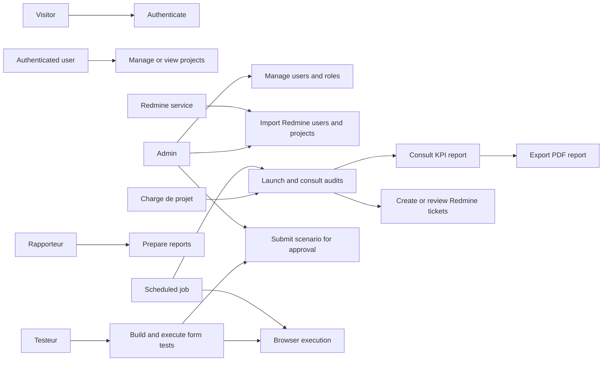

*Figure 5 - Reconstructed global use-case diagram.*

## 2.5 Product backlog

**Table 6 - Product backlog**

| ID | Epic | User story | Priority | Complexity | Sprint | Status |
| --- | --- | --- | --- | --- | --- | --- |
| PB-01 | Authentication | As an administrator, I want secure user accounts and roles, so that access is controlled. | High | `[TO ESTIMATE]` | Sprint 1 | Implemented |
| PB-02 | Project management | As a project manager, I want to manage client projects, so that audits are linked to websites. | High | `[TO ESTIMATE]` | Sprint 1 | Implemented |
| PB-03 | Audit launch | As a project manager, I want to launch audits, so that website quality can be measured. | High | `[TO ESTIMATE]` | Sprint 2 | Implemented |
| PB-04 | Crawler | As the system, I want to crawl website pages, so that evidence is collected. | High | `[TO ESTIMATE]` | Sprint 2 | Implemented |
| PB-05 | NLP enrichment | As the system, I want to enrich page text, so that content and RGPD KPIs are evaluated. | High | `[TO ESTIMATE]` | Sprint 2 | Implemented |
| PB-06 | Visual regression | As the system, I want screenshot comparison and UX KPIs, so that visual quality is evaluated. | Medium | `[TO ESTIMATE]` | Sprint 2 | Implemented |
| PB-07 | KPI normalisation | As a user, I want consistent KPI findings, so that reports are comparable. | High | `[TO ESTIMATE]` | Sprint 2 | Implemented |
| PB-08 | PDF reports | As a rapporteur, I want client-readable PDFs, so that audit results can be delivered. | High | `[TO ESTIMATE]` | Sprint 3 | Implemented |
| PB-09 | Redmine integration | As a project manager, I want Redmine data in SnapFlow, so that activity follow-up is centralised. | High | `[TO ESTIMATE]` | Sprint 3 | Implemented |
| PB-10 | Schedules | As a user, I want scheduled reports, so that monitoring can be recurring. | Medium | `[TO ESTIMATE]` | Sprint 3 | Implemented |
| PB-11 | Deployment | As an operator, I want Docker and k3s deployment assets, so that the platform can run consistently. | High | `[TO ESTIMATE]` | Sprint 4 | Implemented |
| PB-12 | Form workflows | As a tester, I want to build form scenarios visually, so that functional tests are reusable. | High | `[TO ESTIMATE]` | Sprint 5 | Partially implemented |
| PB-13 | Browser executor | As a tester, I want real browser execution, so that results are not simulated. | High | `[TO ESTIMATE]` | Sprint 5 | Implemented |
| PB-14 | Form schedules and campaigns | As a tester, I want scheduled and campaign form tests, so that behaviours can be compared. | Medium | `[TO ESTIMATE]` | Sprint 5 | Partially implemented |
| PB-15 | Quality drift | As an operator, I want quality and drift artefacts, so that KPI stability is monitored. | Medium | `[TO ESTIMATE]` | Sprint 6 | Implemented |

## 2.6 Global domain model

The system uses two main persistence domains:

- Supabase application data: users, roles, projects, assignments, audits, report schedules, notifications, Redmine cache and form workflow data;
- V3 scan database: scan pages, scan summaries, form fuzz results, KPI outputs, scan state and visual screenshots.

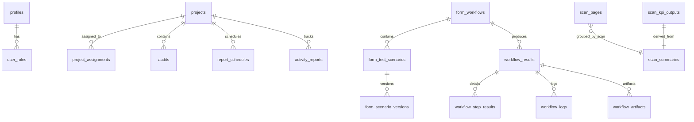

*Figure 9 - Simplified data ownership model.*

## 2.7 Working environment

### 2.7.1 Programming languages and frameworks

**Table 8 - Technology stack**

| Technology | Project role | Location | Reason for use | Limitations |
| --- | --- | --- | --- | --- |
| TypeScript | Frontend and Edge Functions | `Front-Snap` | Type-safe React UI and Supabase serverless functions | Requires strict contract tests to avoid runtime API drift |
| React 18 | SPA frontend | `Front-Snap/src` | Component-based UI for dashboards, reports and workflow builders | Client complexity grows with many modules |
| Vite | Frontend build tool | `Front-Snap` | Fast local development and build | Needs environment configuration discipline |
| Tailwind CSS and shadcn-style UI | UI system | `Front-Snap/src/components/ui` | Consistent dashboard components | Requires design governance |
| Supabase | Auth, database, Edge Functions | `Front-Snap/supabase` | Auth, RLS, migrations, serverless integration layer | Service-role secrets must be protected |
| Go | Scanner and CLI | `V3-Microservices/v3-scanner-go`, `v3-cli` | Efficient crawling and concurrency | Requires careful memory and network tuning |
| Python FastAPI | Aggregator, NLP, visual services, executor | `V3-Microservices` | Rapid API development and data processing | Dependency size can be high |
| PostgreSQL | Scan and application persistence | Supabase and V3 DB | JSONB evidence storage and relational integrity | Shared DB contracts require migration discipline |
| Playwright | Browser automation | browser pool, visual regression, form executor | Rendering, screenshots and real form execution | Browser workloads are resource intensive |
| Docker Compose | Local/preprod orchestration | `V3-Microservices/docker-compose.yml` | Reproducible multi-service execution | Secrets and volumes must be managed carefully |
| k3s/Kubernetes | Pre-production deployment | `k8s` | Lightweight cluster orchestration | Current manifests target single-node preprod |
| Redmine API | Project and ticket integration | Supabase Edge Functions | Existing issue tracking integration | Depends on Redmine API availability and keys |
| React-PDF | PDF export | `Front-Snap/src/components/pdf` | Client-ready audit and activity reports | PDF layout requires tests for long content |

### 2.7.2 Software tools

Confirmed tools and assets include Git, npm, Vitest, ESLint, Docker, Docker Compose, k3s, kubectl scripts, Supabase CLI configuration, PostgreSQL, Redmine API, Playwright, Prometheus ServiceMonitors and Grafana-compatible monitoring manifests.

### 2.7.3 Hardware and execution environment

The AGENTS reference mentions an OVH VPS with 12 vCores and 48 GB RAM for the intended deployment environment. This must be validated against the actual internship environment and hosting invoice or server documentation.

| Resource | Specification | Role |
| --- | --- | --- |
| Development workstation | `[LOCAL MACHINE SPECIFICATION TO ADD]` | Coding and local testing |
| Pre-production VPS | 12 vCores, 48 GB RAM `[TO CONFIRM]` | k3s pre-production execution |
| Database storage | PostgreSQL PVC 50Gi in k8s docs `[TO CONFIRM]` | Scan persistence |

## 2.8 Global architecture

### 2.8.1 Component map

**Table 7 - Component map**

| Component | Location | Purpose | Technology | Inputs | Outputs | Dependencies |
| --- | --- | --- | --- | --- | --- | --- |
| Frontend SPA | `Front-Snap/src` | User interface for projects, audits, reports, Redmine, schedules and forms | React, TypeScript | User actions, Supabase data, API responses | UI views, PDF exports | Supabase, Edge Functions, aggregator |
| Supabase Edge Functions | `Front-Snap/supabase/functions` | Server-side operations and integrations | Deno TypeScript | Authenticated requests | Database updates, API calls | Supabase, Redmine, audit API, AI providers |
| Supabase migrations | `Front-Snap/supabase/migrations` | Application schema and RLS | SQL | Schema migrations | Tables, policies, RPCs | Supabase PostgreSQL |
| Aggregator | `V3-Microservices/v3-aggregator` | API gateway, scan orchestration, KPI build | FastAPI Python | Scan requests, DB rows | Reports, KPI payloads | Scanner, NLP DB output, visual service |
| Scanner | `V3-Microservices/v3-scanner-go` | Crawl and technical evidence collection | Go | URL, domains, scan_id | scan_pages, scan_summaries | PostgreSQL, browser pool |
| NLP worker | `V3-Microservices/v3-nlp-worker` | Text, SEO, content and RGPD enrichment | Python | scan_pages HTML | nlp_results JSONB | PostgreSQL, optional NLP libraries |
| Visual regression | `V3-Microservices/v3-visual-regression` | Screenshots, compare, UX visual KPIs | FastAPI Python | URLs, screenshots | visual_screenshots, UX responses | Playwright, PostgreSQL |
| Browser pool | `V3-Microservices/v3-browser-pool` | Shared Playwright rendering API | FastAPI Python | Render, discovery and screenshot requests | HTML, screenshots, discovery data | Playwright |
| Form executor | `V3-Microservices/v3-form-executor` | Real browser execution of approved form scenarios | FastAPI Python, Playwright | Queued workflow executions | step results, logs, artefacts | Supabase DB, Playwright |
| V3 CLI | `V3-Microservices/v3-cli` | Developer CLI for scan, monitor, build, deploy | Go | CLI commands | Terminal output and service calls | Aggregator, Docker |
| k8s manifests | `k8s` | Pre-production deployment | YAML, Bash | Images and secrets | Namespaces, services, deployments | k3s, cert-manager, KEDA, Prometheus |

### 2.8.2 Physical architecture

The deployment assets target Docker Compose for local or pre-production runs and k3s for single-node pre-production. The k8s folder includes namespaces, PostgreSQL, PgBouncer, Redis, services, autoscaling, ingress, network policies, pod disruption budgets and monitoring manifests.

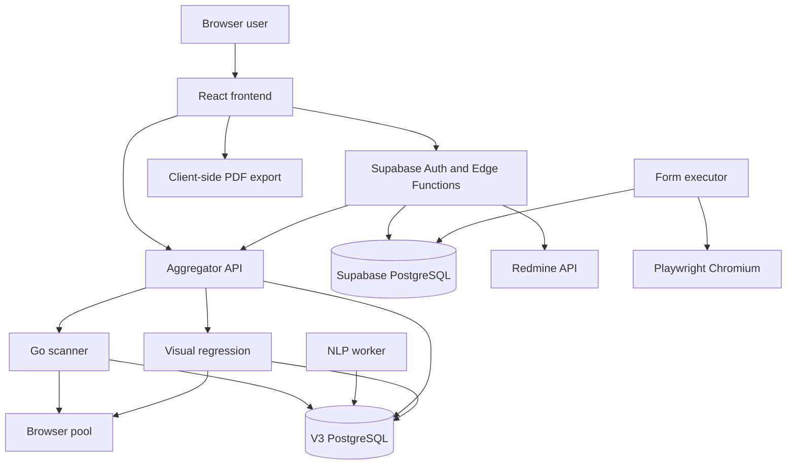

*Figure 6 - Global logical architecture.*

### 2.8.3 Data architecture

The V3 scan database stores crawl and KPI evidence. Supabase stores business and user-facing application data. This separation is important: Supabase controls users and project workflows, while the V3 database stores potentially heavy scan artefacts.

**Table 24 - Database tables and ownership**

| Data area | Main tables | Owner | Purpose |
| --- | --- | --- | --- |
| User and role data | profiles, user_roles, trial_usage | Supabase | Authenticated profiles and role assignment |
| Projects and audits | projects, project_assignments, audits | Supabase | Client sites and report metadata |
| Reporting | report_schedules, activity_reports, notifications | Supabase | Recurring reports and user notifications |
| Redmine cache | redmine_project_account_cache and related functions | Supabase | Project/user mapping and faster filtering |
| Form testing | form_workflows, form_test_scenarios, form_scenario_versions, workflow_results, workflow_step_results, workflow_logs, workflow_artifacts | Supabase | Workflow definitions and execution evidence |
| Scan pages | scan_pages | Scanner and NLP worker | Page HTML, metrics and nlp_results |
| Scan summaries | scan_summaries | Scanner | Domain-level technical summaries |
| Form fuzz results | form_fuzz_results | Scanner | Passive form-fuzzer evidence |
| KPI outputs | scan_kpi_outputs | Aggregator | Canonical KPI payloads and drift artefacts |
| Visual screenshots | visual_screenshots | Visual regression | Screenshot storage |

### 2.8.4 Security architecture

Security mechanisms confirmed in the repository include:

- Supabase authentication for frontend users;
- `user_roles` and a `has_role` security-definer function;
- row-level security policies for projects, audits, assignments, schedules, notifications and form workflow data;
- Edge Functions using service-role keys for privileged operations;
- CORS handling in Edge Functions;
- Redmine API key stored in server environment;
- form executor redaction for passwords, cookies, tokens and sensitive artefacts;
- Kubernetes secret templates and `.gitignore` for secret files;
- network policies in k8s manifests for selected services;
- HTTPS/TLS preparation through cert-manager ClusterIssuer and ingress manifests.

Production security review is still required before external deployment: `[SECURITY AUDIT RESULT TO ADD]`.

## 2.9 General sprint backlog and planning

The following sprint plan is reconstructed from commit history, migration timestamps, implementation plans and module boundaries. Exact sprint dates must be validated by the student.

**Table 9 - General sprint backlog**

| Sprint | Objective | Main features | Expected deliverable | Status |
| --- | --- | --- | --- | --- |
| Sprint 0 | Requirements and architecture foundation | Actors, backlog, technology selection, initial schemas | Project foundation | Reconstructed |
| Sprint 1 | Application foundation | Auth, roles, projects, audits metadata, dashboard layout | Usable frontend shell | Implemented |
| Sprint 2 | Audit engine | Scanner, NLP worker, visual regression, aggregator, KPI model | End-to-end scan pipeline | Implemented |
| Sprint 3 | Reporting and Redmine | Audit report UI, PDF export, Redmine integration, schedules | Client reporting workflow | Implemented |
| Sprint 4 | Deployment readiness | Docker Compose, browser pool, preprod config, k3s manifests | Deploy-ready stack | Implemented |
| Sprint 5 | Form Tester | Workflow builder, scenario versions, browser executor, campaigns and scheduling | Real form testing module | Partially implemented |
| Sprint 6 | Stabilisation | KPI quality drift, evidence cleaning, tests, UX refinements | Hardened final prototype | Implemented, with remaining gaps |

---

### Visual placeholder - Figure 10: Sprint planning view

**Visual type:** Gantt chart  
**What must be shown:** Official sprint dates, sprint objectives and main milestones.  
**Recommended source:** Internship planning document, Trello/Jira/GitHub project board or validated student timeline.  
**Purpose in the report:** Present the official project management schedule.  
**Suggested caption:** *Figure 10 - Official sprint planning for SnapFlow development.*

`[INSERT FIGURE 10 HERE AFTER DATES ARE CONFIRMED]`

---

## Chapter conclusion

Sprint 0 formalised the project's actors, requirements, backlog, architecture and environment. The next chapter begins the implementation narrative with the application foundation: authentication, roles, project management and the first user-facing modules.

# CHAPTER 3 - SPRINT 1: APPLICATION FOUNDATION, AUTHENTICATION AND PROJECT MANAGEMENT

## Introduction

Sprint 1 focused on establishing the application shell, identity model, project data and initial administrative workflows. These elements are necessary before an audit engine can be useful, because scan results must belong to projects and be visible only to authorised users.

## 3.1 Sprint objective

The sprint aimed to deliver a secured React application connected to Supabase, with roles, users, project management, project assignments and audit metadata. The expected increment was an authenticated dashboard where administrators and assigned project managers could manage or consult projects.

## 3.2 Sprint analysis

### 3.2.1 Sprint backlog

**Table 10 - Sprint 1 backlog**

| ID | User story | Tasks | Priority | Status |
| --- | --- | --- | --- | --- |
| S1-US1 | As a user, I want to sign in securely, so that I can access SnapFlow. | Build Auth page, Supabase client and AuthProvider | High | Implemented |
| S1-US2 | As an admin, I want to manage roles, so that permissions are controlled. | Create profiles, user_roles, has_role, admin pages | High | Implemented |
| S1-US3 | As an admin, I want to create projects and assign users, so that work is organised. | Create projects and project_assignments tables, AdminProjects page | High | Implemented |
| S1-US4 | As a project manager, I want to see assigned projects only, so that data access is limited. | Add RLS policies and assignment hooks | High | Implemented |
| S1-US5 | As a user, I want a consistent layout, so that navigation is clear. | Build AppLayout, AppSidebar, routes | Medium | Implemented |

### 3.2.2 Relevant actors

The sprint involved visitors, authenticated users, administrators and project managers.

### 3.2.3 Sprint use-case diagram

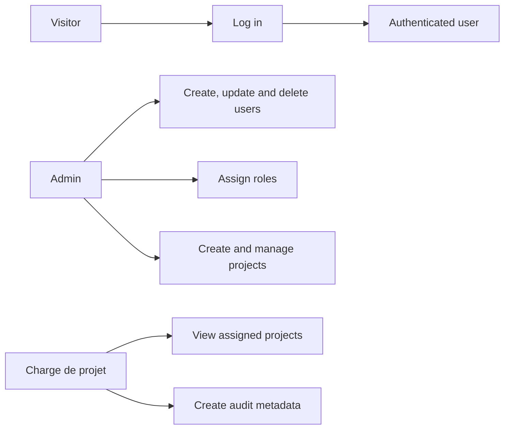

*Figure 11A - Sprint 1 authentication and project-management use cases.*

### 3.2.4 Textual use-case description

| Field | Description |
| --- | --- |
| Use-case name | Manage project access |
| Primary actor | Administrator |
| Preconditions | Administrator is authenticated and has `admin` role |
| Trigger | Administrator opens project or user management page |
| Main scenario | Create project, select assigned users, store assignments, RLS allows assigned users to read their projects |
| Alternative scenarios | Existing project is edited; assigned user is removed |
| Exceptions | Supabase request fails; user has no admin role |
| Postconditions | Project access is persisted and enforced by RLS |

### 3.2.5 Sequence diagram

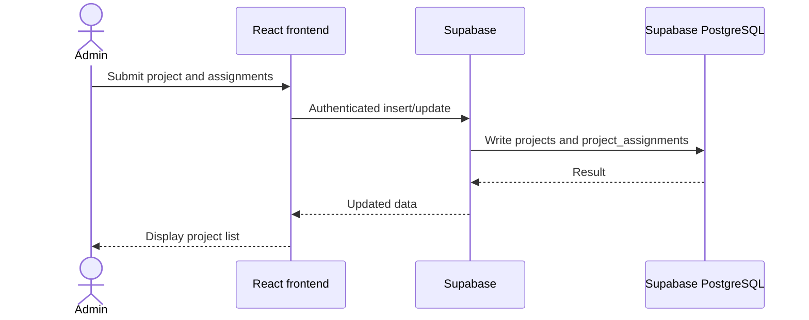

*Figure 11B - Project assignment sequence.*

## 3.3 Implementation

The frontend routing is defined in `Front-Snap/src/App.tsx`. It includes `/auth`, the main `/app` layout, project pages, report pages, schedules, notifications, assistant, workflows, form tester pages, users and audit report routes. The layout uses a central `AppLayout`, React Query, a theme provider and an authentication provider.

Supabase migrations create the foundational tables. The initial role enum contains `admin` and `charge_de_projet`, and later migration adds `testeur` and `rapporteur`. Profiles are created automatically through a trigger on new auth users. The `has_role` security-definer function centralises role checks.

Project management is backed by `projects` and `project_assignments`. Policies allow administrators to manage all projects, while assigned users can view their own assigned projects. Audit metadata is stored in `audits`, with statuses such as pending, generating, completed and error.

Admin pages and service functions implement role and user management. Edge Functions such as `create-user`, `delete-user` and `update-role` perform privileged user operations using server-side Supabase keys.

---

### Visual placeholder - Figure 11: Authentication and project dashboard interface

**Visual type:** Screenshot  
**What must be shown:** Login page, main dashboard or project administration page after authentication.  
**Recommended source:** Running `Front-Snap` application in the browser.  
**Purpose in the report:** Demonstrate that the user and project-management foundation is operational.  
**Suggested caption:** *Figure 11 - Authenticated SnapFlow project dashboard.*

`[INSERT FIGURE 11 HERE]`

---

## 3.4 Tests and validation

**Table 11 - Sprint 1 validation**

| Test ID | Scenario | Expected result | Actual result | Status |
| --- | --- | --- | --- | --- |
| S1-T1 | User role migration exists | `app_role` and `user_roles` are created | Confirmed in migrations | Passed by inspection |
| S1-T2 | Admin can manage user roles | Edge Functions restrict role operations to admin | Confirmed in code | Passed by inspection |
| S1-T3 | Assigned users access projects | RLS checks project_assignments | Confirmed in SQL | Passed by inspection |
| S1-T4 | Project URL handling avoids Redmine URL confusion | Normal project URL is separated from Redmine URL | Covered by `projectUrls.test.ts` | Test present |
| S1-T5 | Project sync does not scan all projects client-side | Dashboard sync-before-read flow | Covered by `projectSync.test.ts` | Test present |

## 3.5 Difficulties and changes

The repository shows later fixes around Redmine project URL handling and project synchronisation. This indicates that separating a client website URL from a Redmine project URL became an important correction. The implemented solution adds dedicated Redmine URL handling and tests to avoid launching audits against Redmine project pages.

`[SPRINT 1 PERSONAL DIFFICULTIES TO BE COMPLETED BY THE STUDENT]`

## 3.6 Sprint review

Sprint 1 delivered a functional application foundation: authentication, roles, projects, assignments, audit metadata and a routed frontend shell. Some role semantics, especially `testeur` and `rapporteur`, should be documented more precisely before final defence.

## 3.7 Sprint retrospective

What worked well was the use of Supabase for rapid authentication and RLS-based access control. What required more attention was the separation between business project URLs and Redmine URLs, because confusing both would directly affect audit execution.

## Chapter conclusion

This sprint established the application and data access foundation. The next sprint added the core technical value of SnapFlow: the website audit engine and canonical KPI pipeline.

# CHAPTER 4 - SPRINT 2: WEBSITE AUDIT ENGINE AND CANONICAL KPI PIPELINE

## Introduction

Sprint 2 implemented the central audit engine. It introduced the scanner, NLP worker, visual regression service, browser pool, aggregator and canonical KPI output contract.

## 4.1 Sprint objective

The sprint aimed to automate website crawling, page analysis, enrichment and KPI aggregation across the main audit axes. The increment was an end-to-end scan pipeline capable of producing structured evidence and report-ready KPI findings.

## 4.2 Sprint analysis

### 4.2.1 Sprint backlog

**Table 12 - Sprint 2 backlog**

| ID | User story | Tasks | Priority | Status |
| --- | --- | --- | --- | --- |
| S2-US1 | As a user, I want to launch a scan, so that a website can be analysed. | Aggregator `/scan`, scanner `/scan`, scan state | High | Implemented |
| S2-US2 | As the system, I want to crawl pages, so that page evidence is collected. | Go scanner with Colly and analyzers | High | Implemented |
| S2-US3 | As the system, I want rendered evidence, so that SPA pages are better handled. | Browser pool and headless sampling | High | Implemented |
| S2-US4 | As the system, I want semantic enrichment, so that content and RGPD are evaluated. | NLP worker with polling and SKIP LOCKED | High | Implemented |
| S2-US5 | As the system, I want visual quality checks, so that visual UX and VRT are available. | Screenshot, compare, UX-KPI endpoints | Medium | Implemented |
| S2-US6 | As a user, I want canonical KPIs, so that results are consistent. | KPI builder, normalisation and persistence | High | Implemented |

### 4.2.2 Relevant actors

The involved actors are authenticated users, the aggregator, scanner, NLP worker, browser pool, visual regression service and PostgreSQL.

### 4.2.3 Sprint use-case diagram

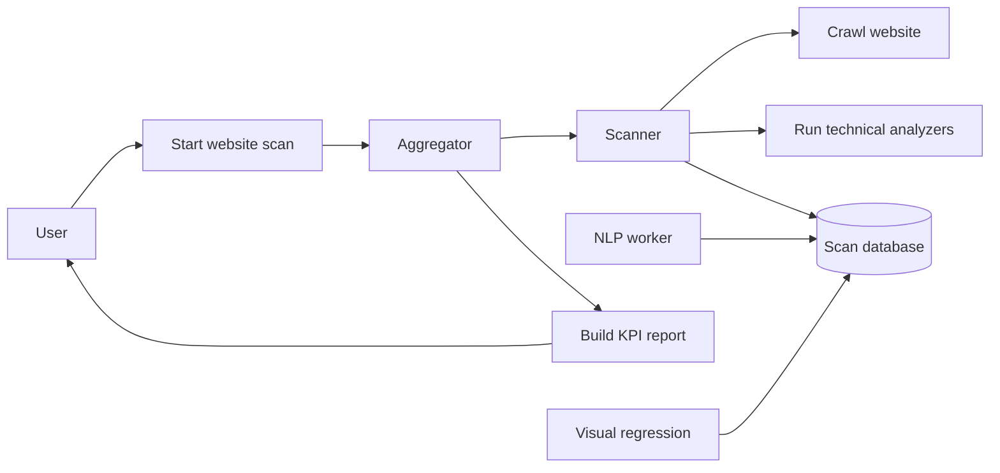

*Figure 12A - Sprint 2 audit engine use cases.*

### 4.2.4 Textual use-case description

| Field | Description |
| --- | --- |
| Use-case name | Launch website audit |
| Primary actor | Authenticated user through frontend or Edge Function |
| Preconditions | Project has a valid website URL; aggregator is reachable |
| Trigger | User clicks audit generation or scheduled job starts scan |
| Main scenario | Aggregator creates scan_id, calls scanner, scanner writes evidence, NLP enriches pages, aggregator builds KPI payload |
| Alternative scenarios | NLP timeout marks scan complete with partial flag; protected site triggers fallback paths |
| Exceptions | Scanner unreachable, DB unavailable, invalid URL |
| Postconditions | KPI endpoints expose scan result or failure status |

### 4.2.5 Sequence diagram

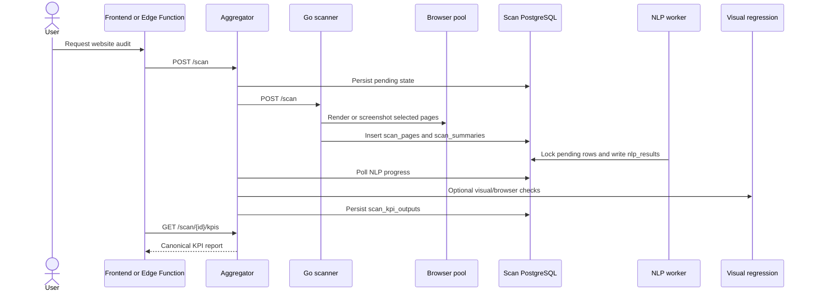

*Figure 7 - Audit scan lifecycle sequence.*

### 4.2.6 Sprint-specific design

The scan lifecycle uses explicit states.

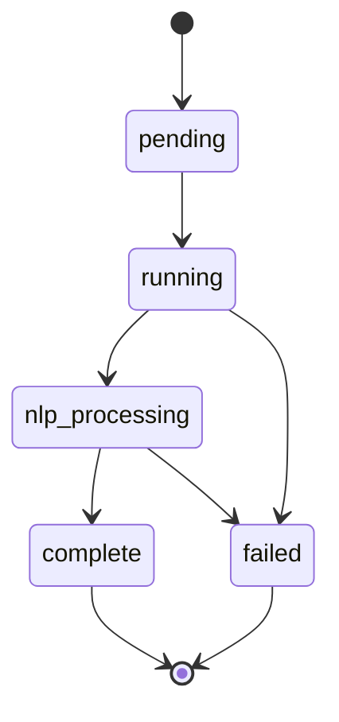

*Figure 8 - Scan state machine.*

The KPI build sequence is a separate design concern.

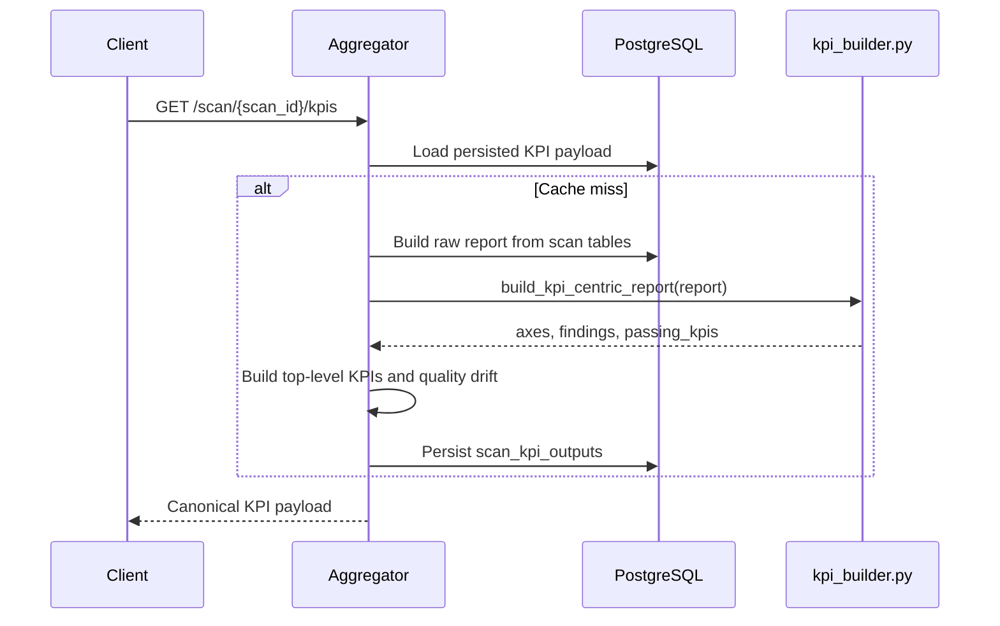

*Figure 13 - KPI payload generation sequence.*

## 4.3 Implementation

The scanner is implemented in Go. It exposes `/scan` and `/health`, accepts a scan ID, URL, domains, page limit and headless concurrency. Its pipeline includes pre-fetching SSL, sitemap, robots and homepage data, running domain analyzers, crawling with Colly, inserting page metrics, discovering and fuzzing forms, sampling pages for headless rendering, running mobile tests and persisting telemetry.

The scanner analyzers cover SEO, security, technology, performance, privacy, UX, functional checks, form browser discovery and form fuzzing. The database helper writes `scan_pages`, `scan_summaries`, `form_fuzz_results`, headless metrics and scan telemetry.

The NLP worker is a Python process that continuously polls `scan_pages` where `nlp_results IS NULL`. It uses `FOR UPDATE SKIP LOCKED`, which allows multiple workers to process rows without duplicate work. It extracts text, calculates readability, keywords, page type, audience segment, freshness, SEO KPIs, content KPIs and RGPD indicators. It also handles SPA shells by writing a `not_evaluated` result rather than producing false content failures.

The aggregator is a FastAPI service. It exposes health, scan, sync scan, status, result, recommendations, KPI, top KPI and KPI quality endpoints. It calls the scanner, polls NLP progress, handles partial completion, builds reports from database artefacts, invokes the KPI builder, computes top-level indicators, stores canonical KPI payloads and persists quality/drift artefacts.

The visual regression service exposes screenshot, compare, UX KPI and browser compatibility endpoints. It uses Playwright, SSIM, perceptual hash, optional LPIPS, OpenCV and zone-based comparison. The browser pool provides shared render, screenshot, batch screenshot, search test and rendered discovery endpoints.

The canonical KPI model is one of the most important design elements. The AGENTS reference describes a 9-field contract, while the current `kpi_builder.py` also contains a later V2 standardisation layer with additional metadata and client-facing fields. The report should therefore state that SnapFlow enforces a canonical KPI contract and has evolved toward richer V2 KPI objects while preserving compatibility with earlier fields.

## 4.4 Tests and validation

**Table 13 - Sprint 2 validation**

| Test ID | Scenario | Expected result | Actual result | Status |
| --- | --- | --- | --- | --- |
| S2-T1 | Scanner handler and helpers | Scan pipeline compiles and tested units pass | Go test files exist for scanner and analyzers | Test present |
| S2-T2 | NLP date and SEO/RGPD enrichment | NLP functions produce structured results | `test_phase_l.py`, `test_phase_o.py`, schema tests exist | Test present |
| S2-T3 | KPI-centric report | Aggregator builds expected KPI axes | `test_kpi_centric_report.py` exists | Test present |
| S2-T4 | Recommendations classifier | Recommendations are generated from findings | classifier tests exist | Test present |
| S2-T5 | Visual comparison | Zone and image comparator behaviour is stable | visual regression tests exist | Test present |
| S2-T6 | Browser pool screenshot waits | Network idle and wait configuration behaves as expected | browser pool test exists | Test present |

Actual command outputs for the final report should be inserted after running the tests in the final delivery environment: `[TEST RUN RESULTS TO ADD]`.

## 4.5 Difficulties and changes

Confirmed technical challenges include:

| Difficulty | Cause | Impact | Applied solution | Outcome |
| --- | --- | --- | --- | --- |
| Protected or Cloudflare-like sites | Plain crawler can be blocked | 0-page scans or incomplete evidence | Pre-fetch fallback, rendered discovery and headless backfill | Partial resilience implemented |
| SPA shell content | Static HTML may lack useful text | False content/RGPD negatives | NLP marks non-hydrated shell as not evaluated | Better evidence integrity |
| NLP latency | Text processing can lag scanner | Delayed final reports | Aggregator completes with `nlp_partiel` when needed | Graceful degradation |
| KPI schema drift | Old and new KPI shapes evolved | Frontend mapping risk | Normalisation and tests in backend and frontend | More stable report contract |
| Browser workload cost | Rendering and screenshots are heavy | CPU/RAM pressure | Shared browser pool and bounded concurrency | Tunable performance |

## 4.6 Sprint review

Sprint 2 delivered the core audit engine. It supports crawling, static and rendered evidence, NLP enrichment, visual analysis, scan state, KPI building and persistence.

## 4.7 Sprint retrospective

The main lesson is that audit platforms must treat missing evidence as a first-class state. SnapFlow's use of `not_available`, partial flags, provenance fields and quality artefacts helps avoid misleading results.

## Chapter conclusion

This sprint transformed SnapFlow from an application shell into a real audit system. The next sprint focused on making the audit results usable for clients and project teams through reports, PDFs and Redmine integration.

# CHAPTER 5 - SPRINT 3: REPORTING, REDMINE INTEGRATION AND CLIENT-FACING AUDIT OUTPUTS

## Introduction

The third sprint transformed raw scan and KPI evidence into user-facing deliverables. It covered audit report views, mapping logic, PDF exports, Redmine integration, activity dashboards and scheduled report workflows.

## 5.1 Sprint objective

The objective was to provide readable audit results and operational follow-up. Target users included project managers, administrators, report writers and client-facing teams.

## 5.2 Sprint analysis

### 5.2.1 Sprint backlog

**Table 14 - Sprint 3 backlog**

| ID | User story | Tasks | Priority | Status |
| --- | --- | --- | --- | --- |
| S3-US1 | As a user, I want to view audit findings by axis, so that I understand site weaknesses. | AuditReport tabs and auditMapper | High | Implemented |
| S3-US2 | As a user, I want readable KPI cards, so that findings are actionable. | KpiCard, AxisDetailSheet, evidence dialogs | High | Implemented |
| S3-US3 | As a rapporteur, I want to export a PDF, so that reports can be shared. | React-PDF document, pages and theme picker | High | Implemented |
| S3-US4 | As a project manager, I want Redmine issues, so that activity is connected to delivery work. | fetch-redmine, Redmine services, activity dashboard | High | Implemented |
| S3-US5 | As a user, I want scheduled reports, so that monitoring is recurring. | report_schedules, execute-scheduled-reports | Medium | Implemented |
| S3-US6 | As a user, I want notifications, so that I know when important events occur. | notifications table and pages | Medium | Implemented |

### 5.2.2 Relevant actors

The sprint involved administrators, project managers, report writers, Redmine, scheduled jobs and clients consuming exported reports.

### 5.2.3 Sprint use-case diagram

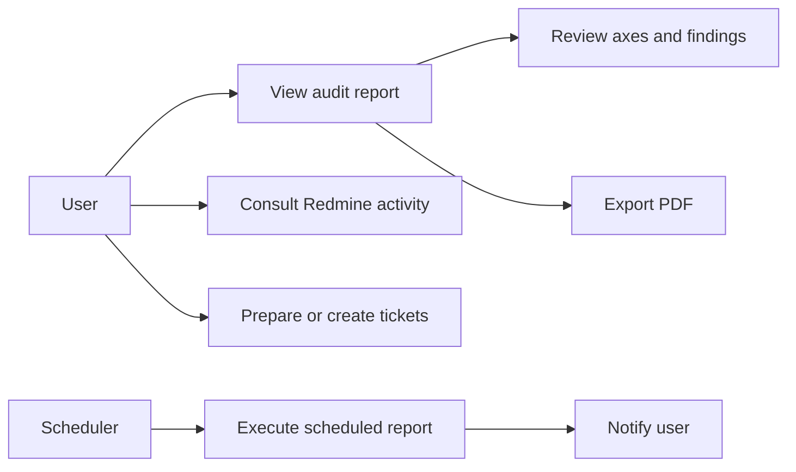

*Figure 14A - Sprint 3 reporting and Redmine use cases.*

### 5.2.4 Textual use-case description

| Field | Description |
| --- | --- |
| Use-case name | Export audit PDF |
| Primary actor | Project manager or rapporteur |
| Preconditions | Audit report data exists and has been mapped to frontend format |
| Trigger | User chooses PDF export from report interface |
| Main scenario | Frontend resolves logo, maps report data, selects theme, renders React-PDF document and downloads blob |
| Alternative scenarios | Stored logo is used as fallback; long evidence lists are limited |
| Exceptions | Logo fetch fails; report has no visible axes |
| Postconditions | A client-readable PDF report is generated |

### 5.2.5 Sequence diagram

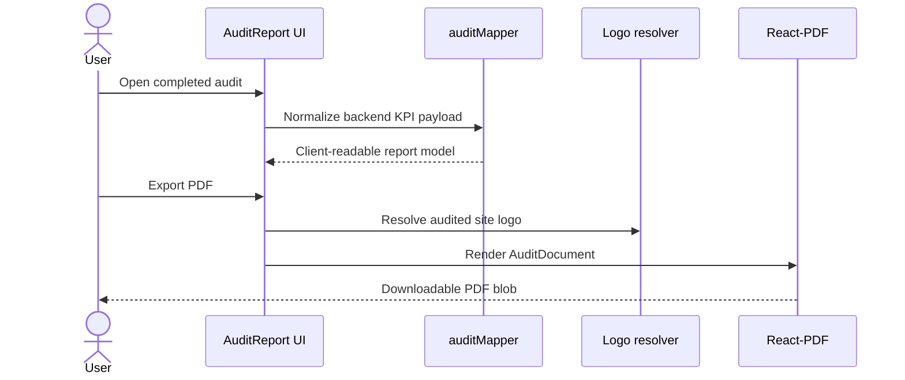

*Figure 14B - PDF export sequence.*

## 5.3 Implementation

The audit report UI is centred around `AuditReport.tsx` and audit-specific tab components: summary, details, overview, table, simulation and tickets. `auditMapper.ts` is critical because it converts backend KPI payloads into client-readable axes, findings, actions and evidence. The test suite around `auditMapper.axis.test.ts` confirms attention to schema compatibility, evidence cleaning and hiding backend non-tested KPI states from client-visible output.

PDF generation is implemented with `@react-pdf/renderer`. The PDF document includes cover page, table of contents, executive summary, KPI grid, axis pages, recommendations, roadmap, conclusion, annexes and back cover. Theme files define report styles, and tests verify that raw JSON evidence is not exposed directly.

Redmine integration is implemented in Supabase Edge Functions and frontend services. The `fetch-redmine` function communicates with `https://maintenance.medianet.tn`, fetches projects, users, issues, trackers, statuses, documents and creates issues. Additional functions and tests handle Redmine login, project account cache and assignment synchronisation. The ActivityReport and ActivityDashboard components present ticket lifecycle metrics and PDF activity exports.

Scheduled reports are implemented through migrations, `ReportSchedules`, `execute-scheduled-reports`, polling and notification logic. Report schedules can launch audit or activity reports according to configured timing.

---

### Visual placeholder - Figure 12: Audit report dashboard interface

**Visual type:** Screenshot  
**What must be shown:** Completed audit report with axis cards, KPI findings and score overview.  
**Recommended source:** `/audit/:id` route after a completed scan.  
**Purpose in the report:** Show the client-facing audit analysis interface.  
**Suggested caption:** *Figure 12 - SnapFlow audit report dashboard organised by audit axes.*

`[INSERT FIGURE 12 HERE]`

---

### Visual placeholder - Figure 14: PDF report export interface

**Visual type:** Screenshot  
**What must be shown:** PDF export modal or generated PDF cover and summary pages.  
**Recommended source:** Audit report PDF export flow.  
**Purpose in the report:** Demonstrate that audit results can be delivered as a formal document.  
**Suggested caption:** *Figure 14 - PDF export workflow for client audit reports.*

`[INSERT FIGURE 14 HERE]`

---

### Visual placeholder - Figure 15: Redmine activity dashboard

**Visual type:** Screenshot  
**What must be shown:** Activity dashboard with Redmine issue status, overdue items or pending validation.  
**Recommended source:** `/app/projects/:id/activity` route.  
**Purpose in the report:** Demonstrate integration between audit/reporting and issue tracking.  
**Suggested caption:** *Figure 15 - Redmine activity dashboard integrated in SnapFlow.*

`[INSERT FIGURE 15 HERE]`

---

## 5.4 Tests and validation

**Table 15 - Sprint 3 validation**

| Test ID | Scenario | Expected result | Actual result | Status |
| --- | --- | --- | --- | --- |
| S3-T1 | Backend KPI payload maps to frontend axes | Correct buckets and readable findings | Covered by auditMapper tests | Test present |
| S3-T2 | Non-tested findings hidden from client report | No false client-visible defects | Covered by auditMapper and PDF tests | Test present |
| S3-T3 | PDF evidence is readable | Raw JSON-looking evidence replaced or summarised | Covered by auditPdfData tests | Test present |
| S3-T4 | Logo resolution uses audited site | Avoid Redmine URL and CORS issues | Covered by logo tests | Test present |
| S3-T5 | Redmine project sync maps account projects | Assignments created safely | Covered by projectSync tests | Test present |
| S3-T6 | Activity PDF contract | Period appears correctly | Covered by activityPdfContract test | Test present |

## 5.5 Difficulties and changes

The commit history shows multiple improvements around Redmine pagination, deduplication, logo handling, PDF structure, KPI definitions and frontend evidence cleaning. A key difficulty was transforming raw backend evidence into client-safe wording without losing technical accuracy.

## 5.6 Sprint review

Sprint 3 delivered report views, PDF export, Redmine data integration, activity reporting, scheduling and notification features. It also improved the bridge between technical evidence and business-readable reports.

## 5.7 Sprint retrospective

The sprint shows the importance of contract tests around presentation logic. Without tests, a small backend schema change could expose raw evidence or hide important findings. The implemented frontend tests reduce this risk.

## Chapter conclusion

The third sprint made SnapFlow useful as a reporting and operational follow-up tool. The next sprint focused on deployment, browser infrastructure and pre-production readiness.

# CHAPTER 6 - SPRINT 4: DEPLOYMENT, BROWSER INFRASTRUCTURE AND OPERATIONAL READINESS

## Introduction

Sprint 4 prepared SnapFlow for reliable execution outside a single developer process. It covered Docker Compose orchestration, browser pool tuning, optional Obscura integration, k3s manifests, scripts, monitoring and deployment assumptions.

## 6.1 Sprint objective

The sprint aimed to make the platform reproducible and deployable in local pre-production and single-node k3s environments.

## 6.2 Sprint analysis

### 6.2.1 Sprint backlog

**Table 16 - Sprint 4 backlog**

| ID | User story | Tasks | Priority | Status |
| --- | --- | --- | --- | --- |
| S4-US1 | As a developer, I want to run all services locally, so that integration testing is possible. | Docker Compose and run scripts | High | Implemented |
| S4-US2 | As an operator, I want a shared browser pool, so that rendering is controlled. | v3-browser-pool service and endpoints | High | Implemented |
| S4-US3 | As an operator, I want preprod deployment files, so that services can run on k3s. | k8s manifests and scripts | High | Implemented |
| S4-US4 | As an operator, I want monitoring manifests, so that service health can be observed. | ServiceMonitors and PrometheusRules | Medium | Implemented as manifests |
| S4-US5 | As an operator, I want smoke tests, so that deployment can be validated. | k8s smoke-test script | Medium | Implemented |

### 6.2.2 Relevant actors

The involved actors are developer, system operator, k3s cluster, Docker runtime and microservices.

### 6.2.3 Deployment diagram

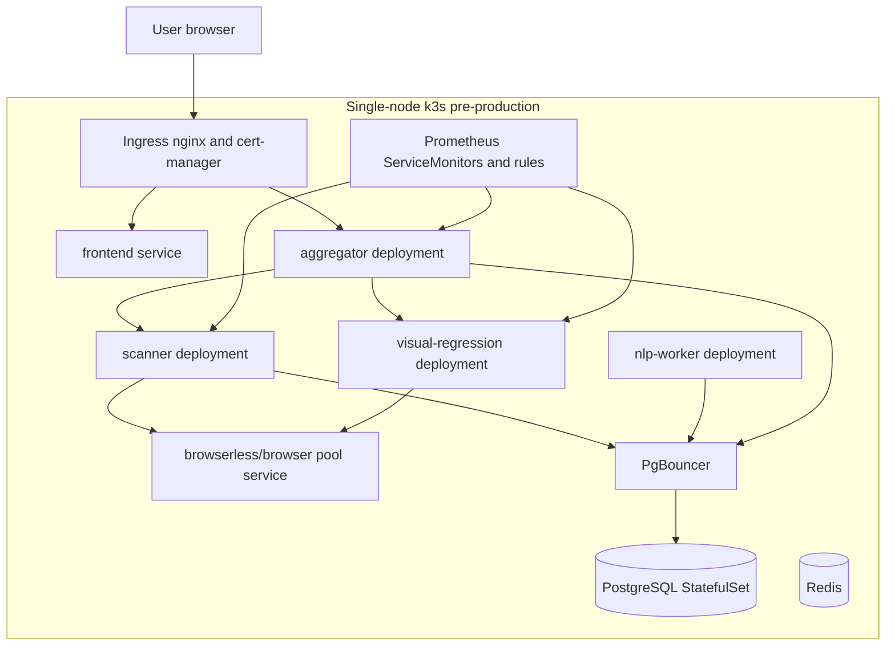

*Figure 16 - k3s deployment architecture.*

## 6.3 Implementation

The Docker Compose file orchestrates PostgreSQL, scanner, NLP worker, aggregator, browser pool, visual regression, optional form executor and optional Obscura service. The scanner is configured with browser pool URL, timeouts, rendered discovery limits, port scan controls and headless concurrency. The form executor is opt-in through a compose profile.

The runbook documents base image rebuild rules, local/preprod execution, Obscura toggling, logs, browser pool capacity, Docker cleanup and troubleshooting. The k8s README documents the single-node k3s scope, directory layout, run order, manual substitutions, validation checklist and known gaps.

The k8s manifests include:

- bootstrap namespaces;
- PostgreSQL, PgBouncer and Redis infrastructure;
- services for aggregator, scanner, NLP worker, visual regression, browserless and frontend;
- HPA and KEDA manifests;
- ingress, cert-manager and network policies;
- pod disruption budgets;
- ServiceMonitors and Prometheus rules;
- secret templates.

The k8s README explicitly states that Redis queue-based scaling is not wired into the current V3 code path and that CPU-triggered KEDA files are used to stay deployable. This is important because it prevents overstating queue-driven architecture.

---

### Visual placeholder - Figure 17: Grafana or monitoring dashboard

**Visual type:** Screenshot  
**What must be shown:** Prometheus/Grafana dashboard or Kubernetes monitoring view for SnapFlow services.  
**Recommended source:** Grafana, Prometheus, Kubernetes dashboard or command-line monitoring output.  
**Purpose in the report:** Demonstrate operational observability after deployment.  
**Suggested caption:** *Figure 17 - Monitoring dashboard for SnapFlow pre-production services.*

`[INSERT FIGURE 17 HERE]`

---

## 6.4 Tests and validation

**Table 17 - Sprint 4 validation**

| Test ID | Scenario | Expected result | Actual result | Status |
| --- | --- | --- | --- | --- |
| S4-T1 | Docker Compose starts core services | Services become healthy | `[RESULT TO ADD]` | To confirm |
| S4-T2 | Browser pool health | `/health` returns pool status | Test and runbook exist | To confirm |
| S4-T3 | k8s dry run | Manifests apply or pass dry-run | Validation checklist exists | To confirm |
| S4-T4 | Smoke test | Health and DB paths validate | `06-smoke-test.sh` exists | To confirm |
| S4-T5 | Browser pool screenshot waits | Wait modes behave as expected | browser pool test present | Test present |

## 6.5 Difficulties and changes

Deployment difficulties shown in the repository include Docker BuildKit cache issues, base image rebuild cost, local vs server environment differences, browser concurrency tuning and placeholder secrets. The runbook documents mitigation procedures such as rebuilding base images only when necessary and using explicit local/preprod launch modes.

## 6.6 Sprint review

Sprint 4 delivered deployment assets and operational documentation. The platform can be orchestrated locally with Docker Compose and has a deploy-ready k3s structure requiring environment-specific secrets and hostnames.

## 6.7 Sprint retrospective

The main lesson is that browser-based audit systems require operational tuning. Browser pools, headless concurrency, screenshot waits and container resource limits must be treated as deployment parameters, not hard-coded assumptions.

## Chapter conclusion

Sprint 4 prepared SnapFlow for realistic execution environments. The next sprint added a second major product capability: visual form workflow testing with real browser execution.

# CHAPTER 7 - SPRINT 5: FORM TESTER WORKFLOW AUTOMATION AND BROWSER EXECUTION

## Introduction

Sprint 5 introduced the Form Tester module. This module goes beyond audit reporting by allowing users to detect forms, build test workflows, create scenarios, approve versions and execute them in a controlled browser worker.

## 7.1 Sprint objective

The sprint aimed to replace unreliable or ambiguous simulated form testing with evidence-backed, real browser execution. It also aimed to provide a visual workflow builder inspired by node-based automation tools.

## 7.2 Sprint analysis

### 7.2.1 Sprint backlog

**Table 18 - Sprint 5 backlog**

| ID | User story | Tasks | Priority | Status |
| --- | --- | --- | --- | --- |
| S5-US1 | As a tester, I want to detect forms, so that workflows start from real DOM evidence. | form-workflows-detect | High | Implemented |
| S5-US2 | As a tester, I want multiple scenarios, so that nominal and edge cases are separated. | form_test_scenarios migration | High | Implemented |
| S5-US3 | As an admin, I want scenario approval, so that only reviewed versions execute. | form_scenario_versions and approve function | High | Implemented |
| S5-US4 | As a tester, I want a visual builder, so that scenarios are editable without JSON. | ReactFlow builder components | High | Partially implemented |
| S5-US5 | As a tester, I want real browser execution, so that results are trustworthy. | v3-form-executor | High | Implemented |
| S5-US6 | As a tester, I want logs and artefacts, so that failures are diagnosable. | workflow_step_results, logs, artefacts | High | Implemented |
| S5-US7 | As a tester, I want AI case generation, so that cases are faster to prepare. | Gemini-backed and heuristic suggestions | Medium | Partially implemented |
| S5-US8 | As a tester, I want scheduled executions and campaigns, so that behaviours can be compared. | schedules and campaign migrations | Medium | Partially implemented |

### 7.2.2 Relevant actors

The involved actors are tester, administrator, form executor worker, Supabase Edge Functions, target website and scheduled dispatcher.

### 7.2.3 Sprint use-case diagram

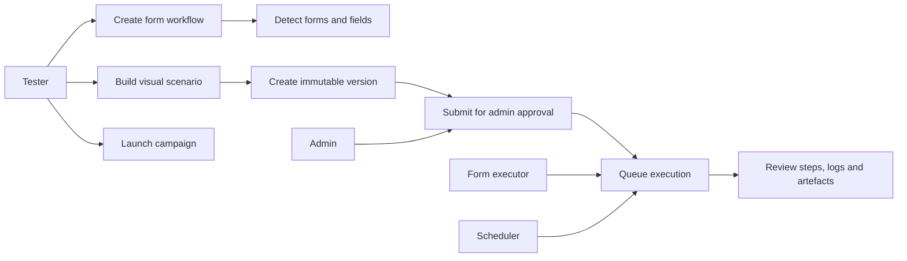

*Figure 18A - Sprint 5 Form Tester use cases.*

### 7.2.4 Textual use-case description

| Field | Description |
| --- | --- |
| Use-case name | Execute approved form scenario |
| Primary actor | Tester |
| Preconditions | Workflow exists, scenario version is approved, executor is running |
| Trigger | Tester launches execution or schedule dispatches execution |
| Main scenario | Edge Function creates queued execution, executor atomically claims it, runs Playwright nodes, stores step results, logs and artefacts |
| Alternative scenarios | CAPTCHA or OTP is detected and marked blocked; execution is stopped or retried |
| Exceptions | Executor failure produces `error`; business assertion failure produces `failed` |
| Postconditions | User can inspect evidence without confusing simulation with real execution |

### 7.2.5 Sequence diagram

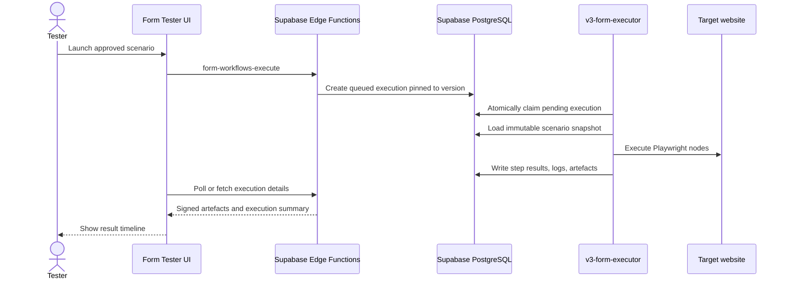

*Figure 18B - Form Tester browser execution sequence.*

### 7.2.6 Sprint-specific design

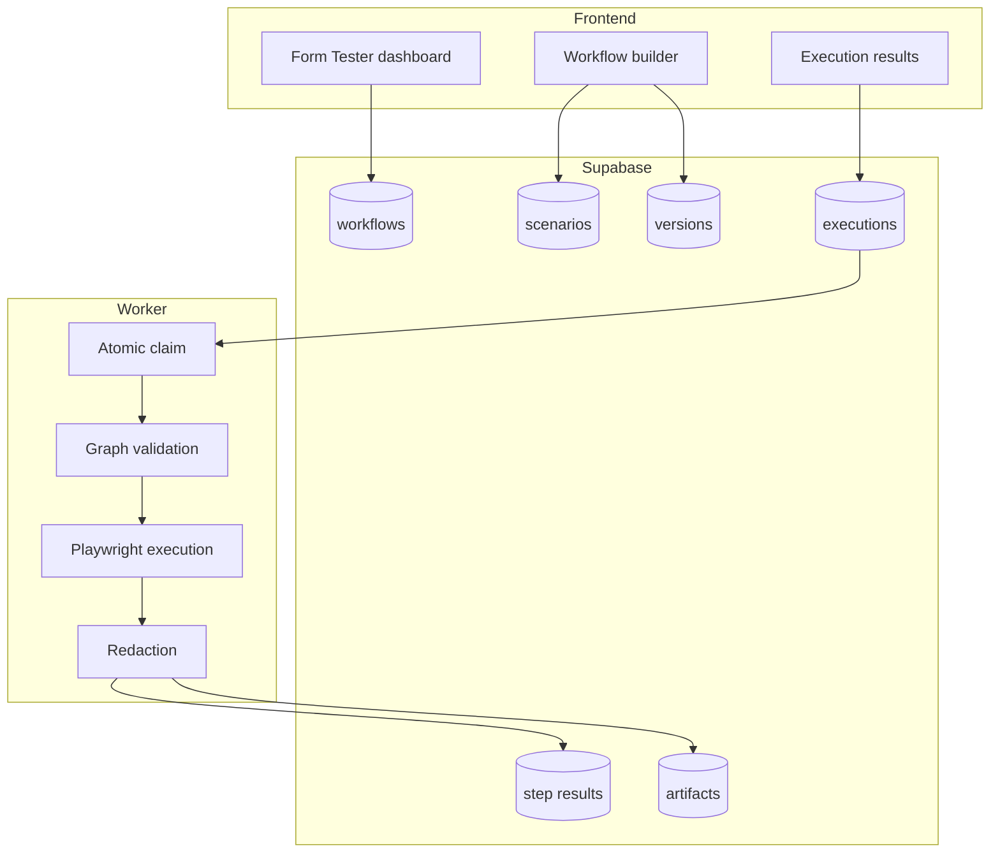

*Figure 18C - Form Tester architecture.*

## 7.3 Implementation

The Form Tester frontend includes pages for workflows, builder, campaign plan and results. Builder components include a workflow canvas, shell, schedule panel, scenario sidebar, node palette, node inspector, live execution panel and AI assistant panel. The project uses `@xyflow/react` for node-based workflow editing.

Supabase migrations create scenarios, immutable versions, execution queues, step results, logs, artefacts, commands, schedules, campaigns, captcha fields and business campaign logic. Important design principles include version checksums, approval statuses, pinned scheduled versions and redaction of sensitive data.

Edge Functions implement workflow CRUD, detection, approval, execution, execution control, suggestions, schedules, AI status and campaigns. AI-related functions use Gemini when configured and fall back to deterministic heuristics where implemented. The functions use shared helpers in `_shared/formTester.ts`.

The `v3-form-executor` is a Python FastAPI/Playwright service. Its README states that it claims executions whose source is `pending_executor`, loads approved immutable scenario snapshots, runs each execution in an isolated Chromium context, persists step results, logs, assertions, network summaries and redacted artefacts, stops on CAPTCHA or OTP without bypassing unsupported challenges, and separates business failures from executor errors.

The worker has node handlers for navigation, fill, select, check, upload, click, submit, wait, condition, assert, screenshot and response inspection. Tests cover business verdict, challenge handling, artefact storage, semantic observation, executor contracts, browser execution and worker behaviour.

---

### Visual placeholder - Figure 18: Form Tester workflow builder

**Visual type:** Screenshot  
**What must be shown:** The three-panel workflow builder with scenario list, node canvas, node palette or inspector.  
**Recommended source:** `/app/workflows/form-tester/:id` route.  
**Purpose in the report:** Demonstrate the visual workflow authoring feature.  
**Suggested caption:** *Figure 18 - Form Tester visual workflow builder.*

`[INSERT FIGURE 18 HERE]`

---

### Visual placeholder - Figure 19: Form Tester execution results

**Visual type:** Screenshot  
**What must be shown:** Execution timeline with status, logs, screenshots or artefact previews.  
**Recommended source:** `/app/workflows/form-tester/:id/results` route.  
**Purpose in the report:** Demonstrate evidence-backed form execution results.  
**Suggested caption:** *Figure 19 - Form Tester execution result with logs and artefacts.*

`[INSERT FIGURE 19 HERE]`

---

## 7.4 Tests and validation

**Table 19 - Sprint 5 validation**

| Test ID | Scenario | Expected result | Actual result | Status |
| --- | --- | --- | --- | --- |
| S5-T1 | Scenario and version contract | Versions are immutable and executable when approved | Covered by scenario/version tests | Test present |
| S5-T2 | Execution source contract | Execution is queued, not falsely simulated | Covered by execution source tests | Test present |
| S5-T3 | Builder contract | Nodes, branches and inspector render correctly | Covered by builder tests | Test present |
| S5-T4 | Executor contract | Browser worker executes node graph safely | Covered by executor tests | Test present |
| S5-T5 | CAPTCHA or OTP | Execution returns blocked, not bypassed | Covered by executor tests | Test present |
| S5-T6 | Redaction | Passwords, cookies and tokens are masked | Covered by tests | Test present |
| S5-T7 | Campaign verdicts | Expected validation rejection is not treated as failure | Covered by business campaign tests | Test present |
| S5-T8 | Scheduling | Approved version is pinned and scheduled | Covered by scheduling contract tests | Test present |

The Form Tester plan records several local checkpoints, including passed frontend, executor and browser-pool target tests. These checkpoint counts should be verified by rerunning the suites before final submission: `[FINAL FORM TESTER TEST OUTPUT TO ADD]`.

## 7.5 Difficulties and changes

| Difficulty | Cause | Impact | Applied solution | Outcome |
| --- | --- | --- | --- | --- |
| Simulation could be confused with real execution | Earlier workflow execution was not backed by a durable browser worker | False confidence in form results | Introduced `simulated_legacy`, `pending_executor` and real executor | Evidence integrity improved |
| Workflow versions could change after approval | Mutable scenarios are unsafe for audit evidence | Results would not match reviewed scenario | Immutable scenario versions with checksums | Traceability improved |
| CAPTCHA/OTP cannot be legally or reliably bypassed | External challenge systems | Could block tests | Mark blocked and record evidence | Safer behaviour |
| Browser artefacts may contain sensitive data | Form inputs can include personal data | Privacy risk | Redaction before persistence | Reduced exposure |
| AI suggestions can hallucinate fields | LLM may produce invalid selectors | Invalid scenarios | Server-side validation and deterministic fallback | Safer AI assistance |

## 7.6 Sprint review

Sprint 5 delivered a significant new module. It includes workflow data models, UI builder, AI-assisted case generation, execution queues, a real Playwright executor, logs, artefacts, scheduling and campaigns. Some UI and hardening tasks remain incomplete according to the implementation plan.

## 7.7 Sprint retrospective

The major lesson is that QA automation must preserve provenance. A failed real browser execution is more valuable than a fake success, because it gives users truthful evidence and a correction path.

## Chapter conclusion

This sprint expanded SnapFlow from audit reporting into digital workflow testing. The next sprint consolidated quality, drift monitoring, evidence cleaning and final stabilisation.

# CHAPTER 8 - SPRINT 6: STABILISATION, QUALITY MONITORING AND FINAL CONSOLIDATION

## Introduction

Sprint 6 focused on hardening, evidence quality and final consistency. It included KPI migration work, quality/drift artefacts, mobile performance handling, PDF and UI refinements, Redmine pagination and final report-readiness improvements.

## 8.1 Sprint objective

The objective was to improve reliability, remove misleading states, enrich KPI evidence and make outputs more stable for frontend consumption and client reporting.

## 8.2 Sprint analysis

### 8.2.1 Sprint backlog

**Table 20 - Sprint 6 backlog**

| ID | User story | Tasks | Priority | Status |
| --- | --- | --- | --- | --- |
| S6-US1 | As a user, I want KPI states to be clear, so that findings are not ambiguous. | Remove "A verifier" style status, normalise states | High | Implemented |
| S6-US2 | As an operator, I want persisted quality drift, so that scan quality can be monitored. | quality_drift_artifact | High | Implemented |
| S6-US3 | As a user, I want mobile performance evidence handled safely, so that missing metrics are not fake zeroes. | Audit mapper and KPI builder fixes | High | Implemented |
| S6-US4 | As a user, I want Redmine issue fetching to handle large projects. | Pagination and deduplication | Medium | Implemented |
| S6-US5 | As a user, I want logo handling to be reliable. | Manual and detected logo fixes | Medium | Implemented |
| S6-US6 | As a developer, I want regression tests, so that schema changes are safer. | Frontend and backend test additions | High | Implemented |

### 8.2.2 Relevant actors

The sprint involved users consuming reports, operators monitoring quality, frontend mapping code, backend KPI builders and Redmine integration paths.

### 8.2.3 Sprint use-case diagram

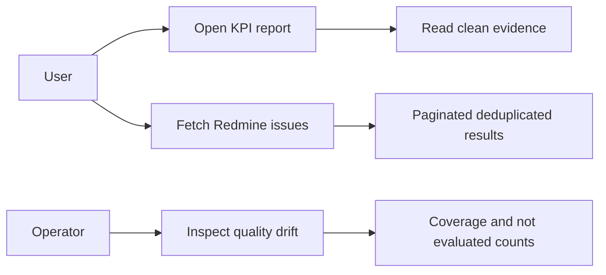

*Figure 20A - Sprint 6 stabilisation use cases.*

## 8.3 Implementation

The aggregator's quality drift logic computes coverage, pass/warning/failure rates, critical rates, composite quality score and trend deltas compared with previous scans for the same URL. The formula penalises failures, warnings, missing coverage and critical findings, then clamps the score between 0 and 100. Results are stored in `scan_kpi_outputs`.

The frontend mapper includes extensive logic to hide backend-only non-tested states, avoid raw JSON evidence, route AI-related KPIs, format structured evidence and prevent mobile metric failures from becoming fake zero scores. Tests cover these behaviours.

Redmine integration was improved with pagination and deduplication so that larger project histories can be fetched more reliably. Logo detection and PDF fallback handling were also refined, reducing report export errors.

## 8.4 Tests and validation

**Table 21 - Sprint 6 validation**

| Test ID | Scenario | Expected result | Actual result | Status |
| --- | --- | --- | --- | --- |
| S6-T1 | KPI quality drift endpoint | Returns persisted quality artefact | Endpoint exists | To confirm with run |
| S6-T2 | Mobile failed metrics | Hidden from client findings without fake zero | Covered by auditMapper tests | Test present |
| S6-T3 | Evidence cleaning | Dangerous payloads and raw JSON hidden | Covered by auditMapper/PDF tests | Test present |
| S6-T4 | Redmine pagination | Issues fetched with pagination and deduplication | Code and commits confirm | To confirm with Redmine |
| S6-T5 | Logo detection | Stored logo is fallback and CORS is avoided | Logo tests present | Test present |

## 8.5 Difficulties and changes

The key difficulty was not adding more checks, but making the evidence credible. The codebase shows repeated work on status handling, not-evaluated states, mobile performance, blocked recovery and report readability.

## 8.6 Sprint review

Sprint 6 consolidated the project by improving quality monitoring and reducing misleading outputs. It prepared the platform for final demonstration and future production hardening.

## 8.7 Sprint retrospective

The sprint reinforces an important engineering principle: audit software must be conservative in its claims. When evidence is missing or uncertain, the system must say so explicitly.

## Chapter conclusion

This final implementation sprint stabilised KPI outputs, reporting and integrations. The next chapter summarises global testing, validation and objective achievement.

# CHAPTER 9 - GLOBAL TESTING, VALIDATION AND RESULTS

## Introduction

This chapter consolidates testing evidence across the repository. It distinguishes confirmed test assets from test results that must be rerun and documented before final submission.

## 9.1 Testing strategy

The project contains several types of tests:

- frontend unit and contract tests with Vitest;
- React component tests with Testing Library and jsdom;
- backend Python tests for aggregator, NLP worker, visual regression, browser pool and form executor;
- Go tests for scanner analyzers, browser pool client, database helpers and CLI components;
- migration and contract tests for Form Tester phases;
- deployment smoke-test scripts for k8s;
- manual runbooks and batch audit results.

The tests are not organised under a single CI workflow in the repository. Therefore, the final defence should include a manual or CI-generated test run summary.

---

### Visual placeholder - Figure 20: Testing and validation evidence

**Visual type:** Screenshot or chart  
**What must be shown:** Consolidated test evidence such as terminal output for frontend, backend and Go test suites, or a generated coverage/test summary table.  
**Recommended source:** Final local or CI test run before report submission.  
**Purpose in the report:** Demonstrate that the implemented modules were validated with repeatable test commands.  
**Suggested caption:** *Figure 20 - Consolidated testing and validation evidence for SnapFlow.*

`[INSERT FIGURE 20 HERE]`

---

## 9.2 Functional validation

Functional validation is supported by:

- route coverage in the React application;
- Supabase migrations for roles, projects, audits, schedules and form workflows;
- Edge Functions for audit generation, polling, Redmine, forms, AI and schedules;
- scanner and aggregator endpoints;
- form executor tests and README instructions.

## 9.3 Integration validation

Integration points include:

- frontend to Supabase;
- frontend to Edge Functions;
- Edge Functions to aggregator;
- aggregator to scanner;
- scanner to PostgreSQL and browser pool;
- NLP worker to PostgreSQL;
- aggregator to visual regression;
- Edge Functions to Redmine;
- form executor to Supabase and target websites.

The repository provides Docker Compose and runbooks for integrated execution. Actual integrated test results must be inserted: `[INTEGRATION TEST RESULTS TO ADD]`.

## 9.4 Security validation

Confirmed security controls include Supabase authentication, RLS policies, admin checks in Edge Functions, server-side secrets, redaction, k8s secret templates and network policies. Security validation still requires:

- review of Edge Functions with `verify_jwt = false`, because most functions perform their own auth checks but this must be audited;
- verification that no committed secret values exist;
- penetration or abuse testing for scanner and form executor safety;
- review of port scanning configuration before production use.

`[SECURITY VALIDATION REPORT TO ADD]`

## 9.5 Deployment validation

Deployment validation assets exist in `k8s/scripts` and Docker Compose. The run order includes bootstrap, k3s install, operators, secrets, image build/import, manifest apply, migrations and smoke tests.

`[DEPLOYMENT SCREENSHOT OR COMMAND OUTPUT TO ADD]`

## 9.6 Performance evaluation

Performance tuning exists through scanner parallelism, headless sample ratio, browser pool concurrency, NLP batch size, HPA/KEDA manifests and executor concurrency. However, measured performance results are not available as a validated table.

---

### Visual placeholder - Figure 21: Audit execution time by project size

**Visual type:** Graph  
**Required data:**

| Project | Number of analysed pages | Headless sample size | Execution time | NLP completion | Status |
| --- | ---: | ---: | ---: | --- | --- |
| Project A | `[TO ADD]` | `[TO ADD]` | `[TO ADD]` | `[TO ADD]` | `[TO ADD]` |
| Project B | `[TO ADD]` | `[TO ADD]` | `[TO ADD]` | `[TO ADD]` | `[TO ADD]` |
| Project C | `[TO ADD]` | `[TO ADD]` | `[TO ADD]` | `[TO ADD]` | `[TO ADD]` |

**Purpose:** Compare scan execution duration according to site size and rendering cost.  
**Suggested caption:** *Figure 21 - Audit execution time according to analysed page count.*

`[INSERT FIGURE 21 HERE AFTER MEASUREMENTS ARE ADDED]`

---

## 9.7 Objective-achievement matrix

**Table 22 - Global objective-achievement matrix**

| Initial objective | Delivered element | Validation evidence | Status |
| --- | --- | --- | --- |
| Build a SaaS audit dashboard | React SPA with routed dashboard pages | `App.tsx`, pages and tests | Achieved |
| Manage users and projects | Supabase roles, profiles, projects and assignments | Migrations and admin pages | Achieved |
| Execute website scans | Aggregator and scanner services | Endpoints and Docker Compose | Achieved |
| Enrich content with NLP | NLP worker and JSONB results | Worker code and tests | Achieved |
| Produce canonical KPI reports | KPI builder and scan_kpi_outputs | Aggregator code and tests | Achieved |
| Generate PDF reports | React-PDF audit document | PDF components and tests | Achieved |
| Integrate Redmine | Edge Functions and activity dashboard | fetch-redmine and tests | Achieved |
| Prepare deployment | Docker Compose and k3s manifests | Runbook and k8s README | Achieved as preprod assets |
| Provide visual form testing | Form Tester UI, migrations and executor | Implementation plan, tests, executor | Partially achieved |
| Monitor KPI quality drift | quality_drift_artifact endpoint and persistence | Aggregator code | Achieved |
| Provide measured production results | Performance and business metrics | `[RESULTS TO ADD]` | Missing |

## 9.8 Limitations

Confirmed or inferred limitations include:

- exact sprint dates and official Scrum roles are not present in the repository;
- production test results, performance graphs and monitoring screenshots are missing;
- Redis is deployed but not wired as the main audit queue in the current code path;
- Form Tester still has remaining UI, export, monitoring and hardening tasks according to the plan;
- single-node k3s is suitable for pre-production but not full high availability;
- browser workloads require careful resource tuning;
- external AI provider availability depends on environment secrets and provider limits;
- Edge Functions with JWT verification disabled need careful internal auth review;
- market comparison and client feedback must be completed with external sources.

## Chapter conclusion

The repository contains substantial functional and technical validation assets. The main missing evidence is not implementation but final execution proof: screenshots, official test output, deployment logs, performance measurements and supervisor validation.

# GENERAL CONCLUSION

SnapFlow was developed to solve a real digital quality problem: website audit, report generation, Redmine follow-up and form workflow testing are often fragmented across multiple tools and manual processes. The project answers this problem with a full-stack SaaS platform hosted in the MEDIANET context.

The implemented solution combines a React frontend, Supabase authentication and application data, Edge Functions, Go and Python microservices, PostgreSQL persistence, Playwright browser automation, Redmine integration, PDF reporting and deployment assets. Its audit engine collects technical, security, SEO, performance, UX, content, RGPD, functional and eco-index evidence, enriches pages with NLP, generates canonical KPI reports and persists quality/drift artefacts. Its reporting layer transforms technical evidence into client-readable dashboards and PDF documents. Its Form Tester module adds browser-executed workflows, immutable versions, approval, scheduling, logs and artefacts.

The main technical contributions are the staged microservices architecture, the scanner/NLP/aggregator data contract, the canonical KPI pipeline, client-safe report mapping, Redmine integration, browser pool usage and the move from simulated form execution to real Playwright execution. Methodologically, the project demonstrates iterative delivery, progressive hardening, evidence-driven testing and careful distinction between confirmed, partial and missing evidence.

The project still requires final completion work before academic submission and production use: official sprint dates, screenshots, supervisor signatures, test command outputs, deployment evidence, performance measurements, security review and personal reflection must be added. Future improvements include high-availability deployment, deeper observability, complete Form Tester exports, stricter quotas, richer Arabic NLP, recurring audit trend dashboards, competitor benchmarking and controlled LLM-generated audit narratives.

From an engineering perspective, SnapFlow represents a substantial final-year project because it is not a single isolated application. It is a connected platform that combines frontend engineering, backend services, data modelling, AI-assisted analysis, browser automation, reporting, DevOps and QA. With the remaining validation artefacts completed, it can support a strong PFE defence.

# BIBLIOGRAPHY AND WEB REFERENCES

Only sources actually consulted or present in the repository are listed here.

## Repository sources

[1] `AGENTS.md`, SnapFlow project bible, repository root.  
[2] `PFE_Internship_Report_SnapFlow.md`, previous internship report draft.  
[3] `V3-Microservices/MICROSERVICES_DEEP_DIVE.md`, backend architecture reference.  
[4] `V3-Microservices/docker-compose.yml`, local and pre-production orchestration.  
[5] `V3-Microservices/db/init.sql`, V3 scan database schema.  
[6] `V3-Microservices/RUNBOOK.md`, local/preprod runbook.  
[7] `k8s/README.md`, Kubernetes handoff and deployment assumptions.  
[8] `FORM_TESTER_V1_IMPLEMENTATION_PLAN.md`, form testing implementation plan and checkpoints.  
[9] `Front-Snap/package.json`, frontend dependencies and scripts.  
[10] `Front-Snap/src/App.tsx`, frontend route structure.  
[11] `Front-Snap/supabase/migrations/*`, application database schema and RLS.  
[12] `Front-Snap/supabase/functions/*`, server-side Edge Functions.  
[13] `V3-Microservices/v3-aggregator/main.py` and `kpi_builder.py`, scan orchestration and KPI reporting.  
[14] `V3-Microservices/v3-scanner-go/*`, crawler, analyzers and database writes.  
[15] `V3-Microservices/v3-nlp-worker/main.py`, NLP enrichment worker.  
[16] `V3-Microservices/v3-visual-regression/*`, screenshot and visual comparison service.  
[17] `V3-Microservices/v3-browser-pool/*`, browser rendering pool.  
[18] `V3-Microservices/v3-form-executor/*`, browser-based form workflow executor.

## Web sources

[19] MEDIANET, "MEDIANET, votre partenaire en strategie digitale et innovation IA", official website, accessed 18 June 2026. https://www.medianet.tn/fr/a-propos  
[20] MEDIANET, "Audit et Test Factory", official website, accessed 18 June 2026. https://www.medianet.tn/fr/audit-et-test-factory  
[21] MEDIANET, "Lancement de SNAPFLOW par MEDIANET: Proactive AI Agent for Smarter Digital QA", official website, accessed 18 June 2026. https://www.medianet.tn/fr/actualites/detail/lancement-de-snapflow-par-medianet-proactive-ai-agent-for-smarter-digital-qa/all/1  

## Technical documentation to cite after final formatting

[22] React documentation. https://react.dev/  
[23] Supabase documentation. https://supabase.com/docs  
[24] FastAPI documentation. https://fastapi.tiangolo.com/  
[25] Go documentation. https://go.dev/doc/  
[26] Playwright documentation. https://playwright.dev/  
[27] PostgreSQL documentation. https://www.postgresql.org/docs/  
[28] Kubernetes documentation. https://kubernetes.io/docs/  
[29] KEDA documentation. https://keda.sh/docs/  
[30] Redmine REST API documentation. https://www.redmine.org/projects/redmine/wiki/Rest_api  

# APPENDICES

## Appendix A - API endpoint catalogue

**Table 23 - API endpoint catalogue**

| Service | Method | Path | Description |
| --- | --- | --- | --- |
| Aggregator | GET | `/health` | Health check |
| Aggregator | POST | `/discover-rendered` | Rendered discovery proxy |
| Aggregator | POST | `/api/discover-rendered` | Alternate rendered discovery route |
| Aggregator | POST | `/scan` | Start asynchronous scan |
| Aggregator | POST | `/scan/sync` | Start blocking scan |
| Aggregator | GET | `/scan/{scan_id}/status` | Read scan state |
| Aggregator | GET | `/scan/{scan_id}/result` | Read full report |
| Aggregator | GET | `/scan/{scan_id}/recommendations` | Read recommendations |
| Aggregator | GET | `/scan/{scan_id}/kpis` | Read canonical KPI report |
| Aggregator | GET | `/scan/{scan_id}/kpis/top` | Read top-level KPI overview |
| Aggregator | GET | `/scan/{scan_id}/kpis/quality` | Read quality and drift artefact |
| Aggregator | GET | `/scan/{scan_id}/kpi` | Alias for KPI report |
| Scanner | POST | `/scan` | Execute crawl and technical analysis |
| Scanner | GET | `/health` | Health check |
| Visual regression | GET | `/health` | Health check |
| Visual regression | POST | `/screenshot` | Capture screenshots |
| Visual regression | POST | `/compare` | Compare baseline and current screenshots |
| Visual regression | POST | `/ux-kpis` | Compute visual UX KPIs |
| Visual regression | POST | `/browser-compat` | Compare browser rendering |
| Browser pool | GET | `/health` | Pool health |
| Browser pool | POST | `/render` | Render page |
| Browser pool | POST | `/test-search` | Test search interaction |
| Browser pool | POST | `/discover-rendered` | Discover rendered links/forms |
| Browser pool | POST | `/screenshot` | Capture screenshot |
| Browser pool | POST | `/batch-screenshot` | Batch screenshots |
| Form executor | GET | `/health` | Worker health |

## Appendix B - Principal Supabase Edge Functions

| Function | Role |
| --- | --- |
| `generate-audit` | Launch audit-related operations |
| `poll-audit-job` | Poll audit status |
| `fetch-audit-api` | Bridge frontend/Supabase to audit API |
| `fetch-redmine` | Redmine projects, users, issues and ticket creation |
| `redmine-login` | Redmine account login and mapping |
| `execute-scheduled-reports` | Scheduled audit/activity report execution |
| `ai-assistant` | AI assistant provider bridge |
| `detect-logo` | Site logo detection for reports |
| `form-workflows` | Form workflow CRUD |
| `form-workflows-detect` | Form detection |
| `form-workflows-approve` | Scenario version approval |
| `form-workflows-execute` | Queue form execution |
| `form-executions` | Read execution details |
| `form-execution-control` | Stop/retry/run commands |
| `form-workflows-suggest` | AI or heuristic case suggestions |
| `form-workflow-schedules` | Form workflow schedules |
| `execute-scheduled-form-workflows` | Dispatch due form schedules |
| `form-tester-ai-status` | Gemini configuration status |
| `form-test-campaigns` | Business campaign execution and review |

## Appendix C - Audit axes and KPI families

The report implementation covers the following audit axes:

| Axis | Examples of KPI families |
| --- | --- |
| TECHNIQUE | CMS, modules, server, language, CVE or version evidence |
| SECURITY | SSL, headers, cookies, sensitive files, admin exposure, service exposure |
| FONCTIONNEL | Forms, links, buttons, search and feature detection |
| PERFORMANCE | Desktop/mobile speed, images, cache, compression, console errors |
| SEO | ALT tags, meta tags, sitemap, robots, URL structure, headings, links, AI readiness |
| UX_UI | Navigation, mobile friendliness, visual ergonomics, social sharing |
| CONTENU | Freshness, thin content, CTAs, cannibalisation, lexical diversity |
| RGPD | Consent, privacy policy, legal notice, rights coverage, retention, minimisation |
| ECO_INDEX | Eco-index score and ecological impact |

## Appendix D - Recommended final test commands

These commands should be run in the final environment and their output inserted in Chapter 9.

```powershell
cd Front-Snap
npm test
npm run build
```

```powershell
cd V3-Microservices/v3-aggregator
python -m pytest tests -q
```

```powershell
cd V3-Microservices/v3-nlp-worker
python -m pytest tests -q
```

```powershell
cd V3-Microservices/v3-visual-regression
python -m pytest tests -q
```

```powershell
cd V3-Microservices/v3-form-executor
python -m pytest tests -q
```

```powershell
cd V3-Microservices/v3-scanner-go
go test ./...
```

## Appendix E - Sensitive information handling

No passwords, tokens, API keys or private secrets should be included in the final report. Any value copied from `.env`, Kubernetes secrets, Redmine keys, Supabase service-role keys or AI provider keys must be replaced with `[REDACTED]`.

# INFORMATION AND VISUALS STILL REQUIRED

## Academic information

- Official university template and final cover-page layout.
- Exact degree title and speciality as required by ESPRIT.
- Official project title if different from the title used here.
- Submission date and defence date.

## Company information

- MEDIANET logo for Figure 2.
- MEDIANET organisational chart or internship team diagram for Figure 4.
- Confirmation of department or team hosting the internship.
- Confirmation of how MEDIANET internally positions SnapFlow.

## Supervisors

- Confirmation of professional supervisor name and title.
- Confirmation of academic supervisor name and title.
- Any additional jury or reviewer names.

## Internship dates

- Internship start date.
- Internship end date.
- Weekly rhythm or onsite/remote arrangement if required.

## Sprint dates

- Official Sprint 0 dates.
- Official Sprint 1 dates.
- Official Sprint 2 dates.
- Official Sprint 3 dates.
- Official Sprint 4 dates.
- Official Sprint 5 dates.
- Official Sprint 6 dates.
- Figure 10 caption: *Figure 10 - Official sprint planning for SnapFlow development.*

## Project-management details

- Product Owner, Scrum Master and development team roles.
- Sprint review evidence.
- Retrospective notes.
- Backlog estimation or story points if available.

## Personal difficulties

- Student's personal technical difficulties.
- Organisational constraints.
- Skills acquired and personal learning reflections.
- Supervisor feedback.

## Test measurements

- Full output of `npm test`.
- Full output of `npm run build`.
- Full output of Python test suites.
- Full output of Go tests.
- Deployment smoke-test output.
- Audit execution time measurements for Figure 21.

## Screenshots

- Figure 11 - Authenticated SnapFlow project dashboard.
- Figure 12 - SnapFlow audit report dashboard organised by audit axes.
- Figure 14 - PDF export workflow for client audit reports.
- Figure 15 - Redmine activity dashboard integrated in SnapFlow.
- Figure 17 - Monitoring dashboard for SnapFlow pre-production services.
- Figure 18 - Form Tester visual workflow builder.
- Figure 19 - Form Tester execution result with logs and artefacts.
- Figure 20 - Testing and validation evidence.

## Diagrams

- Export generated Mermaid diagrams as images if the final word-processing format requires image files.
- Validate Figure 5 global use-case diagram with supervisors.
- Validate Figure 6 architecture with the final deployed topology.
- Validate Figure 16 k3s architecture with actual pre-production deployment.

## Graphs

- Figure 21 - Audit execution time according to analysed page count.
- Additional graph if available: KPI quality score evolution across repeated scans.
- Additional graph if available: Form Tester execution duration by scenario size.

## Signatures and logos

- Signed validation page.
- University logo.
- MEDIANET logo.
- SnapFlow logo.
- Any required confidentiality statement.

## Bibliography sources

- Add official citations for React, Supabase, FastAPI, Go, Playwright, PostgreSQL, Kubernetes, KEDA and Redmine after final formatting.
- Add market comparison sources if Chapter 1 is expanded with named competitors.
- Add any MEDIANET internal documents only if approved for academic use.
