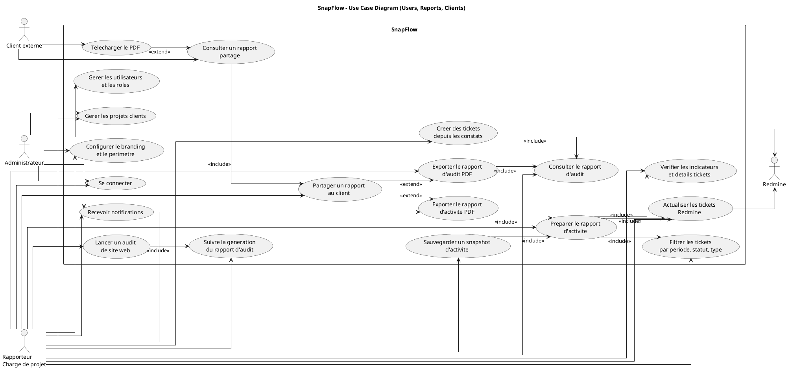

# SnapFlow PlantUML Diagrams

This document contains ready-to-render PlantUML diagrams for SnapFlow.

## Class Diagram

```plantuml
@startuml SnapFlow_Class_Diagram
title SnapFlow - Class / Domain Architecture Diagram

skinparam classAttributeIconSize 0
skinparam packageStyle rectangle
skinparam shadowing false
skinparam linetype ortho

class "Admin" as Admin <<actor>>
class "Chargé de projet" as PM <<actor>>
class "Client externe" as Client <<actor>>

package "Front-Snap React SPA" {
  class AuthProvider {
    +session
    +user
    +role
    +signIn()
    +signOut()
    +loadRole()
  }

  class AppLayout {
    +protectedRoutes
    +navigation
  }

  class OverviewPage {
    +loadDashboardStats()
    +renderAuditSummary()
  }

  class AdminProjectsPage {
    +createProject()
    +updateProject()
    +deleteProject()
    +uploadLogo()
  }

  class AuditReportPage {
    +renderSixTabs()
    +exportPdf()
    +editFindings()
    +pollAuditJob()
  }

  class ActivityReportPage {
    +loadRedmineIssues()
    +filterIssues()
    +exportActivityPdf()
    +saveSnapshot()
  }

  class FormTesterPage {
    +discoverForms()
    +createWorkflow()
    +prepareCampaign()
  }

  class FormTesterBuilderPage {
    +editWorkflow()
    +connectNodes()
    +runScenario()
    +applyAiPatch()
  }

  class AuditService {
    +generateAudit(projectId, url)
    +pollAudit(jobId)
    +completeAudit()
  }

  class AuditMapper {
    +mapApiToDisplay()
    +normalizeAxes()
    +resolveKpiLabels()
  }

  class ActivityPdfGenerator {
    +resolveLogo()
    +renderActivityDocument()
    +downloadBlob()
  }
}

package "Supabase Platform" {
  class SupabaseAuth {
    +emailPasswordLogin()
    +manageSession()
  }

  class Project {
    +id
    +site_name
    +url
    +redmine_url
    +logo_url
  }

  class Audit {
    +id
    +project_id
    +status
    +job_id
    +report_data
  }

  class Profile {
    +id
    +email
    +full_name
  }

  class UserRole {
    +user_id
    +role
  }

  class ActivityReportSnapshot {
    +project_id
    +report_data
    +filters
  }

  class Notification {
    +user_id
    +title
    +message
    +category
    +is_read
  }

  class ProjectPerimeterBlock {
    +project_id
    +title
    +subtitle
    +items
    +display_order
  }

  class EdgeFunctionFetchAuditApi {
    +invoke(url, async_mode, max_pages)
    +proxyToAggregator()
  }

  class EdgeFunctionPollAuditJob {
    +invoke(job_id)
    +proxyResult()
  }

  class EdgeFunctionFormWorkflows {
    +createWorkflow()
    +updateScenario()
    +upsertNode()
    +upsertEdge()
    +deleteEdge()
  }

  class EdgeFunctionFormWorkflowEdit {
    +proposePatch()
    +validatePatch()
    +returnPreviewOnly()
  }
}

package "V3 Microservices" {
  class AggregatorAPI {
    +POST /scan
    +POST /scan/sync
    +GET /scan/{id}/status
    +GET /scan/{id}/result
    +GET /scan/{id}/kpis
    +GET /scan/{id}/recommendations
  }

  class ScanOrchestrator {
    +createScanId()
    +persistState()
    +runScanner()
    +waitForNlp()
    +buildReport()
  }

  class KpiBuilder {
    +buildKpiCentricReport()
    +normalizeKpiObject()
    +buildTopLevelKpis()
    +buildQualityDriftArtifact()
  }

  class RecommendationClassifier {
    +classifyFindings()
    +scoreEffort()
    +rankSeverity()
    +buildRoadmap()
  }

  class ScannerGo {
    +POST /scan
    +crawlWebsite()
    +runDomainAnalyzers()
    +discoverForms()
    +sampleHeadlessPages()
    +persistScanData()
  }

  class NlpWorker {
    +pollPendingPages()
    +extractText()
    +analyzeContent()
    +buildSeoKpis()
    +buildRgpdKpis()
    +writeNlpResults()
  }

  class VisualRegressionService {
    +POST /screenshot
    +POST /compare
    +POST /ux-kpis
    +POST /browser-compat
  }

  class BrowserPool {
    +POST /render
    +POST /screenshot
    +POST /batch-screenshot
    +managePlaywrightPool()
  }

  class FormExecutor {
    +pollExecutionQueue()
    +runPlaywrightScenario()
    +storeArtifacts()
    +writeExecutionResult()
  }
}

package "Scan PostgreSQL Database" {
  class ScanPage {
    +scan_id
    +domain
    +url
    +raw_html
    +rendered_html
    +metrics
    +nlp_results
  }

  class ScanSummary {
    +scan_id
    +domain_security
    +domain_tech
    +domain_privacy
    +domain_functional
    +scan_telemetry
  }

  class FormFuzzResult {
    +scan_id
    +page_url
    +form_id
    +test_type
    +payload
    +anomaly
  }

  class ScanKpiOutput {
    +scan_id
    +scan_url
    +kpi_json
    +top_level_kpis
    +quality_drift_artifact
  }

  class ScanState {
    +scan_id
    +state_json
    +updated_at
  }

  class VisualScreenshot {
    +scan_id
    +url
    +screenshot
  }
}

package "External Systems" {
  class RedmineAPI {
    +fetchIssues()
    +fetchProjects()
    +createIssue()
  }

  class OpenAICompatibleAI {
    +chatCompletions()
    +returnStructuredPatch()
  }

  class GeminiAI {
    +generateContent()
    +returnSuggestions()
  }
}

Admin --> AuthProvider
PM --> AuthProvider
Client --> AuditReportPage

AuthProvider --> SupabaseAuth
AppLayout --> AuthProvider
OverviewPage --> Project
AdminProjectsPage --> Project
AuditReportPage --> AuditService
AuditReportPage --> AuditMapper
ActivityReportPage --> RedmineAPI
ActivityReportPage --> ActivityPdfGenerator
FormTesterPage --> EdgeFunctionFormWorkflows
FormTesterBuilderPage --> EdgeFunctionFormWorkflows
FormTesterBuilderPage --> EdgeFunctionFormWorkflowEdit

AuditService --> EdgeFunctionFetchAuditApi
AuditService --> EdgeFunctionPollAuditJob
EdgeFunctionFetchAuditApi --> AggregatorAPI
EdgeFunctionPollAuditJob --> AggregatorAPI

AggregatorAPI --> ScanOrchestrator
ScanOrchestrator --> ScannerGo
ScanOrchestrator --> NlpWorker
ScanOrchestrator --> VisualRegressionService
ScanOrchestrator --> KpiBuilder
KpiBuilder --> RecommendationClassifier

ScannerGo --> BrowserPool
ScannerGo --> ScanPage
ScannerGo --> ScanSummary
ScannerGo --> FormFuzzResult
NlpWorker --> ScanPage
VisualRegressionService --> VisualScreenshot
AggregatorAPI --> ScanState
AggregatorAPI --> ScanKpiOutput
KpiBuilder --> ScanKpiOutput

FormExecutor --> EdgeFunctionFormWorkflows
FormExecutor --> BrowserPool

EdgeFunctionFormWorkflowEdit --> OpenAICompatibleAI
EdgeFunctionFormWorkflowEdit --> GeminiAI

Project "1" --> "many" Audit
Project "1" --> "many" ActivityReportSnapshot
Project "1" --> "many" ProjectPerimeterBlock
Profile "1" --> "many" UserRole
Profile "1" --> "many" Notification

@enduml
```

## Use Case Diagram

```plantuml
@startuml SnapFlow_Use_Case_Diagram
title SnapFlow - Use Case Diagram (Users, Reports, Clients)

left to right direction
skinparam shadowing false
skinparam packageStyle rectangle
skinparam linetype ortho

actor "Administrateur" as Admin
actor "Rapporteur\nCharge de projet" as Reporter
actor "Client externe" as Client
actor "Redmine" as Redmine

rectangle "SnapFlow" {
  usecase "Se connecter" as UC_Login
  usecase "Gerer les utilisateurs\net les roles" as UC_Users
  usecase "Gerer les projets clients" as UC_Projects
  usecase "Configurer le branding\net le perimetre" as UC_ProjectSetup

  usecase "Lancer un audit\nde site web" as UC_StartAudit
  usecase "Suivre la generation\ndu rapport d'audit" as UC_TrackAudit
  usecase "Consulter le rapport\nd'audit" as UC_ViewAudit
  usecase "Exporter le rapport\nd'audit PDF" as UC_AuditPdf
  usecase "Creer des tickets\ndepuis les constats" as UC_CreateRedmineTickets

  usecase "Actualiser les tickets\nRedmine" as UC_LoadRedmine
  usecase "Filtrer les tickets\npar periode, statut, type" as UC_FilterTickets
  usecase "Preparer le rapport\nd'activite" as UC_PrepareActivity
  usecase "Verifier les indicateurs\net details tickets" as UC_ReviewActivity
  usecase "Exporter le rapport\nd'activite PDF" as UC_ActivityPdf
  usecase "Sauvegarder un snapshot\nd'activite" as UC_Snapshot

  usecase "Partager un rapport\nau client" as UC_ShareReport
  usecase "Consulter un rapport\npartage" as UC_ClientView
  usecase "Telecharger le PDF" as UC_ClientDownload
  usecase "Recevoir notifications" as UC_Notifications
}

Admin --> UC_Login
Admin --> UC_Users
Admin --> UC_Projects
Admin --> UC_ProjectSetup
Admin --> UC_Notifications

Reporter --> UC_Login
Reporter --> UC_Projects
Reporter --> UC_ProjectSetup
Reporter --> UC_StartAudit
Reporter --> UC_TrackAudit
Reporter --> UC_ViewAudit
Reporter --> UC_AuditPdf
Reporter --> UC_CreateRedmineTickets
Reporter --> UC_LoadRedmine
Reporter --> UC_FilterTickets
Reporter --> UC_PrepareActivity
Reporter --> UC_ReviewActivity
Reporter --> UC_ActivityPdf
Reporter --> UC_Snapshot
Reporter --> UC_ShareReport
Reporter --> UC_Notifications

Client --> UC_ClientView
Client --> UC_ClientDownload

UC_StartAudit --> UC_TrackAudit : <<include>>
UC_AuditPdf --> UC_ViewAudit : <<include>>
UC_CreateRedmineTickets --> UC_ViewAudit : <<include>>
UC_CreateRedmineTickets --> Redmine

UC_PrepareActivity --> UC_LoadRedmine : <<include>>
UC_PrepareActivity --> UC_FilterTickets : <<include>>
UC_PrepareActivity --> UC_ReviewActivity : <<include>>
UC_ActivityPdf --> UC_PrepareActivity : <<include>>
UC_Snapshot --> UC_PrepareActivity : <<include>>
UC_LoadRedmine --> Redmine

UC_ShareReport --> UC_AuditPdf : <<extend>>
UC_ShareReport --> UC_ActivityPdf : <<extend>>
UC_ClientView --> UC_ShareReport : <<include>>
UC_ClientDownload --> UC_ClientView : <<extend>>

@enduml
```
