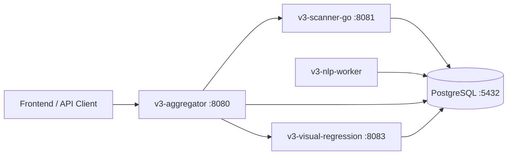

# SnapFlow V3 Microservices Deep Dive (Extended)

## 1. Goal of This Document

This is a code-level architecture reference for the V3 backend. It is intentionally detailed and maps directly to the implementation.

It explains:
- How each microservice works internally.
- What each service reads/writes in the database.
- Which fallbacks are implemented.
- Which environment variables control runtime behavior.
- Where throughput bottlenecks and reliability trade-offs come from.

Primary orchestration file:
- `V3-Microservices/docker-compose.yml`

---

## 2. Runtime Topology

Service ownership model:
- Aggregator owns request lifecycle and scan state.
- Scanner owns acquisition and technical capture.
- NLP worker owns semantic enrichment over captured HTML.
- Visual regression owns screenshot capture/comparison and visual UX KPIs.
- PostgreSQL is the shared source of truth across stages.

---

## 3. Data Plane and Contracts

Schema bootstrap file:
- `V3-Microservices/db/init.sql`

### 3.1 Core tables

1. `scan_pages`
- Granularity: one row per `(scan_id, url)`.
- Core payload columns:
  - `html`: compatibility HTML (legacy readers).
  - `raw_html`: static crawler HTML.
  - `rendered_html`: headless-hydrated DOM.
  - `metrics`: scanner per-page JSONB.
  - `nlp_results`: NLP per-page JSONB (`NULL` means pending).
- Important index:
  - `idx_nlp_pending` on `id` filtered by `nlp_results IS NULL`.

2. `scan_summaries`
- One row per `scan_id`.
- Domain-level outputs:
  - `domain_security`
  - `domain_tech`
  - `domain_privacy`
  - `domain_functional`
  - `image_compression`
  - `broken_links_summary`
  - `seo_kpi_extended`
  - `form_fuzzer_summary`
  - runtime-added column in scanner DB helper: `scan_telemetry`

3. `form_fuzz_results`
- Detailed per-form test records.
- Includes payload, response type/status, anomaly flags, duration, and error.

4. `scan_kpi_outputs`
- Canonical KPI persistence generated by aggregator.
- Contains:
  - `kpi_json` (full KPI tree)
  - `top_level_kpis`
  - `quality_drift_artifact`
  - `scan_url`, `updated_at`
- Supports drift lookup by `scan_url + updated_at desc`.

5. `scan_state`
- Created by aggregator at startup if absent.
- Persists API-visible scan state (`pending`, `running`, etc.) in JSONB.
- Allows status continuity across aggregator restarts.

6. `visual_screenshots`
- Created by visual regression service at startup.
- Stores screenshot `BYTEA` with unique `(scan_id, url)`.

### 3.2 Ownership and write boundaries

- Scanner writes:
  - `scan_pages` (crawl rows + merged headless metrics)
  - `scan_summaries` domain and technical summaries
  - `form_fuzz_results`

- NLP writes:
  - `scan_pages.nlp_results`

- Aggregator writes:
  - `scan_state`
  - `scan_kpi_outputs`

- Visual regression writes:
  - `visual_screenshots`

This ownership split avoids two services writing the same semantic field.

---

## 4. End-to-End Scan Lifecycle

### 4.1 Async flow (`POST /scan`)

1. Client calls aggregator `POST /scan`.
2. Aggregator creates `scan_id` and persists state `pending`.
3. Background thread runs `run_scanner(...)`.
4. Aggregator state transitions to `running` and calls scanner `POST /scan`.
5. Scanner runs full crawl pipeline and writes DB artifacts.
6. Aggregator sets state to `nlp_processing` and polls DB counts.
7. NLP worker fills `scan_pages.nlp_results` asynchronously.
8. When done (or timeout), aggregator sets state `complete` with optional `nlp_partiel=true`.
9. Result/KPI endpoints become consumable.

### 4.2 Sync flow (`POST /scan/sync`)

- Same internal sequence, but API call blocks until completion and returns final report.
- Implementation uses `asyncio.to_thread(...)` so FastAPI event loop stays responsive.

### 4.3 State machine

Canonical states in API:
- `pending`
- `running`
- `nlp_processing`
- `complete`
- `failed`

State persistence:
- In-memory dict for low-latency reads.
- `scan_state` DB row for restart resilience.

---

## 5. Microservice Deep Dive: Aggregator (`v3-aggregator`)

Primary code:
- `V3-Microservices/v3-aggregator/main.py`

Role:
- API gateway and orchestration brain.
- Does not crawl pages; it coordinates scanner and DB-backed enrichment.

### 5.1 Startup behavior

At startup, aggregator:
1. Ensures `scan_state` table exists.
2. Ensures `scan_kpi_outputs` table and drift index exist.
3. Logs KPI mode as `new`.
4. Optionally starts Azure heartbeat thread when `WEBSITE_SITE_NAME` is set.

### 5.2 Public endpoints and behavior

- `GET /health`
- `POST /scan`
  - asynchronous launch, immediate `scan_id` return.
- `POST /scan/sync`
  - blocking full scan for manual testing.
- `GET /scan/{scan_id}/status`
  - returns state + counts (`pages_crawled`, `pages_nlp_done`) + elapsed + error.
- `GET /scan/{scan_id}/result`
  - returns full aggregated report only when complete.
- `GET /scan/{scan_id}/recommendations`
  - recommendations generated from report.
- `GET /scan/{scan_id}/kpis`
  - canonical KPI payload (`kpi_mode=new`).
- `GET /scan/{scan_id}/kpis/top`
  - compact top-level KPI block.
- `GET /scan/{scan_id}/kpis/quality`
  - quality/drift artifact.
- `GET /scan/{scan_id}/kpi`
  - alias for `/kpis`.

### 5.3 Scanner invocation and fallback routing

`run_scanner(...)` behavior:
1. Derives allowed domain list from scan URL.
2. Builds scanner payload:
   - `scan_id`, `url`, `domains`, `max_pages`, `headless_concurrency`.
3. Attempts scanner endpoint on ordered candidates:
   - configured `SCANNER_API_URL`
   - `localhost`
   - `127.0.0.1`
   - `host.docker.internal`
   - `scanner`
4. On total failure, marks scan `failed` with compact error string.

Reasoning:
- This makes local and containerized runs more resilient to host/network topology differences.

### 5.4 NLP completion policy

After scanner returns HTTP 200:
1. State becomes `nlp_processing`.
2. Aggregator polls `COUNT(*)` and `COUNT(nlp_results)` from `scan_pages`.
3. Poll window: 100 loops x 3s (roughly 5 minutes).
4. If not fully complete by deadline:
   - state still transitions to `complete`
   - `nlp_partiel=true`
   - KPI payload decorated with warning fields.

Why this policy exists:
- Avoid hard user-facing failure when NLP lag is the only blocker.
- Allow progressive delivery of useful technical outputs.

### 5.5 KPI persistence and quality drift internals

When `/kpis` is requested:
1. Aggregator builds full report from DB artifacts.
2. Transforms report via `build_kpi_centric_report(...)`.
3. Computes `top_level_kpis` for quick UI/API usage.
4. Loads previous artifact by `scan_url` for drift comparison.
5. Computes and stores `quality_drift_artifact`.
6. Persists all outputs to `scan_kpi_outputs`.

Quality artifact fields:
- Coverage block:
  - total, evaluated, not-evaluated counts + coverage %.
- Distribution block:
  - pass/warning/fail/critical/high-confidence fail counts.
- Rates block:
  - pass/warning/failure/critical rates.
- Composite:
  - `quality_score`
  - `quality_status` (`good`, `watch`, `at_risk`)
  - operational alert flags.

Quality score formula in code terms:

$$
Q = 100 - failure\_rate - 0.4\cdot warning\_rate - 0.3\cdot (100-coverage) - 0.5\cdot critical\_rate
$$

Then clamped to $[0,100]$.

Drift logic:
- Finds prior scan artifact for same URL.
- Computes deltas for score, coverage, pass/fail/warning rates, and not-evaluated count.
- Trend thresholds:
  - improving if delta score >= 2
  - regressing if delta score <= -2
  - else stable.

### 5.6 Failure and recovery characteristics

Strengths:
- Persistent state in DB for restart survivability.
- Scanner endpoint fallback candidates.
- KPI payload cache in DB avoids expensive recomputation on every read.

Residual risks:
- If scanner never reachable, scan fails early.
- If DB unavailable, both state and report generation degrade.
- Sync endpoint can keep client connection open for long durations.

### 5.7 Key environment knobs

- `SCANNER_API_URL`
- `VISUAL_REGRESSION_API_URL`
- `MULTI_BROWSER_FALLBACK_TIMEOUT`
- `HEARTBEAT_INTERVAL_SECONDS`
- DB vars (`DB_HOST`, `DB_PORT`, `DB_NAME`, `DB_USER`, `DB_PASS`)

Aggregator mapping highlights (for reporting):
- `domain_analysis.cms_kpi` now surfaces:
  - `cms`, `cms_version`
  - `server_tech`, `server_version`, `server_banner`, `os_hint`
  - `language`, `language_version`
- `domain_analysis.service_exposure_kpi` surfaces open-port findings from security analyzer.

---

## 6. Microservice Deep Dive: Scanner (`v3-scanner-go`)

Primary code:
- `V3-Microservices/v3-scanner-go/main.go`
- `V3-Microservices/v3-scanner-go/db/db.go`
- `V3-Microservices/v3-scanner-go/analyzers/*`

Role:
- Crawl/acquisition service that produces page-level and domain-level technical evidence.

### 6.1 HTTP interface

- `POST /scan`
  - synchronous request handling.
  - returns when scanner pipeline completes.
- `GET /health`

Request payload:
- `scan_id`
- `url`
- `domains`
- `max_pages`
- `headless_concurrency`

Validation/defaults:
- `max_pages` defaults to 100 if invalid.
- `headless_concurrency` defaults to 4 if invalid.
- URL and domains are sanitized.

### 6.2 Runtime controls

Main controls:
- `SCANNER_TIMEOUT` (default 600s)
- `SCANNER_PARALLELISM` (default 150)
- `HEADLESS_SAMPLE_RATIO` (default 0.35, clamped 0.30..0.90)
- `CHROME_PATH`
- `CHROME_NO_SANDBOX`

Security service exposure controls:
- `ENABLE_PORT_SCAN` (default `true` in current compose)
- `PORT_SCAN_PORTS` (comma-separated list; defaults to common risky ports)
- `PORT_SCAN_TIMEOUT_MS` (default `900`, bounded)

Form controls:
- `ENABLE_FORM_FUZZER`
- `FORM_FUZZ_CONCURRENCY`
- `FORM_FUZZ_TIMEOUT_SEC`
- `FORM_FUZZ_MAX_FORMS`
- `FORM_FUZZ_PAYLOAD_PROFILE`
- `FORM_FUZZ_MIN_BUDGET_SEC`
- `FORM_FUZZ_BLOCK_IN_PRODUCTION`
- `ENABLE_MODAL_DETECTION`
- `FORM_BROWSER_TIMEOUT_SEC`
- `FORM_BROWSER_MAX_FORMS`
- `FORM_BROWSER_HEADLESS`

### 6.3 Pipeline stages in order

1. **Pre-fetch phase** (parallel)
- SSL check, sitemap check, robots check.
- Fetch robots content with bounded timeout.
- Fetch homepage HTML + headers with bounded timeout.

2. **Domain analyzers phase**
- `tech.Analyze(...)` first to expose CMS data.
- security/privacy/functional analyzers run in parallel.
- Inserts domain summary into `scan_summaries`.

3. **Colly crawl phase**
- Async collector with configured parallelism.
- Transport-level timeouts and connection tuning.
- Multiple discovery handlers:
  - anchors
  - `data-*` routes
  - `onclick` path extraction
  - meta-refresh URLs
  - canonical/alternate links
  - inline script route inference
- Per-page analysis:
  - SEO analyzer
  - UX analyzer
- Async DB insert into `scan_pages` with metrics:
  - `evidence_provenance=static`
  - `html_source=static`

4. **Crawl stop and DB sync phase**
- Stops on `max_pages` or timeout context.
- Waits for async DB insert workers (`dbWg`) with a max wait guard.

5. **Cloudflare 0-page fallback phase 1**
- If crawl yielded 0 pages but prefetch HTML exists:
  - seed homepage metrics from prefetch HTML.
  - insert seeded page row.
  - set provenance/source as `static_prefetch`.

6. **Form collection and fuzzing phase**
- Extract forms from crawled HTML.
- If no forms + cloudflare challenge markers:
  - try Rod browser fallback for form discovery.
- Optional modal-triggered form discovery:
  - only when Chromium binary is present (no auto-download).
- Fuzzer execution subject to budget/safety gates.
- Writes detailed `form_fuzz_results` + summary in `scan_summaries`.

7. **Headless sampling and execution phase**
- Build sample using hybrid strategy:
  - always include homepage
  - worst-SEO subset
  - deterministic stride fill
- If SPA fingerprints detected, sample forced to 100%.
- Executes `performance.RunHeadlessPool(sampleURLs, concurrency)`.
- Persists rendered HTML and merges headless metrics.
- Sets `html_source=headless` only when rendered HTML is available.

8. **Cloudflare fallback phase 2 backfill**
- For seeded-only case, replace synthetic homepage SEO/UX with rendered analysis.
- Merge updated metrics and switch evidence source to mixed/headless.

9. **Mobile representative tests**
- Picks up to 3 URLs (homepage, hub-like, leaf).
- Runs mobile performance traces and stores summary in `seo_kpi_extended`.

10. **Final aggregation and telemetry**
- Computes SEO and UX aggregate sections.
- Persists broken links, image compression, SEO extended KPIs.
- Computes and persists scan telemetry including timings and coverage.

### 6.4 Output semantics (important for downstream services)

Per-page metric provenance keys:
- `evidence_provenance`
  - `static`, `runtime`, or `mixed`.
- `html_source`
  - `static`, `static_prefetch`, or `headless`.

Why this matters:
- NLP worker prefers hydrated HTML when available.
- Aggregator and KPI layers can interpret confidence more accurately.

### 6.5 Headless coverage telemetry

Scanner computes:

$$
headless\_coverage\_pct = \frac{|sampleURLs|}{total\_pages}\times100
$$

Flags partial coverage when `< 80%` and `total_pages > 0`.

Telemetry persisted in `scan_summaries.scan_telemetry` includes:
- stop reason
- phase timings (`pre_fetch`, `domain_analysis`, `crawl`, `post_crawl_sync`, `headless`, `db_wait`)
- pages at stop
- remaining timeout budget
- form-fuzzer summary
- headless coverage and partial flag

### 6.6 Reliability design and practical caveats

Implemented protections:
- bounded HTTP timeouts in prefetch and transport.
- async DB inserts with explicit wait.
- merge retry in DB helper for race conditions (`MergePageMetrics`).
- fallback seed for anti-bot 0-page cases.
- explicit Chromium path check for modal discovery.

Known caveats:
- high `SCANNER_PARALLELISM` can increase network noise and anti-bot triggering.
- headless phase is usually the slowest section.
- very protected targets may still yield limited crawl breadth even with fallback.

### 6.7 Service Exposure (Open Ports)

The security analyzer can optionally perform TCP reachability checks against monitored ports.

Output location:
- `domain_security.service_exposure`
- bridged summary: `domain_analysis.service_exposure_kpi`

Output structure includes:
- `enabled`, `host`, `ports_scanned`
- `open_services[]` with:
  - `port`, `service`, `state`, `risk`, optional `banner`, explanatory note
- overall `status`, `severity`, and `impact`

Risk examples in current model:
- `3306` MySQL: `critical`
- `5432` PostgreSQL: `critical`
- `3389` RDP: `critical`
- `21` FTP: `high`
- `22` SSH: `medium`
- `80/443` HTTP(S): `low`

Important operational note:
- Port scanning is disabled by default for safety/policy reasons and must be explicitly enabled.

---

## 7. Microservice Deep Dive: NLP Worker (`v3-nlp-worker`)

Primary code:
- `V3-Microservices/v3-nlp-worker/main.py`

Role:
- Asynchronous semantic enrichment of scanned pages.
- No public HTTP API; runs as a continuous poller.

### 7.1 Polling and locking model

Loop behavior:
- waits for DB connectivity at startup.
- continuous loop with `POLL_INTERVAL` (default 3s).

Fetch query characteristics:
- selects rows where:
  - `nlp_results IS NULL`
  - at least one HTML source exists.
- `LIMIT 20` per cycle.
- `FOR UPDATE SKIP LOCKED` to support safe horizontal scaling.

Why this is robust:
- Multiple worker replicas can run without double-processing the same row.

### 7.2 HTML source precedence

Per row, selected HTML source is:
1. `rendered_html`
2. `html`
3. `raw_html`

This prioritizes hydrated DOM for SPA-heavy pages.

### 7.3 Transaction strategy

Pattern:
- batch rows are selected under lock.
- each row processed in `try/except`.
- each successful row committed individually.
- row-level failures rollback only that row transaction segment.

Benefit:
- One malformed page does not block entire batch progress.

### 7.4 SPA shell handling

If page appears to be a non-hydrated shell (very low text + SPA markers + no rendered HTML):
- worker writes `status=not_evaluated` with reason `spa_shell_not_hydrated`.
- avoids false negative content KPIs.

### 7.5 NLP payload structure (per page)

Main families inside `nlp_results`:
- extraction metadata
- readability and lexical signals
- keyword/stuffing signals
- audience segment classification
- page type classification
- date freshness signals
- `seo_kpis` nested object
- `content_kpis` nested object
- `rgpd_text_analysis`
- `rgpd_kpis` nested object

Notable implementation details:
- multilingual stop words (FR/EN/AR).
- optional spaCy and language-tool integrations with graceful degradation.
- explicit detection and scoring for compliance/privacy cues.
- extraction source traceability (`main_content_first` metadata).

### 7.6 Failure characteristics

Resilience:
- per-row exception isolation.
- idle logging without noisy errors.
- retries naturally occur by leaving `nlp_results` null on failure.

Risks:
- large heavy pages can increase cycle duration.
- missing optional NLP dependencies reduce feature richness (but do not crash worker).

---

## 8. Microservice Deep Dive: Visual Regression (`v3-visual-regression`)

Primary code:
- `V3-Microservices/v3-visual-regression/main.py`
- `V3-Microservices/v3-visual-regression/comparator.py`
- `V3-Microservices/v3-visual-regression/services/image_comparator.py`
- `V3-Microservices/v3-visual-regression/services/zone_comparator.py`
- `V3-Microservices/v3-visual-regression/services/ux_kpis.py`

Role:
- Screenshot capture, visual diffing, and standalone visual UX scoring.

### 8.1 Startup

On lifespan startup:
- initializes `visual_screenshots` table.
- logs `VISUAL_REGRESSION_ENABLED` and sandbox mode.

### 8.2 Endpoints

- `GET /health`
- `POST /screenshot`
  - captures batch screenshots and persists them.
- `POST /compare`
  - compares baseline vs new captures.
- `POST /ux-kpis`
  - computes standalone UX visual KPIs for one URL.
- `POST /browser-compat`
  - compares same URL across Chromium and WebKit.

### 8.3 Screenshot capture behavior

Capture engine:
- Playwright async.
- browser args include `--disable-dev-shm-usage`, plus optional no-sandbox flags.

Full-page strategy:
- if scroll height <= 15000px: regular full-page screenshot.
- if > 15000px: segmented top/middle/bottom capture, stitched into one PNG.

Batch mode:
- bounded concurrency via semaphore (`max_concurrency` default 3).
- one browser lifecycle reused across pages for better throughput.

### 8.4 Compare endpoint internals

`/compare` behavior by scenario:
- both captures missing: `non_evalue`.
- baseline missing only: `new_page` (not auto-regression).
- new missing only: `deleted_page` (not auto-regression).
- viewport width mismatch: `non_evalue` with reason.

When both captures exist:
1. SSIM/perceptual metrics from `image_comparator`:
   - SSIM score
   - pHash distance
   - optional LPIPS distance
2. Zone regression from `zone_comparator`:
   - header/hero/content/footer/cta weighted analysis
3. Fused score:
   - weighted blend of zone + ssim delta + pHash + LPIPS.
4. Severity guardrails:
   - critical zone severity alone is not sufficient without a fused floor.
5. structural metadata:
   - layout size change
   - size delta
   - structural score.

### 8.5 Zone model details

Zone weights (sum to 1.0):
- header: 0.30
- hero: 0.25
- content: 0.15
- footer: 0.05
- cta: 0.25

Additional safeguards:
- short pages under `MIN_PAGE_HEIGHT_PX` are returned as non-evaluable.
- CTA SSIM failures are skipped instead of forcing false criticals.
- adaptive vertical bounds reduce layout-shift false positives.

### 8.6 UX KPI formulas

Standalone outputs:
- visual complexity
- CTA prominence
- first impression score

First impression composition:

$$
score = 0.30\cdot aboveFold + 0.35\cdot cta + 0.20\cdot hierarchy + 0.15\cdot (1-complexity)
$$

### 8.7 Browser compatibility endpoint

`/browser-compat`:
- captures URL in Chromium and WebKit.
- computes diff percentage and structural metadata.
- returns pass/fail against threshold (default 5.0).

### 8.8 Feature flags and knobs

- `VISUAL_REGRESSION_ENABLED`
- `CHROME_NO_SANDBOX`
- `SCREENSHOT_GOTO_TIMEOUT_MS`
- `VISUAL_LPIPS_ENABLED`
- `CTA_INFER_MIN_SCORE`
- `MIN_PAGE_HEIGHT_PX`

---

## 9. Microservice Deep Dive: Database (`db`)

Service:
- PostgreSQL 16 Alpine.

Compose wiring:
- Exposed on `5432`.
- Initializes with `db/init.sql`.
- Persistent volume `pgdata`.

### 9.1 Why DB logic appears in service code too

Even with bootstrap SQL, services run idempotent `ensure` logic at startup.

Examples:
- scanner DB helper ensures missing columns/tables for backward compatibility.
- aggregator ensures `scan_state` and KPI output table.
- visual regression ensures screenshot table.

This supports rolling upgrades and environments that started from earlier schema states.

### 9.2 Practical data consistency model

- Transactional DB writes per service operation.
- eventual consistency between scanner and NLP stages.
- aggregator status reflects this by exposing `nlp_partiel` when enrichment is incomplete.

---

## 10. Cross-Service Contracts and Invariants

1. Scanner must write at least one `scan_pages` row for meaningful downstream processing.

2. NLP worker only processes rows where HTML exists and `nlp_results` is null.

3. Aggregator completion does not require full NLP completion; it marks partial state explicitly.

4. KPI endpoints are canonical in `new` mode and persisted in `scan_kpi_outputs`.

5. Visual regression is optional by deployment policy; disabled mode returns explicit 503 semantics.

6. `html_source` and `evidence_provenance` are critical for interpreting confidence of derived KPIs.

---

## 11. Performance and Scalability Notes

### 11.1 Scanner

Main cost centers:
- network crawl breadth (`SCANNER_PARALLELISM`)
- headless execution (`headless_concurrency` and sample size)
- image and form sub-pipelines

Tuning guidance:
- increase crawl parallelism carefully to avoid anti-bot triggers.
- increase headless concurrency only if host CPU/RAM support it.
- keep sample ratio moderate unless SPA-heavy or strict completeness needed.

### 11.2 NLP worker

Scaling model:
- safe horizontal scaling via `FOR UPDATE SKIP LOCKED`.
- throughput roughly proportional to worker count and page text complexity.

### 11.3 Aggregator

Mostly orchestration workload.

Potential hotspots:
- repeated full report builds if KPI cache misses.
- sync scans with long-running client connections.

### 11.4 Visual regression

Main cost centers:
- browser startup/capture cost.
- image diff computations, especially large pages.
- LPIPS if enabled.

---

## 12. Failure Modes and Diagnostics by Service

### 12.1 Aggregator issues

Symptom: scanner unreachable
- check `SCANNER_API_URL`
- verify fallback host routing and scanner health endpoint

Symptom: status exists but report missing
- verify `scan_pages` and `scan_summaries` rows for scan_id
- check aggregator logs for report build exceptions

### 12.2 Scanner issues

Symptom: complete with 0 pages
- inspect logs for cloudflare/challenge indicators
- verify fallback seeding path triggered
- check `scan_pages` insert success

Symptom: no rendered HTML despite headless run
- verify browser availability and `CHROME_PATH`
- inspect headless errors in scanner logs

### 12.3 NLP worker issues

Symptom: pending pages never drain
- verify worker running and DB connectivity
- check lock contention and exceptions in worker logs
- inspect whether rows lack usable HTML columns

### 12.4 Visual regression issues

Symptom: endpoints return disabled
- verify `VISUAL_REGRESSION_ENABLED`

Symptom: false regressions spike
- inspect viewport mismatch status
- inspect short-page non-evaluated behavior
- calibrate CTA inference and threshold envs

---

## 13. Operational Runbook Snippets

### 13.1 Track scan progress

- query `scan_state` for API-level status.
- query `scan_pages` count vs `COUNT(nlp_results)` for enrichment completion.

### 13.2 Check if KPI payload is persisted

- verify `scan_kpi_outputs` row for `scan_id`.
- if missing, trigger `/scan/{id}/kpis` once to force generation and persistence.

### 13.3 Validate fallback behavior

- in scanner logs, confirm:
  - 0-page fallback seed message
  - headless backfill message for homepage (when applicable)

---

## 14. Design Rationale Summary

The architecture is intentionally staged and additive:
- scanner captures technical evidence quickly and deterministically.
- NLP enriches asynchronously with lock-safe parallelism.
- aggregator exposes a stable API and explicit partial-completion semantics.
- visual regression adds optional visual quality dimensions.

This yields graceful degradation under real-world conditions (anti-bot friction, slow NLP, partial browser coverage) while preserving a single persistence backbone and consistent API surface.
